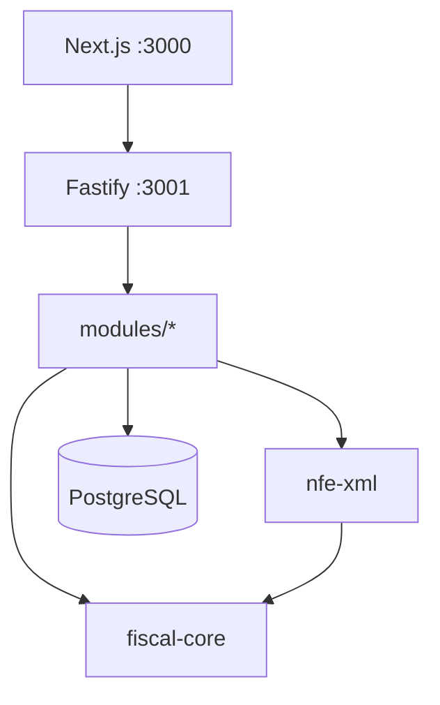

# MSimulation XML

**Educational Brazilian tax simulator** for Mercado Livre Full fulfillment — NF-e, CT-e, remittances, sales, and tax engine (homologation only; not valid with SEFAZ).

Simulador fiscal educacional para operações de **fulfillment Mercado Livre Full** — NF-e, CT-e, remessas, vendas e impostos.

Monorepo · pnpm workspaces · Fastify · Next.js · `@msimulation-xml/fiscal-core` · `@msimulation-xml/nfe-xml`

> **Aviso:** simulador educacional. XMLs em homologação (`tpAmb=2`), assinaturas fictícias — **sem validade jurídica** perante a SEFAZ. Não use em produção real.

**Diferencial:** motor tributário + geração de XML NF-e/CT-e em packages testáveis, orquestrados por um backend em Clean Architecture / DDD (bounded contexts).

[Licença MIT](./LICENSE) · [Contribuir](./CONTRIBUTING.md) · [Convenções do monorepo](./docs/specs/monorepo-conventions.md) · [Backend](./backend/README.md) · [Frontend](./frontend/README.md)

---


## Quick start

**Pré-requisitos:** Node.js 20+, pnpm 9 (`corepack enable && corepack prepare pnpm@9.15.9 --activate`), Docker (PostgreSQL).

```bash
git clone <url-do-repo>
cd msimulation-xml
pnpm install

cp .env.example .env
cp backend/.env.example backend/.env
cp frontend/.env.example frontend/.env.local   # opcional

pnpm db:setup   # docker compose up + migrations
pnpm dev        # API :3001 + UI :3000
```


| Serviço                  | URL                                                                  |
| ------------------------ | -------------------------------------------------------------------- |
| Frontend                 | [http://localhost:3000](http://localhost:3000)                       |
| Backend                  | [http://localhost:3001](http://localhost:3001)                       |
| Health                   | [http://localhost:3001/api/health](http://localhost:3001/api/health) |
| Validador MCP (opcional) | [http://localhost:8080/health](http://localhost:8080/health)         |


Variáveis: `[.env.example](./.env.example)`, `[backend/.env.example](./backend/.env.example)`, `[frontend/.env.example](./frontend/.env.example)`. **Nunca** commit `.env` reais, certificados ou dados de clientes.

---


## O que o sistema simula


| Etapa    | O que faz                                                       |
| -------- | --------------------------------------------------------------- |
| Cadastro | Tenant, produtos, regras tributárias, CDs (unidades logísticas) |
| Remessa  | NF-e de envio ao CD Mercado Livre + FIFO                        |
| Avanço   | Movimentação entre CDs                                          |
| Venda    | Pedido → retorno simbólico → NF-e venda → CT-e                  |
| Consulta | Listagem, XML, cancelamento, devolução, auditoria MCP           |


### Conceitos (glossário rápido)


| Termo               | No projeto                                               |
| ------------------- | -------------------------------------------------------- |
| **Tenant**          | Empresa emitente (multi-empresa)                         |
| **NF-e / CT-e**     | Nota de produto / conhecimento de transporte (simulados) |
| **FIFO**            | Saldo por item de NF-e (`nfe_itens`)                     |
| **Thin client**     | Frontend só UI + I/O; regra fiscal no backend            |
| **Bounded context** | Módulo em `backend/src/modules/<nome>/`                  |

---

## Monorepo

```
msimulation-xml/
├── backend/              # API Fastify + Prisma + módulos DDD
├── frontend/             # Next.js 16 (thin client)
├── packages/
│   ├── fiscal-core/      # Lógica fiscal pura
│   └── nfe-xml/          # Geração XML NF-e/CT-e
├── infra/fiscal-validator-proxy/  # Proxy MCP (opcional)
├── docker-compose.yml
├── LICENSE
├── CONTRIBUTING.md
└── README.md             # este portal
```


```mermaid
graph TB
  NEXT[Next.js :3000] --> FAST[Fastify :3001]
  FAST --> MOD[modules/*]
  MOD --> FC[fiscal-core]
  MOD --> NX[nfe-xml]
  NX --> FC
  MOD --> PG[(PostgreSQL)]
```


Detalhe de arquitetura, fluxos e validador: `[backend/README.md](./backend/README.md)`. UI e rotas: `[frontend/README.md](./frontend/README.md)`.

---


## Stack


| Camada      | Tecnologias                                           |
| ----------- | ----------------------------------------------------- |
| Monorepo    | pnpm 9, concurrently                                  |
| Backend     | Fastify 5, TypeScript, Zod, Prisma 7, PostgreSQL      |
| Frontend    | Next.js 16, React 19.2 + Compiler, Tailwind v4, shadcn/ui |
| Auth        | JWT, 2FA TOTP, Brevo (e-mail opcional em dev)         |
| Packages    | TypeScript puro (`fiscal-core`, `nfe-xml`)            |
| Infra local | Docker Compose (Postgres 16 + validador MCP opcional) |


---


## Scripts (raiz)


| Comando                                           | Descrição                              |
| ------------------------------------------------- | -------------------------------------- |
| `pnpm dev`                                        | Backend + frontend                     |
| `pnpm dev:backend` / `pnpm dev:frontend`          | Isolados                               |
| `pnpm build`                                      | Packages + frontend + backend          |
| `pnpm db:setup`                                   | Docker up + `migrate deploy`           |
| `pnpm docker:up` / `docker:down` / `docker:reset` | Compose                                |
| `pnpm test:backend`                               | Testes fiscal-core + nfe-xml + backend |
| `pnpm test:fiscal-core` / `pnpm test:nfe-xml`     | Packages                               |
| `pnpm lint`                                       | ESLint (frontend)                      |
| `pnpm format`                                     | Prettier                               |


Prisma Studio (opcional): `pnpm --filter @msimulation-xml/backend exec prisma studio`.

---


## Documentação


| Documento                                                                                            | Conteúdo                                 |
| ---------------------------------------------------------------------------------------------------- | ---------------------------------------- |
| [backend/README.md](./backend/README.md)                                                             | Clean Architecture, módulos, fluxos, MCP |
| [frontend/README.md](./frontend/README.md)                                                           | Thin client, rotas, padrões              |
| [CONTRIBUTING.md](./CONTRIBUTING.md)                                                                 | Onboarding e PRs                         |
| [backend/docs/fiscal/regras-fulfillment-cat31.md](./backend/docs/fiscal/regras-fulfillment-cat31.md) | CAT 31 / ML Full                         |
| [backend/docs/fiscal/manual-nfe-moc.md](./backend/docs/fiscal/manual-nfe-moc.md)                     | MOC NF-e                                 |
| [docs/specs/readme-github-share.md](./docs/specs/readme-github-share.md)                             | SPEC desta documentação                  |


---


## Segurança no repositório público

- Use só os `*.env.example` (placeholders).
- Não versionar certificados digitais, dumps de banco ou CNPJs/clientes reais.
- Segredos de produção ficam no provedor de host (Render, etc.), não no git.

---

MSimulation XML — simulador educacional · não substitui assessoria fiscal ou contábil