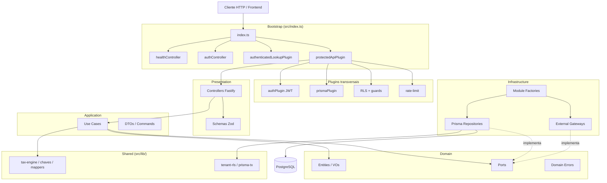
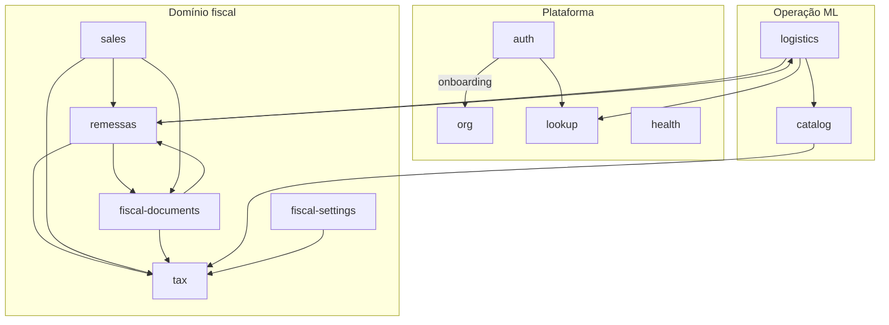

# Backend — MSimulation XML

API REST em **Fastify + TypeScript + Prisma + PostgreSQL** que sustenta o simulador fiscal de fulfillment (Mercado Livre Full).

> **Contexto do produto:** simulador educacional. XMLs usam homologação (`tpAmb=2`), assinaturas fictícias e **não têm validade** perante a SEFAZ.

---

## Índice

1. [Stack e execução local](#stack-e-execução-local)
2. [Visão geral da arquitetura](#visão-geral-da-arquitetura)
3. [Camadas (Clean Architecture)](#camadas-clean-architecture)
4. [Bounded contexts (`src/modules/`)](#bounded-contexts-srcmodules)
5. [Diagrama de arquitetura](#diagrama-de-arquitetura)
6. [Bootstrap e registo de rotas](#bootstrap-e-registo-de-rotas)
7. [Estrutura de pastas](#estrutura-de-pastas)
8. [Comunicação entre módulos](#comunicação-entre-módulos)
9. [Padrões e convenções](#padrões-e-convenções)
10. [Testes e scripts](#testes-e-scripts)
11. [Documentação por módulo](#documentação-por-módulo)

---

## Stack e execução local

| Tecnologia | Uso |
|------------|-----|
| **Fastify 5** | Servidor HTTP, plugins, hooks |
| **TypeScript** | Tipagem estrita |
| **Zod** | Validação HTTP (presentation) |
| **Prisma 7** | ORM + migrations PostgreSQL |
| **@fastify/jwt** | Access / refresh tokens |
| **Resend** | E-mails transacionais |
| **otplib** | 2FA TOTP |

```bash
# Na raiz do monorepo
pnpm install
cp .env.example .env
cp backend/.env.example backend/.env
pnpm db:setup
pnpm dev
```

| Serviço | URL |
|---------|-----|
| API | http://localhost:3001 |
| Health | http://localhost:3001/api/health |

Variáveis obrigatórias: `DATABASE_URL`, `JWT_SECRET`, `PASSWORD_PEPPER`, `CORS_ORIGINS`, `APP_PUBLIC_URL`. Ver [`backend/.env.example`](./.env.example).

---

## Visão geral da arquitetura

O backend é um **monolito modular** organizado por **Bounded Contexts** (DDD), cada um em `src/modules/<nome>/`. A organização interna segue **Clean Architecture** em quatro camadas concêntricas:

| Camada | Responsabilidade | Depende de |
|--------|------------------|------------|
| **Domain** | Entidades, erros, ports (contratos), regras puras | Nada externo |
| **Application** | Casos de uso, DTOs, orquestração | Domain |
| **Infrastructure** | Prisma, APIs externas, adapters, factories | Application + Domain |
| **Presentation** | Controllers Fastify, schemas Zod | Application (+ Infrastructure via factory) |

**Regra de ouro das dependências:** o domínio nunca importa Fastify, Prisma ou HTTP. Os controladores são *burros*: validam entrada, chamam um caso de uso e devolvem a resposta.

O wiring HTTP vive em `src/index.ts` e em `src/plugins/` — não em pastas `routes/` legadas (removidas na migração para módulos).

---

## Camadas (Clean Architecture)

Fluxo típico de uma requisição autenticada:

```
HTTP Request
    │
    ▼
plugins/ (JWT, RLS, rate-limit, guards)
    │
    ▼
presentation/controllers/   ← parse Zod, tenantId, status HTTP
    │
    ▼
application/use-cases/    ← um caso de uso = uma ação de negócio
    │
    ▼
domain/ports/             ← interface (contrato)
    │
    ▼
infrastructure/           ← Prisma repository, gateway HTTP, adapter
    │
    ▼
PostgreSQL (+ RLS por tenant)
```

Cada módulo expõe um **composition root** em `infrastructure/factory/*-module.factory.ts` que instancia repositórios e injeta nos casos de uso.

Código transversal (motor de impostos, geração de chaves NF-e, mappers, RLS) permanece em `src/lib/` — bibliotecas internas sem regra de negócio de um único contexto.

---

## Bounded contexts (`src/modules/`)

| Módulo | Responsabilidade de negócio |
|--------|----------------------------|
| [**auth**](./src/modules/auth/) | Autenticação (login, refresh, logout), registo, verificação de e-mail, reset de senha, 2FA TOTP e onboarding inicial (vínculo empresa + utilizador). |
| [**org**](./src/modules/org/) | Gestão de **tenants** (empresas emitentes) e **utilizadores** do tenant (CRUD, papéis ADMIN/MEMBER). |
| [**catalog**](./src/modules/catalog/) | Catálogo de **produtos** (SKU, NCM, preços, vínculo com regra fiscal `taxRuleBaseId`), importação em massa. |
| [**tax**](./src/modules/tax/) | **Regras tributárias** (catálogo, resolução origem×destino, cálculo de impostos para venda/remessa/inbound). |
| [**logistics**](./src/modules/logistics/) | **Unidades logísticas** Meli Full, movimentações de stock, avanço entre CDs e resolução de destino fiscal. |
| [**remessas**](./src/modules/remessas/) | Emissão de **NF-e de remessa** (física e simbólica), **FIFO** de saldo por `nfe_itens`, CT-e de remessa e avanço de mercadoria na cadeia fulfillment. |
| [**sales**](./src/modules/sales/) | **Pedidos** (rascunho, checkout, faturamento) e orquestração da **cadeia de venda** (retorno simbólico → venda → CT-e). |
| [**fiscal-documents**](./src/modules/fiscal-documents/) | Consulta e ciclo de vida de **NF-e** e **CT-e** (listagem, XML, soft-delete, cancelamento, devolução, inutilização), timeline e eventos fiscais. |
| [**fiscal-settings**](./src/modules/fiscal-settings/) | **Configurações do emissor** ML (séries, prazos, composição de base, CST de devolução, etc.). |
| [**lookup**](./src/modules/lookup/) | Consultas externas **CNPJ** (BrasilAPI / OpenCNPJ) e **CEP** (BrasilAPI / ViaCEP) para onboarding e cadastros. |
| [**health**](./src/modules/health/) | Endpoint `/api/health` (liveness + verificação de conexão à base de dados). |

---

## Diagrama de arquitetura

### Camadas e fluxo HTTP



### Módulos e dependências de negócio



---

## Bootstrap e registo de rotas

[`src/index.ts`](./src/index.ts) regista plugins nesta ordem:

| Escopo | Plugin / Controller | Autenticação |
|--------|---------------------|--------------|
| `/api/health` | `healthController` | Público |
| `/api/auth/*` | `authController` | Público / Bearer |
| `/api/lookup/*` | `lookupController` (via `authenticatedLookupPlugin`) | JWT, **sem** tenant |
| `/api/*` (negócio) | `protectedApiPlugin` → contextos | JWT + tenant + e-mail verificado |

Contextos protegidos ([`plugins/contexts/`](./src/plugins/contexts/)):

| Plugin | Controllers registados |
|--------|------------------------|
| `orgContextPlugin` | `tenantController`, `userController` |
| `catalogContextPlugin` | `productController` |
| `fiscalContextPlugin` | NF-e, CT-e, lifecycle, observabilidade, tax rules, emitter settings, pedidos |
| `logisticsContextPlugin` | unidades logísticas, movimentações |

Todos os controladores são importados diretamente de `modules/<ctx>/presentation/controllers/`.

---

## Estrutura de pastas

```
backend/
├── prisma/                    # Schema e migrations
├── src/
│   ├── index.ts               # Entrada Fastify
│   ├── modules/               # Bounded contexts (Clean Architecture)
│   │   └── <context>/
│   │       ├── domain/
│   │       ├── application/
│   │       ├── infrastructure/
│   │       ├── presentation/
│   │       └── index.ts
│   ├── plugins/               # JWT, Prisma, API protegida, contextos
│   ├── lib/                   # Utilitários transversais (fiscal, db, http)
│   └── generated/prisma/      # Client gerado
└── package.json
```

Estrutura interna de cada módulo (obrigatória):

```
modules/<context>/
├── domain/
│   ├── entities/
│   ├── errors/
│   ├── ports/              # Interfaces de repositório / gateway
│   └── value-objects/      # Quando aplicável
├── application/
│   ├── use-cases/
│   ├── dto/
│   └── services/           # Orquestração pura sem I/O
├── infrastructure/
│   ├── prisma/
│   ├── external/           # APIs de terceiros
│   └── factory/            # Composition root
└── presentation/
    ├── controllers/
    └── schemas/
```

---

## Comunicação entre módulos

- **Preferência:** um módulo consome outro via **caso de uso público** ou função exportada no `index.ts` do módulo alvo — nunca importando Prisma de outro contexto diretamente no controller.
- **Adapters:** quando um contexto precisa de capacidade externa (ex.: logistics → lookup CEP), usa-se um adapter em `infrastructure/external/` que implementa um **port** do próprio módulo.
- **lib/fiscal:** motor de cálculo (`tax-engine`), snapshots e chaves são bibliotecas compartilhadas; a resolução de regras fica no módulo **tax**.
- **remessas** é o núcleo FIFO e emissão de remessa; **sales** e **fiscal-documents** delegam consumo/estorno de saldo a ele.
- **services/fiscal/index.ts** é apenas uma **fachada de re-export** legada para imports antigos — a lógica vive nos módulos.

---

## Padrões e convenções

| Tópico | Convenção |
|--------|-----------|
| Ficheiros / pastas | `kebab-case` |
| Casos de uso | `verb-noun.use-case.ts` + classe `PascalCase` |
| Controllers | `*-controller.ts`, plugin FastifyAsync |
| Erros de domínio | Classe com `.status` HTTP; mapear em `handleRouteError` |
| Validação HTTP | Zod em `presentation/schemas/` |
| IDs multi-tenant | Sempre filtrar por `tenantId` do JWT; RLS ativo em `protected-api` |
| Transações | Dentro de infrastructure (repositório), não no controller |

Pacotes internos do monorepo: `@msimulation-xml/fiscal-core`, `@msimulation-xml/nfe-xml`.

---

## Testes e scripts

```bash
# Testes unitários (compila pacotes fiscais antes)
pnpm --filter @msimulation-xml/backend test

# Typecheck
pnpm --filter @msimulation-xml/backend exec tsc --noEmit

# Prisma
pnpm --filter @msimulation-xml/backend exec prisma migrate dev
pnpm --filter @msimulation-xml/backend exec prisma studio
```

---

## Documentação por módulo

Cada bounded context deve ter o seu `README.md` com overview, diagrama de sequência do caso de uso principal e lista de entidades (regra **02-backend-documentation**). Índice previsto:

| Módulo | README |
|--------|--------|
| auth | [`src/modules/auth/README.md`](./src/modules/auth/README.md) |
| org | [`src/modules/org/README.md`](./src/modules/org/README.md) |
| catalog | [`src/modules/catalog/README.md`](./src/modules/catalog/README.md) |
| tax | [`src/modules/tax/README.md`](./src/modules/tax/README.md) |
| logistics | [`src/modules/logistics/README.md`](./src/modules/logistics/README.md) |
| remessas | [`src/modules/remessas/README.md`](./src/modules/remessas/README.md) |
| sales | [`src/modules/sales/README.md`](./src/modules/sales/README.md) |
| fiscal-documents | [`src/modules/fiscal-documents/README.md`](./src/modules/fiscal-documents/README.md) |
| fiscal-settings | [`src/modules/fiscal-settings/README.md`](./src/modules/fiscal-settings/README.md) |
| lookup | [`src/modules/lookup/README.md`](./src/modules/lookup/README.md) |
| health | [`src/modules/health/README.md`](./src/modules/health/README.md) *(a criar)* |

Documentação de produto complementar: [`docs/`](../docs/) na raiz do monorepo.
