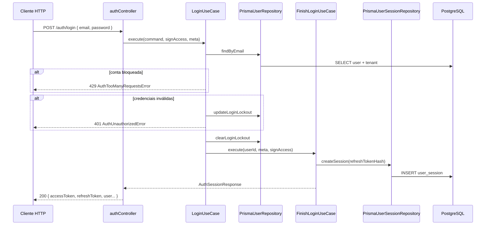
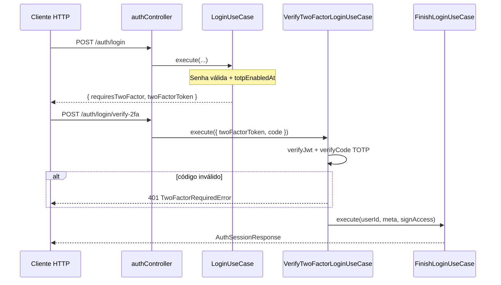
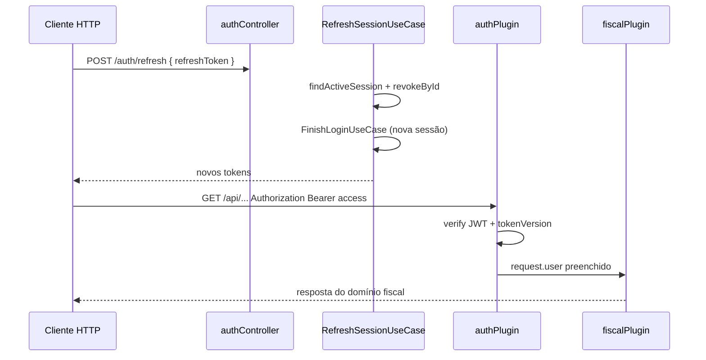
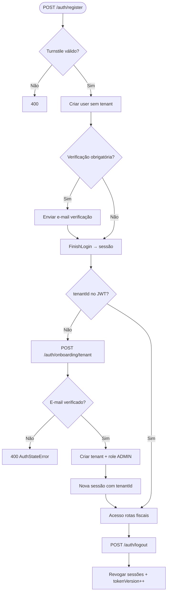

# Módulo Auth (Autenticação)

Bounded context responsável por **identidade, sessão e acesso** ao simulador fiscal: registo, login, refresh de tokens, logout, verificação de e-mail, redefinição de senha, 2FA TOTP e onboarding inicial (vínculo utilizador ↔ empresa).

---

## Visão geral

O módulo implementa autenticação **stateful** com dois tipos de credencial:

| Credencial | Formato | Uso |
|------------|---------|-----|
| **Access token** | JWT curto (`typ: "access"`) | Header `Authorization: Bearer` em rotas protegidas |
| **Refresh token** | Opaco (hash SHA-256 em `user_session`) | Renovar sessão sem re-login |

Fluxo típico de uma conta nova:

```
Registo → (opcional) Verificar e-mail → Onboarding empresa → Acesso às rotas fiscais
```

---

## Cadeia de autenticação (Auth Chain)

A “cadeia” descreve como um pedido HTTP se transforma numa sessão válida e como essa sessão é validada nas rotas protegidas:

```
Credenciais / Token
    │
    ▼  LoginUseCase ou RefreshSessionUseCase
FinishLoginUseCase
    │  gera refresh opaco + persiste user_session
    │  assina access JWT (userId, tenantId, tokenVersion)
    ▼
AuthSessionResponse
    │
    ▼  Requisições subsequentes
authPlugin (JWT verify + tokenVersion)
    │
    ▼  Rotas com tenant
tenantPlugin (exige tenantId no JWT)
```

### Regras de negócio principais

1. **Lockout progressivo** — falhas de senha ou TOTP incrementam `failedLoginAttempts`; após limite, `lockedUntil` bloqueia tentativas (`AuthTooManyRequestsError`).
2. **Timing-safe** — e-mail inexistente ainda verifica hash dummy para evitar enumeração por tempo.
3. **Rotação de refresh** — cada `POST /auth/refresh` revoga a sessão antiga e cria uma nova.
4. **Invalidação global** — logout com access token ou reset de senha incrementa `tokenVersion` e revoga todas as `user_session`.
5. **2FA TOTP** — login com 2FA ativo devolve JWT temporário `2fa_pending`; sessão completa só após código válido.
6. **Onboarding** — conta nova tem `tenantId === null`; cadastro da empresa exige JWT e (em produção) e-mail verificado.
7. **Rate limiting** — limites por rota no controller (registo, login, 2FA, etc.).

---

## Diagrama: Login sem 2FA



---

## Diagrama: Login com 2FA



---

## Diagrama: Refresh e validação em rota protegida



---

## Fluxograma: ciclo de vida da conta



---

## Entidades principais

| Entidade | Papel |
|----------|-------|
| `AuthUser` | Utilizador com credenciais, lockout, 2FA e `tokenVersion` |
| `AuthUserWithTenant` | Utilizador + resumo da empresa (`TenantSummary`) |
| `AccessTokenPayload` | Claims do JWT de acesso validado pelo `authPlugin` |
| `TwoFactorPendingPayload` | JWT temporário entre senha OK e código TOTP |
| `AuthSessionResponse` | Perfil + `accessToken` + `refreshToken` + `expiresIn` |
| `LoginResponse` | Sessão completa ou desafio `requiresTwoFactor` |

---

## Casos de uso

| Caso de uso | Descrição |
|-------------|-----------|
| `RegisterUserUseCase` | Registo de conta + sessão inicial |
| `LoginUseCase` | Login por e-mail/senha com lockout e bifurcação 2FA |
| `VerifyTwoFactorLoginUseCase` | Completa login após TOTP |
| `FinishLoginUseCase` | Cria sessão e monta resposta (núcleo da cadeia) |
| `RefreshSessionUseCase` | Renova tokens com rotação de refresh |
| `LogoutUseCase` | Revoga sessão ou todas + invalida access tokens |
| `GetCurrentUserUseCase` | Perfil para `/auth/me` |
| `RequestPasswordResetUseCase` | Envia e-mail de redefinição (resposta genérica) |
| `ResetPasswordUseCase` | Redefine senha + invalida sessões |
| `VerifyEmailUseCase` | Confirma e-mail via token |
| `SendVerificationEmailUseCase` | Gera token e envia e-mail (interno) |
| `ResendVerificationEmailUseCase` | Reenvio autenticado |
| `SetupTwoFactorUseCase` | Gera segredo TOTP e QR |
| `EnableTwoFactorUseCase` | Ativa 2FA após código válido |
| `DisableTwoFactorUseCase` | Desativa 2FA (senha + TOTP) |
| `GetTwoFactorStatusUseCase` | Consulta se 2FA está ativo |
| `InvalidateAllSessionsUseCase` | Logout forçado global |
| `AttachTenantOnboardingUseCase` | Cria empresa e vincula utilizador |

---

## Estrutura do módulo

```
auth/
├── domain/           # Entidades, erros, ports (repositórios, TOTP, e-mail)
├── application/      # Use cases + DTOs/commands
├── infrastructure/
│   ├── prisma/       # 5 repositories (user, session, reset, email, onboarding)
│   ├── external/     # bcrypt, TOTP, Resend, refresh token, lockout
│   └── factory/      # auth-module.factory (DI)
└── presentation/     # auth.controller, onboarding.controller, schemas
```

---

## Erros de domínio

| Erro | HTTP | Quando |
|------|------|--------|
| `AuthUnauthorizedError` | 401 | Credenciais inválidas, sessão expirada |
| `AuthConflictError` | 409 | E-mail já cadastrado |
| `AuthTooManyRequestsError` | 429 | Lockout por tentativas excessivas |
| `AuthStateError` | 400 | Estado inválido (2FA, onboarding) |
| `TwoFactorRequiredError` | 401 | Código TOTP inválido ou token 2FA expirado |
| `PasswordResetInvalidError` | 400 | Token de reset inválido |
| `EmailVerificationInvalidError` | 400 | Token de verificação inválido |
| `EmailDeliveryError` | 502 | Falha no envio Resend (produção) |

---

## Dependências externas

- **org** — schema `tenantCreateBody` e `TenantConflictError` no onboarding
- **lib/auth** — config JWT, Turnstile, lockout helpers
- **Resend** — envio de e-mails transacionais (adapter `resend-email.adapter`)
