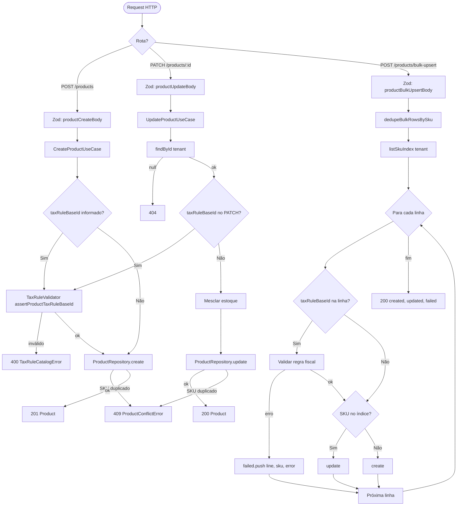

# Módulo Catalog (Catálogo)

Bounded context responsável pela **gestão de produtos** do seller: cadastro individual, atualização, listagem, exclusão e **importação em massa (bulk upsert)** a partir de planilhas ou integrações.

---

## Visão geral

Cada produto pertence a um **tenant** e é identificado de forma única pelo **SKU** dentro dessa empresa. Os dados fiscais (NCM, CEST, origem) e comerciais (preço de venda, preço de custo, estoque) alimentam os módulos **sales**, **remessas** e **tax**.

| Operação | Endpoint | Comportamento |
|----------|----------|---------------|
| Listar | `GET /products` | Todos os produtos do tenant |
| Detalhe | `GET /products/:id` | Produto por UUID |
| Criar | `POST /products` | Novo produto (SKU único) |
| Atualizar | `PATCH /products/:id` | Campos parciais |
| Excluir | `DELETE /products/:id` | Remove se sem pedidos faturados |
| Bulk upsert | `POST /products/bulk-upsert` | Create/update por SKU em lote |

---

## Gestão de produtos

### Campos principais

- **SKU** — chave natural; único por tenant; usada no bulk upsert para decidir create vs update
- **NCM / CEST / origem** — classificação fiscal brasileira
- **preco / precoCusto** — venda ao consumidor e base de custo (retorno simbólico na Sales Chain)
- **taxRuleBaseId** — vínculo opcional com regra do módulo **tax**; validado na UF do emitente
- **estoque** — quantidade informativa no catálogo (movimentação real via remessas FIFO)

### Regras de negócio

1. **SKU único** — constraint `@@unique([tenantId, sku])`; conflito → `ProductConflictError` (409)
2. **Validação fiscal** — se `taxRuleBaseId` for enviado, o módulo tax valida existência e compatibilidade com a UF
3. **Exclusão protegida** — produtos com pedidos `FATURADO` não podem ser apagados (histórico NF-e)
4. **Exclusão em cascata parcial** — ao excluir, remove também pedidos em `RASCUNHO` do produto
5. **Payload HTTP** — validado com Zod em `product.schemas.ts` (NCM 8 dígitos, CEST 7, EAN opcional)

---

## Bulk Upsert (importação em massa)

Endpoint `POST /products/bulk-upsert` recebe `{ rows: CreateProductCommand[] }`.

### Processo

1. **Validação Zod** no controller (formato de cada linha)
2. **Deduplicação por SKU** — `dedupeBulkRowsBySku`: em planilhas com linhas repetidas, a **última** ocorrência prevalece
3. **Índice SKU** — uma query carrega todos os SKUs existentes do tenant (`listSkuIndex`)
4. **Processamento linha a linha**:
   - SKU no índice → `update` (mantém ID; atualiza campos enviados)
   - SKU ausente → `create`
   - Erro numa linha → regista em `failed[]` e **continua** o lote
5. **Resposta** — `{ created, updated, failed, total }` onde `total` é o número de linhas após dedupe

### Semântica de update no bulk

- `taxRuleBaseId` só é alterado se enviado na linha (string não vazia após trim)
- `estoque` omisso trata-se como `0`
- SKUs criados no mesmo lote entram no índice em memória (upserts subsequentes no mesmo request fazem update)

---

## Fluxograma: criação/atualização de produto



---

## Entidades principais

| Entidade / tipo | Papel |
|-----------------|-------|
| `Product` | Produto persistido com dados fiscais e comerciais |
| `ProductWriteData` | DTO de escrita para create/update no repository |
| `ProductSkuIndexEntry` | Entrada do mapa SKU → id usado no bulk upsert |
| `CreateProductCommand` | Entrada dos use cases de criação e linhas do bulk |
| `BulkUpsertProductsResult` | Resultado agregado da importação em massa |

---

## Casos de uso

| Caso de uso | Descrição |
|-------------|-----------|
| `ListProductsUseCase` | Lista catálogo do tenant |
| `GetProductByIdUseCase` | Detalhe por UUID |
| `CreateProductUseCase` | Cria produto com validação fiscal opcional |
| `UpdateProductUseCase` | Atualização parcial (PATCH) |
| `DeleteProductUseCase` | Exclusão com proteção de histórico faturado |
| `BulkUpsertProductsUseCase` | Importação em massa create/update por SKU |

---

## Estrutura do módulo

```
catalog/
├── domain/
│   ├── entities/       # Product
│   ├── errors/         # ProductConflictError
│   ├── ports/          # ProductRepository, TaxRuleValidatorPort
│   └── services/       # dedupeBulkRowsBySku
├── application/
│   ├── dto/            # Commands e resultado do bulk
│   └── use-cases/      # 6 casos de uso
├── infrastructure/
│   ├── prisma/         # PrismaProductRepository
│   └── fiscal/         # TaxRuleValidatorAdapter → módulo tax
└── presentation/       # product.controller + schemas Zod
```

---

## Erros de domínio

| Erro | HTTP | Quando |
|------|------|--------|
| `ProductConflictError` | 409 | SKU duplicado, exclusão com pedidos faturados ou FK |
| `TaxRuleCatalogError` | 400 | `taxRuleBaseId` inválido ou incompatível com UF |

---

## Dependências externas

- **tax** — `assertProductTaxRuleBaseId` via `TaxRuleValidatorAdapter`
- **sales** — consome produtos em pedidos e checkout (exige `taxRuleBaseId` na emissão)
- **remessas** — movimentação de stock fiscal independente do campo `estoque` do catálogo
