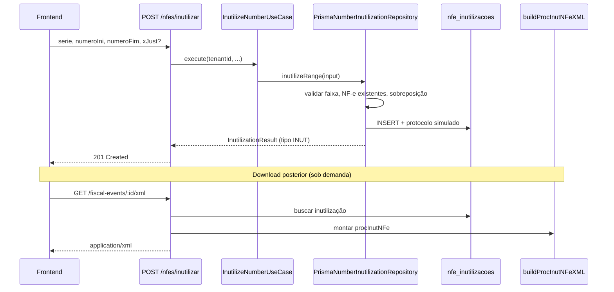

# Inutilização de numeração NF-e

Documentação do processo de **inutilização de faixa de numeração** no módulo `fiscal-documents`. Este fluxo trata números de NF-e que **nunca foram emitidos** — não confundir com **cancelamento** de nota já autorizada.

---

## Contexto fiscal (SEFAZ)

### O que é inutilização?

A inutilização é um serviço da SEFAZ para declarar oficialmente que um ou mais números de uma **série** de NF-e (modelo 55) **não serão utilizados**. Isso ocorre quando há “buracos” na sequência numérica: por exemplo, a empresa emitiu a nota 100 e depois a 105, deixando os números 101–104 sem uso.

Sem inutilizar esses números, a sequência fiscal fica irregular e pode gerar problemas em auditorias ou na continuidade da numeração.

### Inutilização × cancelamento

| Aspecto | Inutilização | Cancelamento |
|--------|--------------|--------------|
| Alvo | Números **nunca emitidos** | NF-e **já autorizada** |
| Documento | `procInutNFe` | Evento `110111` (`procEventoNFe`) |
| Altera registro de NF-e? | Não | Sim (status `CANCELADA`) |
| Justificativa (`xJust`) | Obrigatória na SEFAZ (mín. 15 caracteres) | Obrigatória (mín. 15 caracteres) |
| Resposta de sucesso típica | `cStat` **102** — Inutilização homologada | `cStat` **135/155** — Evento registrado |

### Regras gerais (produção real)

Na operação com a SEFAZ real (fora do escopo de simulação deste projeto):

1. A faixa informada (`nNFIni` … `nNFFin`) deve ser **contígua** e pertencer à mesma série e CNPJ emitente.
2. **Nenhum** dos números da faixa pode ter NF-e já autorizada.
3. A justificativa deve ter **no mínimo 15 caracteres**.
4. O pedido é assinado digitalmente e enviado ao Web Service de Inutilização da UF.
5. Em caso de sucesso, a SEFAZ devolve protocolo (`nProt`) e data de recebimento (`dhRecbto`).

Este sistema **simula** a homologação (`cStat=102`) e gera o XML `procInutNFe` com assinatura de certificado de simulação — alinhado ao padrão usado em outros artefatos fiscais do projeto (NF-e, CT-e, eventos).

---

## Visão geral no sistema



A inutilização **não cria** registro na tabela `nfes`. É um evento administrativo persistido em `nfe_inutilizacoes` e exposto na timeline/eventos fiscais com `tipo: "INUT"`.

---

## Camadas do módulo (Clean Architecture)

| Camada | Arquivo | Responsabilidade |
|--------|---------|------------------|
| **Domain — serviço XML** | `domain/services/inutilizacao-xml.ts` | Monta `procInutNFe` v4.00 e calcula o `Id` de `infInut` |
| **Domain — port** | `domain/ports/fiscal-document-lifecycle.port.ts` | Contrato `NumberInutilizationPort` e DTO `InutilizeNumberInput` |
| **Domain — entidade** | `domain/entities/lifecycle-result.entity.ts` | `InutilizationResult` |
| **Domain — erro** | `domain/errors/number-inutilization.error.ts` | `NumberInutilizationError` com HTTP status |
| **Application** | `application/use-cases/inutilize-number.use-case.ts` | Orquestra o caso de uso (delega ao port) |
| **Infrastructure** | `infrastructure/prisma/prisma-number-inutilization.repository.ts` | Validações de negócio + persistência Prisma |
| **Presentation** | `presentation/controllers/nfe-lifecycle.controller.ts` | Rota `POST /nfes/inutilizar` |
| **Presentation** | `presentation/controllers/fiscal-observability.controller.ts` | Listagem em `/fiscal-events` e XML em `/fiscal-events/:id/xml` |
| **Presentation** | `presentation/schemas/fiscal-document.schemas.ts` | Validação Zod do body |

---

## API HTTP

### Registrar inutilização

```
POST /api/nfes/inutilizar
```

**Body (JSON):**

```json
{
  "serie": 5,
  "numeroIni": 101,
  "numeroFim": 104,
  "xJust": "Numeros pulados por falha de integracao"
}
```

| Campo | Tipo | Regras |
|-------|------|--------|
| `serie` | `number` | Inteiro positivo |
| `numeroIni` | `number` | Inteiro positivo, ≤ `numeroFim` |
| `numeroFim` | `number` | Inteiro positivo, ≥ `numeroIni` |
| `xJust` | `string` | Opcional na API; se omitida ou &lt; 15 chars, usa texto padrão |

**Resposta `201`:**

```json
{
  "id": "uuid",
  "tipo": "INUT",
  "descricao": "Inutilização de numeração",
  "serie": 5,
  "numeroIni": 101,
  "numeroFim": 104,
  "xJust": "Numeros pulados por falha de integracao",
  "protocolo": "151234567890123",
  "ocorridoEm": "2026-06-16T12:00:00.000Z"
}
```

### Baixar XML (`procInutNFe`)

```
GET /api/fiscal-events/:id/xml
GET /api/fiscal-events/:id/xml?download=1
```

O `:id` é o UUID do registro em `nfe_inutilizacoes`. O XML é **gerado sob demanda** a partir dos dados persistidos (não há coluna `xml` na tabela).

### Listar eventos (inclui inutilizações)

```
GET /api/fiscal-events
```

Retorna eventos de `fiscal_events` **e** registros de `nfe_inutilizacoes`, ordenados por `ocorridoEm` decrescente. Inutilizações aparecem com `tipo: "INUT"`.

---

## Validações de negócio

Implementadas em `PrismaNumberInutilizationRepository.inutilizeRange`:

1. **Faixa válida** — `numberStart ≥ 1`, `numberEnd ≥ 1`, `numberStart ≤ numberEnd`.  
   → Erro **422** se inválida.

2. **Tenant existente** — `tenantId` deve existir.  
   → Erro **404** se não encontrado.

3. **Sem NF-e emitida na faixa** — consulta `nfes` do tenant/série com `numero` entre `numeroIni` e `numeroFim` (exclui soft-deleted).  
   → Erro **409** listando os números conflitantes.

4. **Sem sobreposição com inutilizações anteriores** — para a mesma série, nenhuma faixa já registrada pode intersectar a nova.  
   → Erro **409** citando a faixa anterior.

5. **Justificativa** — se `justification` tiver menos de 15 caracteres após trim, usa o padrão:  
   `"Numero nao utilizado dentro do prazo legal"`.

Após as validações, o sistema:

- Gera `protocolo` via `gerarProtocoloSefaz()` (15 dígitos simulados);
- Define `ocorridoEm` como `new Date()`;
- Persiste em `nfe_inutilizacoes`.

---

## Modelo de dados

Tabela Prisma: `NfeInutilizacao` → `nfe_inutilizacoes`

| Coluna | Descrição |
|--------|-----------|
| `id` | UUID do evento (usado na URL do XML) |
| `tenant_id` | Empresa emitente (RLS por tenant) |
| `serie` | Série da numeração |
| `numero_ini` / `numero_fim` | Faixa inutilizada (inclusive) |
| `x_just` | Justificativa |
| `protocolo` | Protocolo SEFAZ simulado |
| `ocorrido_em` | Data/hora do registro |
| `created_at` | Timestamp de criação no banco |

Índices: `(tenant_id)` e `(tenant_id, serie)` para checagem rápida de sobreposição.

---

## Geração do XML (`procInutNFe`)

Arquivo: `domain/services/inutilizacao-xml.ts`

### Identificador `infInut` (`Id`)

Função `infInutId(cUF, ano, cnpj, serie, nNFIni, nNFFin)`:

```
ID + cUF(2) + ano(2) + CNPJ(14) + mod(55) + serie(3) + nNFIni(9) + nNFFin(9)
```

Exemplo conceitual: `ID41262412345678000199550010000000010000000004`

- `cUF`: código IBGE da UF do emitente (`ufToCodigo`)
- `ano`: dois últimos dígitos do ano de `ocorridoEm`
- `mod`: fixo `55` (NF-e)

### Estrutura do documento

O XML montado segue o layout **procInutNFe versão 4.00**:

1. **`inutNFe` / `infInut`** — pedido de inutilização (`xServ=INUTILIZAR`, faixa, justificativa).
2. **`retInutNFe`** — retorno simulado da SEFAZ com `cStat=102` e `xMotivo=Inutilizacao de numero homologado`.
3. **Assinatura** — `injectSimulationSignature` com `INUT_SIGNATURE_CONFIG` (`fiscal-core`), assinando o grupo `infInut` dentro de `inutNFe`.

O ambiente no XML simulado usa `tpAmb=1` (produção). Em integração real, esse valor viria das configurações do emitente.

---

## Frontend

| Peça | Local |
|------|-------|
| Formulário de inutilização | `frontend/src/components/nfe-inutilizar-form.tsx` |
| Página de eventos | `frontend/src/app/(app)/eventos/page.tsx` |
| Server Action | `frontend/src/app/(app)/eventos/actions.ts` → `inutilizarNumeracao` |
| Cliente API | `frontend/src/lib/fiscal-api.ts` → `POST /api/nfes/inutilizar` |
| Listagem unificada NF-e + inutilizações | `frontend/src/lib/nfe-table-rows.ts` (`buildNfeTableRows`) |
| Download XML | `getFiscalEventXml` → `/api/fiscal-events/:id/xml` |

Na listagem de NF-e (`/nfe`), faixas inutilizadas aparecem como linhas `INUTILIZACAO` com badge de status **INUTILIZADA**, ordenadas por série e número junto às notas emitidas.

---

## Uso programático (backend)

```typescript
import { inutilizeNfeNumberRange } from "../modules/fiscal-documents/index.js";

const result = await inutilizeNfeNumberRange({
  tenantId: "...",
  series: 5,
  numberStart: 101,
  numberEnd: 104,
  justification: "Numeros nao utilizados no periodo",
});
```

Ou via factory do módulo:

```typescript
const { inutilizeNumber } = createFiscalDocumentsModule();
await inutilizeNumber.execute({ ... });
```

---

## Erros HTTP

| Status | Situação |
|--------|----------|
| **404** | Tenant não encontrado |
| **409** | NF-e já emitida na faixa, ou sobreposição com inutilização anterior |
| **422** | Faixa inválida (`numeroIni` &gt; `numeroFim` ou valores &lt; 1) |
| **400** | Body inválido (falha Zod no controller) |

Classe de erro: `NumberInutilizationError` (alias legado: `InutilizacaoError`).

---

## Limitações da simulação atual

- **Não há chamada** ao Web Service real da SEFAZ; o protocolo e o retorno `cStat=102` são simulados.
- O XML é **regerado** a cada download (não armazenado em disco/banco).
- Apenas **NF-e modelo 55** (`mod=55`) está contemplada no `Id` e no XML.
- A inutilização **não bloqueia** futura emissão no código de emissão de NF-e por si só — a consistência depende das validações na emissão e do controle de numeração do tenant. A tabela `nfe_inutilizacoes` serve como registro auditável e para exibição na UI.

---

## Referências no repositório

- Migration: `backend/prisma/migrations/20260528600000_nfe_inutilizacao/`
- Assinatura XML: `packages/fiscal-core/src/xml-signature.ts` (`INUT_SIGNATURE_CONFIG`)
- Protocolo simulado: `domain/services/sefaz-protocol.ts`
