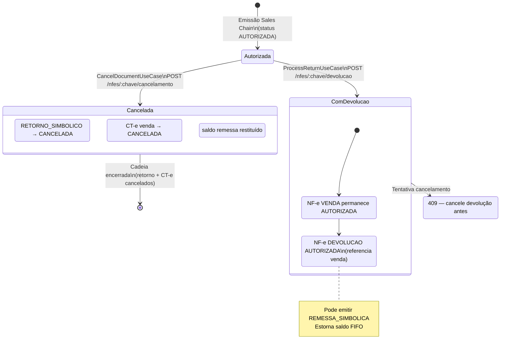
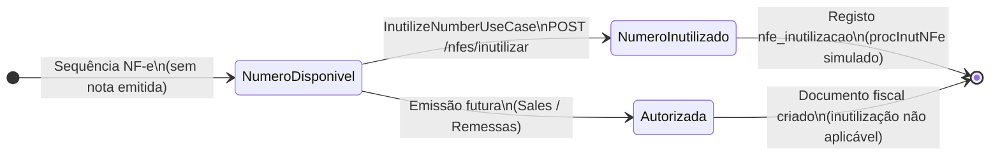
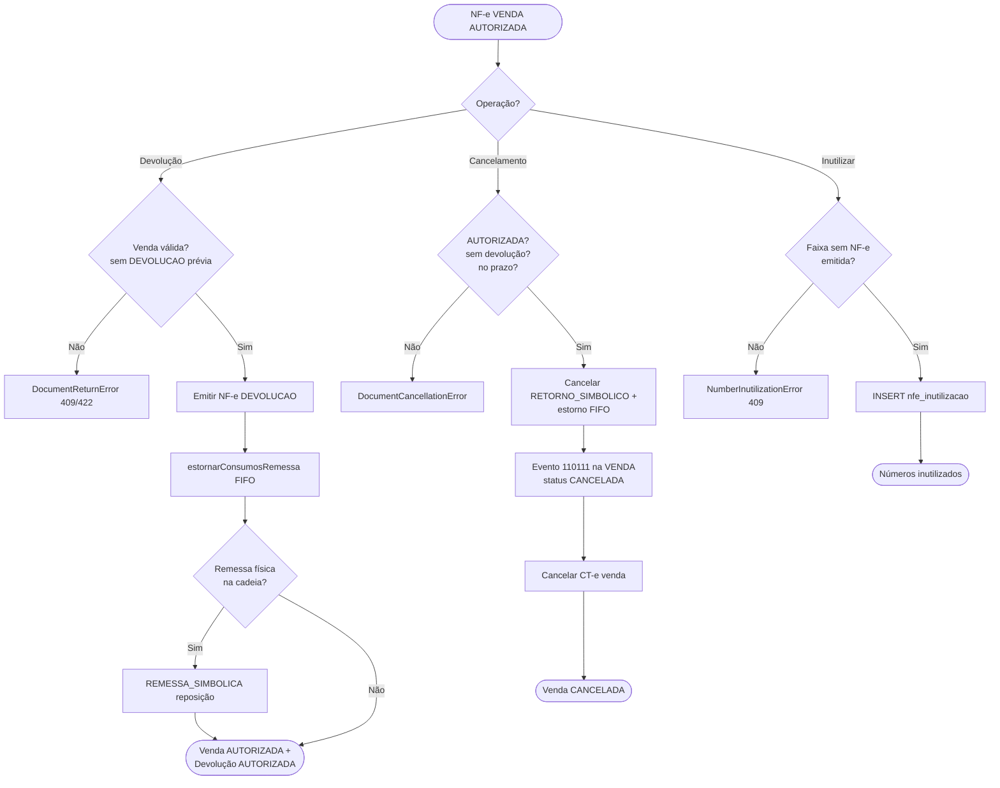

# Módulo Fiscal Documents (Documentos Fiscais)

Bounded context de **consulta** e **ciclo de vida** de NF-e e CT-e após emissão: listagem, XML, soft-delete, cancelamento, devolução, inutilização de numeração e observabilidade (timeline).

A emissão inicial (Sales Chain, remessas) vive em **sales** e **remessas**; este módulo trata o que acontece **depois** da autorização.

---

## Visão geral

| Área | Responsabilidade |
|------|------------------|
| **Consulta** | `GET /nfes`, `GET /nfes/:chave/xml`, CT-e equivalente |
| **Soft-delete** | Ocultar documento da UI (`deletedAt`) sem apagar histórico fiscal |
| **Ciclo de vida** | Cancelamento, devolução, inutilização (`nfe-lifecycle.controller`) |
| **Observabilidade** | Timeline de eventos e cadeia documental |

---

## Status fiscal (`FiscalStatus`)

Persistido em `nfe.status` e `cte.status`:

| Status | Significado |
|--------|-------------|
| `AUTORIZADA` | Documento válido após emissão simulada |
| `PENDENTE` | Em processamento (raro no simulador) |
| `REJEITADA` | Rejeitado pela SEFAZ (simulação) |
| `CANCELADA` | Evento de cancelamento registrado |
| `DENEGADA` | Uso denegado |

Tipos de NF-e relevantes: `VENDA`, `RETORNO_SIMBOLICO`, `DEVOLUCAO`, `REMESSA`, `REMESSA_SIMBOLICA`.

---

## Ciclo de vida após emissão

### Cadeia típica (Sales Chain)

```
REMESSA (física)
    → RETORNO_SIMBOLICO
        → VENDA (+ CT-e)
            → [opcional] DEVOLUÇÃO (+ REMESSA_SIMBOLICA reposição)
            → [opcional] CANCELAMENTO (encerra venda + retorno + CT-e)
```

### Operações de lifecycle

| Operação | Endpoint | Efeito principal |
|----------|----------|------------------|
| **Devolução** | `POST /nfes/:chave/devolucao` | Nova NF-e `DEVOLUCAO` (AUTORIZADA); venda permanece AUTORIZADA; estorna FIFO |
| **Cancelamento** | `POST /nfes/:chave/cancelamento` | VENDA → `CANCELADA`; cancela retorno simbólico e CT-e; estorna FIFO |
| **Inutilização** | `POST /nfes/inutilizar` | Regista faixa de números **sem NF-e**; não muda documento existente |

Regras de exclusão mútua:
- Não cancelar venda que já tem **devolução** emitida (409)
- Não devolver venda que já tem **devolução** (409)
- Só cancelar NF-e **AUTORIZADA** dentro do prazo configurado

---

## Diagrama de estados — NF-e de VENDA



---

## Diagrama — Inutilização (numeração sem documento)



A inutilização atua sobre **buracos na numeração**, não sobre NF-e já autorizadas.

---

## Fluxograma: cancelamento vs devolução



---

## Casos de uso de lifecycle

| Caso de uso | Descrição |
|-------------|-----------|
| `CancelDocumentUseCase` | Cancela venda e cadeia simbólica |
| `ProcessReturnUseCase` | Emite devolução referenciando venda |
| `InutilizeNumberUseCase` | Inutiliza faixa de numeração vazia |

### Outros use cases (consulta)

| Caso de uso | Descrição |
|-------------|-----------|
| `ListNfesUseCase` / `GetNfeByKeyUseCase` | Listagem e detalhe |
| `GetNfeXmlUseCase` | Download XML autorizado |
| `SoftDeleteNfeUseCase` | Soft-delete na UI |
| Equivalentes CT-e | `ListCtes`, `GetCteByKey`, etc. |

---

## Estrutura do módulo

```
fiscal-documents/
├── domain/
│   ├── entities/       # LifecycleResult, …
│   ├── ports/          # Cancellation, Return, Inutilization, queries
│   └── errors/         # DocumentCancellationError, …
├── application/
│   └── use-cases/      # lifecycle + consultas
├── infrastructure/
│   ├── prisma/         # Repositories de lifecycle e query
│   ├── xml/            # Persistência XML NF-e/CT-e
│   └── observability/  # Timeline
└── presentation/
    ├── controllers/    # nfe, cte, nfe-lifecycle, observability
    └── schemas/
```

---

## Erros de domínio (lifecycle)

| Erro | HTTP típico | Quando |
|------|-------------|--------|
| `DocumentCancellationError` | 404/409/422 | Cancelamento inválido |
| `DocumentReturnError` | 404/409/422 | Devolução inválida |
| `NumberInutilizationError` | 404/409/422 | Faixa inutilização inválida |

---

## Dependências

- **remessas** — `estornarConsumosRemessa`, `prepararRemessaSimbolicaFiscal`
- **tax** — resolução de regras na devolução
- **sales** — emissão inicial da cadeia (entrada deste ciclo de vida)
