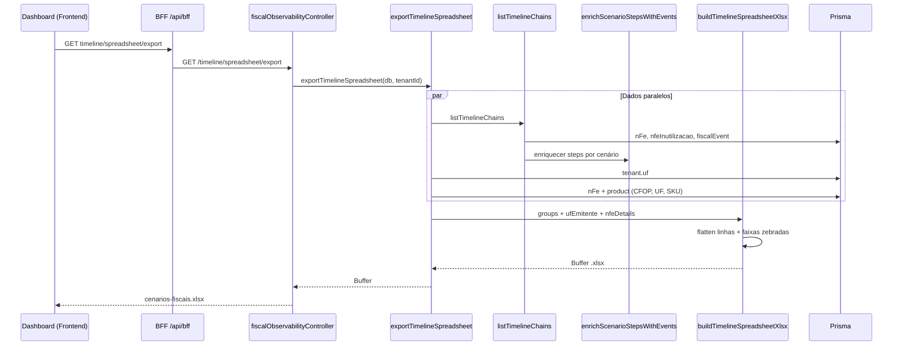
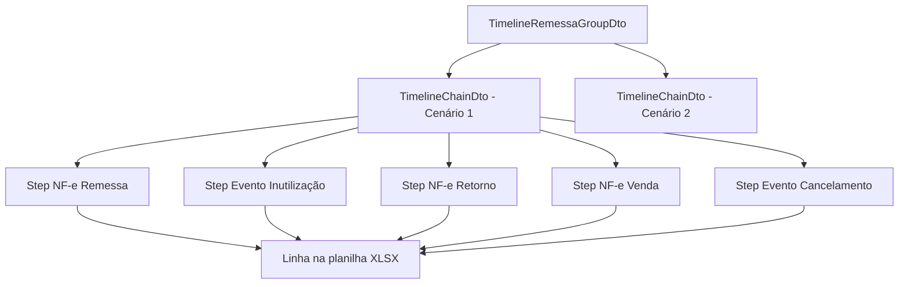

# Observabilidade Fiscal — Timeline e Planilha de Cenários

## Visão geral

Este pacote concentra a **leitura analítica** das cadeias fiscais do tenant (fulfillment Mercado Livre Full): montagem da timeline por remessa/cenário, enriquecimento com eventos SEFAZ simulados e **exportação XLSX** para organização operacional.

Responsabilidades de negócio:

- Representar cada **cenário** como cadeia `Remessa → Retorno simbólico → Venda` (com devoluções quando existirem).
- Inserir na ordem numérica **inutilizações** e **cancelamentos** relevantes ao cenário.
- Gerar planilha tabular (uma linha por passo) com dados fiscais mínimos para auditoria e conferência externa.

A geração do arquivo **nunca ocorre no frontend** — apenas download via API autenticada.

---

## Diagrama de fluxo — exportação da planilha



---

## Diagrama de domínio — estrutura da timeline



---

## DTOs principais

| Tipo | Descrição |
|------|-----------|
| `TimelineRemessaGroupDto` | Agrupa cenários pela remessa raiz (ou vendas avulsas). |
| `TimelineChainDto` | Um cenário completo derivado de uma venda. |
| `TimelineNfeStepDto` | Passo documental (`kind: "nfe"`) com chave, número, status. |
| `TimelineEventStepDto` | Passo de evento (`INUT` ou `110111` cancelamento). |
| `TimelineSpreadsheetRow` | Linha flat com colunas fixas da planilha. |
| `TimelineSpreadsheetDataRow` | Linha + `scenarioStripe` para formatação zebrada. |

Definições em `timeline-step.dto.ts`.

---

## Casos de uso

| Caso de uso | Função | Endpoint |
|-------------|--------|----------|
| Listar timeline (JSON) | `listTimelineChains` | `GET /timeline` |
| Exportar planilha de cenários | `exportTimelineSpreadsheet` | `GET /timeline/spreadsheet/export` |

---

## Colunas da planilha (`cenarios-fiscais.xlsx`)

| Coluna | Origem | Observação |
|--------|--------|------------|
| **CENÁRIO** | Índice dentro do grupo de remessa | `Cenário 1`, `Cenário 2`, … |
| **DATA** | `emitidaEm` (NF-e) ou `ocorridoEm` (evento) | Formato `pt-BR` |
| **TIPO** | Label do tipo de NF-e ou evento | Ex.: Remessa, Venda, Inutilização, Cancelamento |
| **NF-e/SÉRIE** | Número e série | Faixa `11–12/58` para inutilização |
| **CHAVE DE ACESSO** | Chave da NF-e | Vazia em inutilização; preenchida em cancelamento |
| **CHAVE REF** | `nfeReferencia` | Cadeia fiscal ascendente |
| **UF EMITENTE** | `tenant.uf` | Constante por tenant na exportação |
| **UF DEST** | `nfe.destUf` | Vazia em eventos |
| **CFOP** | `nfe.cfop` | Vazia em eventos |
| **PRODUTO** | SKU do produto | Cabeçalho ou primeiro item da NF-e |

Constante de cabeçalhos: `TIMELINE_SPREADSHEET_HEADERS` em `timeline-spreadsheet.export.ts`.

---

## Regras de negócio

### Montagem da cadeia (`timeline-service.ts`)

1. Parte de cada NF-e tipo **VENDA** do tenant.
2. Sobe referências até a remessa raiz (`nfeReferenciaId`).
3. Anexa devoluções e remessas simbólicas ligadas à venda.
4. Agrupa cenários pela remessa do primeiro passo.

### Enriquecimento com eventos (`timeline-chain-enrichment.ts`)

| Evento | Quando entra na cadeia |
|--------|------------------------|
| **Inutilização (INUT)** | Mesma série do cenário e faixa anterior ao primeiro número **ou** sobreposta ao intervalo numérico do cenário. |
| **Cancelamento (110111)** | Imediatamente após NF-e de **Venda** ou **Retorno simbólico** cancelada, se existir `fiscalEvent` tipo `110111`. |

Ordenação final: número da NF-e/faixa → desempate (inutilização anterior → NF-e → inutilização intermediária → cancelamento).

### Formatação zebrada por cenário

- Cada **cenário** recebe um `scenarioStripe` sequencial (0, 1, 2…).
- Todas as linhas (passos) do mesmo cenário compartilham a mesma faixa.
- Cores alternadas: branco (`#FFFFFF`) / cinza claro (`#F3F4F6`).
- Cabeçalho: `#E5E7EB`, negrito.

Implementado com `xlsx-js-style` em `applyScenarioStripes`.

---

## Arquivos do pacote

| Arquivo | Responsabilidade |
|---------|------------------|
| `timeline-service.ts` | Query Prisma + montagem JSON da timeline |
| `timeline-chain-enrichment.ts` | Inserção de INUT e cancelamentos na cadeia |
| `timeline-step.dto.ts` | Contratos TypeScript da timeline |
| `timeline-spreadsheet.service.ts` | Orquestração da exportação (DB → buffer) |
| `timeline-spreadsheet.export.ts` | Mapeamento de linhas + geração XLSX |
| `timeline-spreadsheet.export.test.ts` | Testes unitários de linhas e faixas |
| `timeline-chain-enrichment.test.ts` | Testes do enriquecimento |

Controller HTTP: `presentation/controllers/fiscal-observability.controller.ts`.

---

## Integração frontend

- Botão **Exportar XLSX** no Dashboard (`TimelineExportButton`).
- Download via BFF: `/api/timeline/spreadsheet/export` (prefixo `timeline/` na allowlist do BFF).
- O frontend **não** monta planilha — apenas dispara o download autenticado.

---

## Testes

```bash
cd backend
node --import tsx --test \
  src/modules/fiscal-documents/infrastructure/observability/timeline-spreadsheet.export.test.ts \
  src/modules/fiscal-documents/infrastructure/observability/timeline-chain-enrichment.test.ts
```

Cobertura principal:

- Uma linha por passo do cenário (NF-e + eventos).
- Mesmo `scenarioStripe` para todos os passos de um cenário.
- Alternância de faixa entre cenários distintos.
- Lacunas de inutilização e cancelamentos encadeados.
