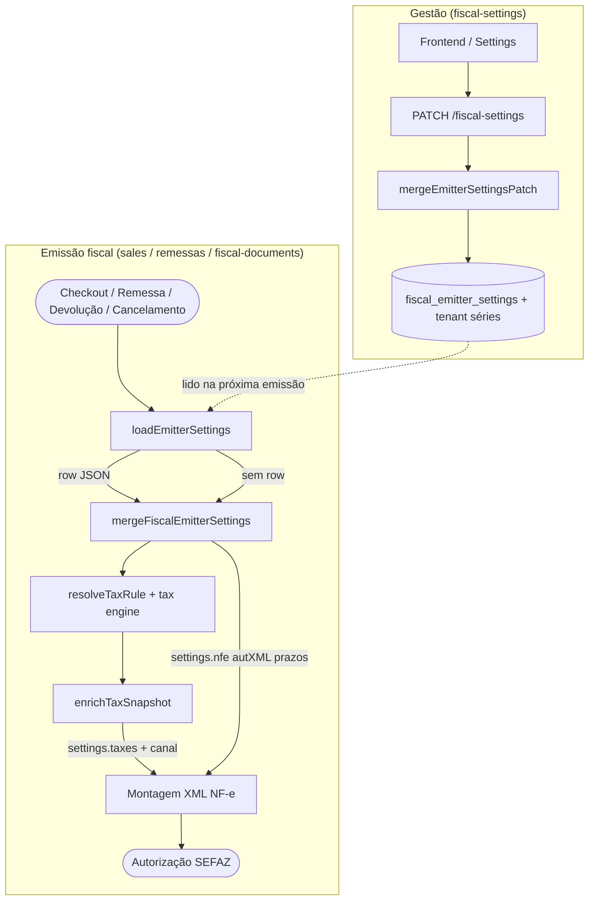

# Módulo Fiscal Settings (Configurações do Emissor)

Bounded context responsável pela **gestão das configurações de emissão fiscal** de um tenant (estilo hub Mercado Livre Full): séries, composição de base de cálculo, CST de devolução, DIFAL por UF, modalidade de frete, prazos de cancelamento e contatos `autXML`.

As mesmas configurações são **lidas em runtime** durante venda, remessa, retorno e cancelamento — não ficam só na tela de settings.

---

## Visão geral

| Responsabilidade | Onde vive |
|------------------|-----------|
| CRUD de settings (API) | `GET` / `PATCH` `/fiscal-settings` |
| Persistência JSON | Tabela `fiscal_emitter_settings.settings` |
| Séries NF-e / CT-e | Colunas `tenant.serie_remessa`, `tenant.serie_cte` |
| Defaults + validação | `lib/fiscal/fiscal-emitter-settings-defaults.ts` |
| Leitura na emissão | `lib/fiscal/fiscal-emitter-runtime.ts` → `loadEmitterSettings` |

O tipo `FiscalEmitterSettingsData` vem de `@msimulation-xml/fiscal-core` e é partilhado com o motor fiscal.

---

## Estrutura de `FiscalEmitterSettingsData`

### `basic`

- `formaFaturamento` — emissor próprio vs terceiros
- `dadosFiscaisAnunciosOk` / `dadosFiscaisAnunciosNota` — checklist de anúncios

### `taxes`

| Bloco | Efeito na emissão |
|-------|-------------------|
| `cstDevolucao` | Mapeia CST venda → CST na NF-e de devolução |
| `composicaoBaseCalculo` | Incluir/subtrair frete, desconto, ICMS, IPI na base (canais venda/remessa) |
| `calculoDifal` | Modo DIFAL por UF (`PADRAO`, `BASE_DUPLA_COM_ICMS`, …) |
| `modalidadeFrete` | `modFrete` por canal (Full, coleta, flex, turbo) |
| `emissaoGnre` | Estados com IE para GNRE |

### `nfe`

- Mensagens padrão, `acrescimoPrecoProduto`, `freteNoCalculo`
- `prazoCancelamento` — usado em cancelamentos (`fiscal-documents`)
- `contatos` — CPFs para tag `autXML` na NF-e

---

## API HTTP

| Método | Rota | Use case | Resposta |
|--------|------|----------|----------|
| GET | `/fiscal-settings` | `GetEmitterSettingsUseCase` | `EmitterSettingsView` |
| PATCH | `/fiscal-settings` | `UpdateEmitterSettingsUseCase` | `EmitterSettingsView` atualizado |

**`EmitterSettingsView`:** `tenantId`, `serieRemessa`, `serieCte`, `taxRulesCount`, `settings`.

O PATCH aceita secções parciais (`basic`, `taxes`, `nfe`) e séries. O merge profundo está em `mergeEmitterSettingsPatch` antes de `mergeFiscalEmitterSettings`.

**404** — tenant inexistente (`Empresa não encontrada`).

---

## Persistência

```text
tenant
  ├── serie_remessa, serie_cte     ← atualizados pelo PATCH (opcional)
  └── fiscal_emitter_settings (1:1)
        └── settings (JSON)      ← basic + taxes + nfe
```

Se não houver linha em `fiscal_emitter_settings`, GET e `loadEmitterSettings` devolvem `DEFAULT_FISCAL_EMITTER_SETTINGS`.

`taxRulesCount` é informativo: grupos distintos de `tax_rule.nome` (sem sufixo UF) do tenant.

---

## Consumidores na emissão fiscal

| Módulo | Função | Uso das settings |
|--------|--------|------------------|
| **sales** | `resolveSalesChainRules` | `loadEmitterSettings` → venda + retorno simbólico |
| **remessas** | `fiscal-emissor-adapter`, remessa simbólica | `loadEmitterSettings` + `enrichTaxSnapshot` |
| **fiscal-documents** | cancelamento / devolução | prazo cancelamento, CST devolução |

`enrichTaxSnapshot` (fiscal-core via `fiscal-emitter-runtime`) aplica composição de base, DIFAL, mod frete e CST conforme o canal (`venda` vs `remessa`).

---

## Fluxo: obtenção e aplicação nas Emitter Settings (`graph TD`)



**Leitura:** cada emissão chama `loadEmitterSettings(prisma, tenantId)` dentro da transação — não há cache em memória entre requests.

**Aplicação:** `settings` entram em dois momentos — (1) enriquecimento tributário (`enrichTaxSnapshot`) e (2) metadados da NF-e (`autXML`, mensagens, prazo de cancelamento).

---

## Use cases

| Classe | Descrição |
|--------|-----------|
| `GetEmitterSettingsUseCase` | Vista agregada para UI |
| `UpdateEmitterSettingsUseCase` | Patch parcial + persistência transacional |

---

## Estrutura de pastas

```text
fiscal-settings/
├── domain/
│   ├── entities/emitter-settings-view.entity.ts
│   └── ports/emitter-settings.repository.ts
├── application/
│   ├── use-cases/
│   │   ├── get-emitter-settings.use-case.ts
│   │   └── update-emitter-settings.use-case.ts
│   └── services/merge-emitter-settings-patch.service.ts
├── infrastructure/
│   ├── prisma/prisma-emitter-settings.repository.ts
│   └── factory/fiscal-settings-module.factory.ts
├── presentation/
│   ├── controllers/emitter-settings.controller.ts
│   └── schemas/emitter-settings.schemas.ts
├── index.ts
└── README.md
```

---

## Dependências

- **Inward:** `org` (tenant), `tax` (contagem de regras)
- **Outward:** `lib/fiscal/fiscal-emitter-settings-defaults`, `lib/fiscal/fiscal-emitter-runtime`
- **Consumido por:** `sales`, `remessas`, `fiscal-documents` (via `loadEmitterSettings`, não import direto do módulo)

---

## Fachada legada

`FiscalEmitterSettingsService` em `index.ts` delega para `createFiscalSettingsModule`. Preferir use cases em código novo.
