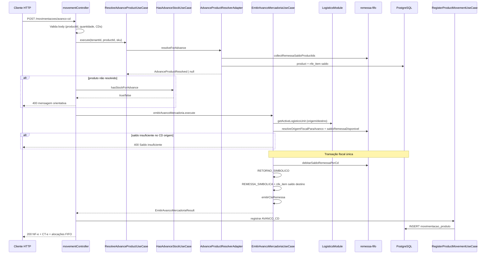

# Módulo Logistics (Logística)

Bounded context responsável por **unidades logísticas** Mercado Livre Full (centros de distribuição), **movimentações de produto** e resolução de destino fiscal para remessas e avanços entre CDs.

---

## Visão geral

No fulfillment ML Full, o stock do seller transita entre depósitos temporários (CDs) antes da venda ao consumidor. Este módulo modela:

| Conceito | Tabela / entidade | Função |
|----------|-------------------|--------|
| **Logistics Unit** | `meli_unidade_logistica` + `tenant_unidade_logistica` | CD com CNPJ, endereço e destinatário fiscal |
| **Product Movement** | `movimentacao_produto` | Rasto operacional: o quê, quanto, de qual CD para qual CD, qual NF-e |

A emissão fiscal propriamente dita (NF-e, CT-e, FIFO) vive no módulo **remessas**; logistics fornece cadastro de CDs, timeline e resolução de produto/destino.

---

## Logistics Unit (Unidade Logística)

Representa um **centro de distribuição Meli** (ex.: `BRSP01`).

```
Catálogo global ML          Vínculo por tenant
┌──────────────────────┐    ┌─────────────────────────┐
│ meli_unidade_logistica│◄───│ tenant_unidade_logistica │
│  codigo, cnpj, uf...  │    │  tenantId, padrao       │
└──────────────────────┘    └─────────────────────────┘
```

### Regras de negócio

1. **Importação** — planilha ML via `POST /unidades-logisticas/bulk-import` (ADMIN); dedupe por CNPJ
2. **CD padrão** — `PATCH /unidades-logisticas/:id/padrao` define destino default de remessa
3. **Destinatário fiscal** — derivado do endereço/CNPJ do CD para NF-e de remessa e avanço
4. **Ativa/inativa** — apenas unidades `ativa: true` participam de emissões

---

## Product Movements (Movimentações de Produto)

Cada movimentação regista um evento de stock **após** emissão fiscal bem-sucedida:

- `tipoOperacao` — ex.: remessa física, `AVANCO_CD`
- `unidadeOrigemId` / `unidadeDestinoId` — CDs envolvidos
- `nfeId` — NF-e principal (ex.: remessa simbólica no destino)
- `nfeSecundariaId` — documento complementar quando aplicável
- `observacao` — texto legível (ex.: `Avanço BRSP01 → BRRJ01`)

Consulta: `GET /movimentacoes-produto?productId=...`

---

## Avanço de Mercadoria (Advance Product)

Transferência fiscal de stock entre dois CDs **sem nova remessa física**. A cadeia emitida pelo módulo **remessas**:

```
Saldo FIFO no CD origem (remessa física anterior)
    │
    ▼  débito FIFO
RETORNO SIMBÓLICO  (saída lógica do CD origem)
    │
    ▼
REMESSA SIMBÓLICA  (entrada no CD destino — novo saldo FIFO)
    │
    ▼
CT-e de remessa
    │
    ▼
Product Movement (AVANCO_CD)
```

Endpoint: `POST /movimentacoes/avanco-cd`

---

## Diagrama: Avanço de Mercadoria entre CDs



---

## Entidades principais

| Entidade | Papel |
|----------|-------|
| `LogisticsUnit` | CD Meli com endereço, CNPJ e destinatário fiscal |
| `LogisticsUnitImportRow` | Linha de planilha para bulk import |
| `ProductMovement` | Evento operacional pós-emissão |
| `AdvanceProductResolved` | Produto + fifoProductId para avanço |

---

## Casos de uso

| Caso de uso | Descrição |
|-------------|-----------|
| `ListLogisticsUnitsUseCase` | Lista CDs com filtros |
| `GetLogisticsUnitByIdUseCase` | Detalhe de unidade |
| `BulkImportLogisticsUnitsUseCase` | Importação planilha ML |
| `SetDefaultLogisticsUnitUseCase` | Define CD padrão do tenant |
| `ResolveShipmentDestinationUseCase` | Destino fiscal para remessa |
| `GetActiveLogisticsUnitUseCase` | Unidade ativa por ID |
| `GetActiveLogisticsUnitByCodeUseCase` | Unidade ativa por código |
| `ResolveAdvanceProductUseCase` | Produto para avanço CD |
| `HasAdvanceStockUseCase` | Verifica saldo FIFO legado |
| `ListProductMovementsUseCase` | Timeline de movimentações |
| `RegisterProductMovementUseCase` | Persiste movimentação (interno) |

---

## Estrutura do módulo

```
logistics/
├── domain/
│   ├── entities/     # LogisticsUnit, ProductMovement, AdvanceProduct
│   ├── errors/       # LogisticsUnitError
│   └── ports/        # Repositories, CEP, advance resolver
├── application/      # 11 use cases
├── infrastructure/
│   ├── prisma/       # Repositories + mappers
│   └── external/     # CEP lookup, advance product resolver
└── presentation/
    ├── controllers/  # logistics-unit, movement
    ├── helpers/      # bulk-import payload
    └── schemas/      # Zod
```

---

## Erros de domínio

| Erro | HTTP | Quando |
|------|------|--------|
| `LogisticsUnitError` | 400 | CD inativo, sem padrão, destino inválido |
| `RemessaDomainError` | 400 | Saldo, origem/destino, validação fiscal (via remessas) |
| `SaldoRemessaInsuficienteError` | 400/422 | FIFO insuficiente no CD origem |

---

## Dependências

- **lookup** — enriquecimento CEP no bulk import
- **remessas** — emissão fiscal (remessa inicial, avanço CD, FIFO)
- **catalog** — produto deve existir com regra fiscal para avanço bem-sucedido
