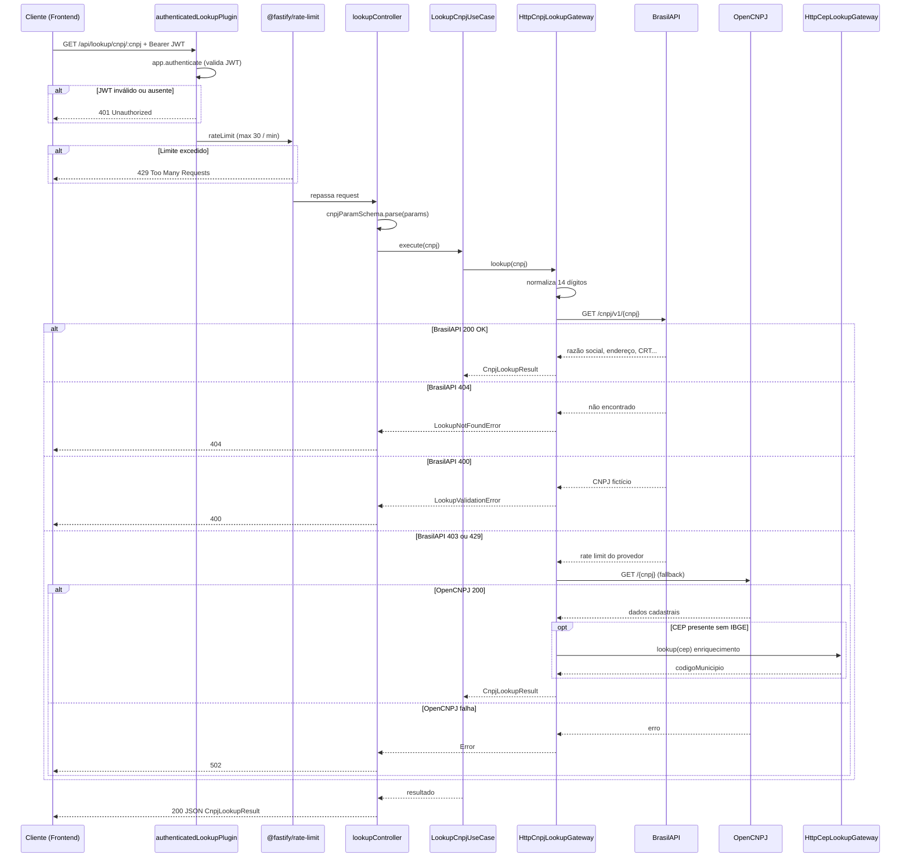

# Módulo Lookup (Consultas Externas)

Bounded context responsável por **consultas a APIs públicas brasileiras** de **CEP** e **CNPJ**, usadas principalmente no **onboarding** e em cadastros para pré-preencher endereço e dados da empresa sem digitação manual.

O módulo atua como **proxy controlado**: exige autenticação JWT, limita taxa de requisições e encapsula fallback entre provedores externos.

---

## Visão geral

| Consulta | Rotas | Fontes externas |
|----------|-------|-----------------|
| **CNPJ** | `GET /api/lookup/cnpj/:cnpj` | BrasilAPI → OpenCNPJ (fallback) |
| **CEP** | `GET /api/lookup/cep/:cep` | BrasilAPI → ViaCEP (só IBGE) |

**Autenticação:** plugin `authenticatedLookupPlugin` — JWT obrigatório, **sem** contexto de tenant (adequado ao onboarding antes da empresa existir).

**Rate limiting:** `@fastify/rate-limit` — máximo **30 requisições por minuto** por rota (`lookupRouteRateLimit`), protegendo o backend e reduzindo abuso das APIs públicas.

---

## Propósito de negócio

### Consulta CEP

Preenche logradouro, bairro, município, UF e **código IBGE** (7 dígitos) a partir de um CEP válido. Essencial para endereços fiscais corretos na NF-e.

### Consulta CNPJ

Preenche razão social, nome fantasia, endereço, telefone e **CRT** inferido:

- `crt = 1` — optante Simples Nacional ou MEI
- `crt = 3` — demais regimes

Reduz erros de digitação no cadastro do emitente e acelera o fluxo de onboarding.

---

## Entidades de resposta

### `CepLookupResult`

| Campo | Descrição |
|-------|-----------|
| `cep` | 8 dígitos normalizados |
| `logradouro`, `bairro`, `municipio`, `uf` | Endereço |
| `codigoMunicipio` | IBGE (opcional; ViaCEP como fallback) |

### `CnpjLookupResult`

Dados cadastrais completos + `crt` + `telefone` opcional. `numero` default `"SN"` quando ausente na fonte.

---

## Erros de domínio

| Erro | HTTP | Quando |
|------|------|--------|
| `LookupValidationError` | 400 | CEP/CNPJ com tamanho inválido; CNPJ fictício (BrasilAPI 400) |
| `LookupNotFoundError` | 404 | Registro inexistente nas bases consultadas |
| `ZodError` (params) | 400 | Parâmetro de rota fora do schema |
| Erro genérico | 502 | Provedor externo indisponível após fallbacks |

---

## Casos de uso

| Classe | Descrição |
|--------|-----------|
| `LookupCepUseCase` | Orquestra consulta CEP via port `CepLookupPort` |
| `LookupCnpjUseCase` | Orquestra consulta CNPJ via port `CnpjLookupPort` |

---

## Gateways (adapters HTTP)

| Classe | Port | Comportamento |
|--------|------|---------------|
| `HttpCepLookupGateway` | `CepLookupPort` | BrasilAPI v2; ViaCEP opcional para IBGE |
| `HttpCnpjLookupGateway` | `CnpjLookupPort` | BrasilAPI v1; fallback OpenCNPJ em 403/429; enriquecimento CEP |

Ambos enviam `User-Agent: msimulation-xml/1.0 (fiscal-simulator)` para identificação nas APIs públicas.

---

## Consumo interno

Outros módulos podem usar as funções de fachada sem passar pelo HTTP:

```ts
import { lookupCep } from "../lookup/index.js";
```

Exemplo: `logistics/infrastructure/external/cep-lookup.adapter.ts` reutiliza `lookupCep` para enriquecer endereços logísticos.

---

## Fluxo de consulta externa (`sequenceDiagram`)

Exemplo: **consulta CNPJ** com autenticação, rate limit, fallback de gateway e resposta HTTP.



**CEP** segue o mesmo esqueleto até o use case; o gateway chama BrasilAPI `/cep/v2` e, se faltar IBGE, ViaCEP em chamada secundária silenciosa.

---

## Estrutura de pastas

```text
lookup/
├── domain/
│   ├── entities/
│   │   ├── cep-lookup-result.entity.ts
│   │   └── cnpj-lookup-result.entity.ts
│   ├── errors/
│   │   ├── lookup-not-found.error.ts
│   │   └── lookup-validation.error.ts
│   └── ports/
│       ├── cep-lookup.port.ts
│       └── cnpj-lookup.port.ts
├── application/use-cases/
│   ├── lookup-cep.use-case.ts
│   └── lookup-cnpj.use-case.ts
├── infrastructure/
│   ├── external/
│   │   ├── http-cep-lookup.gateway.ts
│   │   └── http-cnpj-lookup.gateway.ts
│   └── factory/lookup-module.factory.ts
├── presentation/
│   ├── controllers/lookup.controller.ts
│   └── schemas/lookup.schemas.ts
├── index.ts
└── README.md
```

---

## Segurança e limites

| Mecanismo | Onde | Objetivo |
|-----------|------|----------|
| **JWT** | `authenticatedLookupPlugin` | Só utilizadores autenticados consultam (evita API pública aberta) |
| **Rate limit 30/min** | `lookupRateLimitPlugin` + `lookupRouteRateLimit` | Anti-abuso e proteção das quotas das APIs externas |
| **Validação Zod** | `cepParamSchema`, `cnpjParamSchema` | Parâmetros malformados rejeitados antes do fetch |
| **Fallback CNPJ** | `HttpCnpjLookupGateway` | Resiliência quando BrasilAPI retorna 403/429 |
| **Sem tenant** | Plugin isolado de `protected-api` | Onboarding sem empresa criada ainda |

Configuração do rate limit: `lib/lookup/lookup-rate-limit.ts`.
