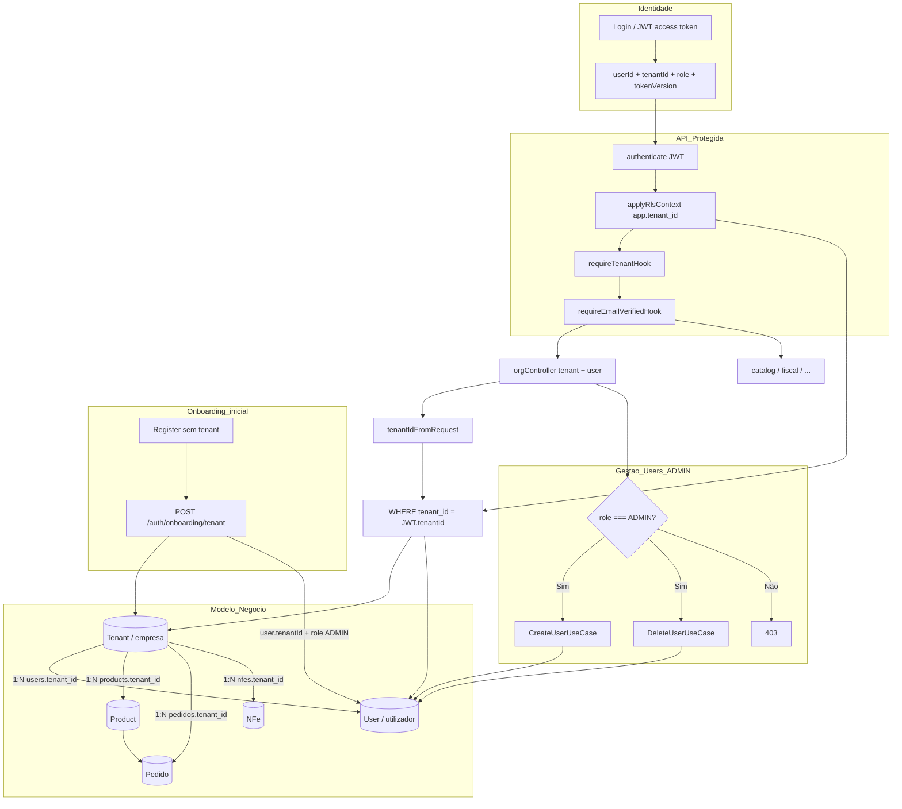

# Módulo Org (Organização)

Bounded context responsável pela **gestão organizacional**: empresas emitentes (**tenants**) e **utilizadores** vinculados a cada empresa. Define quem opera o simulador fiscal e em nome de qual CNPJ os documentos são emitidos.

---

## Visão geral

O modelo segue **multi-tenancy**: cada registo de negócio (produto, pedido, NF-e, remessa) carrega `tenantId`. O utilizador autentica-se globalmente (e-mail único), mas opera **dentro** de um tenant após o onboarding.

| Recurso | Endpoint base | Quem acede |
|---------|---------------|------------|
| Empresa (tenant) | `/tenants` | Qualquer membro do tenant |
| Utilizadores | `/users` | Leitura: todos; escrita: **ADMIN** |

---

## Relação Tenant ↔ User

```
┌─────────────────┐         1:N          ┌─────────────────┐
│     Tenant      │◄───────────────────────│      User       │
│  (empresa/CNPJ) │                        │  (conta login)  │
└────────┬────────┘                        └────────┬────────┘
         │                                            │
         │ 1:N                                        │ role: ADMIN | MEMBER
         ▼                                            │
   Product, Pedido, NFe, Remessa...                  │
   (todos com tenant_id)                             │
```

### Ciclo de vida

1. **Registo** (`auth`) — `User` criado com `tenantId = null`
2. **Onboarding** (`auth/onboarding/tenant`) — cria `Tenant` e associa o utilizador como **ADMIN**
3. **Convite de equipa** (`POST /users`) — ADMIN cria novos `User` com `tenantId` fixo e role **MEMBER**
4. **JWT de acesso** — inclui `userId`, `tenantId`, `role` e `tokenVersion`

### Papéis

| Role | Permissões Org |
|------|----------------|
| `ADMIN` | Criar, editar e excluir utilizadores; fundador do onboarding |
| `MEMBER` | Listar empresa e colegas; sem gestão de utilizadores |

---

## Isolamento e segurança (Row Level Security)

A identificação do tenant é **crucial** em três camadas complementares:

1. **JWT** — `tenantId` assinado no access token; `tenantIdFromRequest()` é a única fonte confiável nos controllers
2. **Hooks** — `requireTenantHook` bloqueia rotas de negócio sem empresa; `requireAdminHook` restringe CRUD de utilizadores
3. **PostgreSQL RLS** — `applyRlsContext` define `app.tenant_id` na sessão DB; políticas RLS filtram linhas por tenant
4. **Queries explícitas** — repositories usam `where: { tenantId }` como defesa em profundidade

Tentar aceder a `:id` de outro tenant (ex.: `GET /tenants/outro-uuid`) devolve **404**, não 403 — evita revelar existência de recursos alheios.

---

## Fluxograma: modelo relacional e isolamento



---

## Entidades principais

| Entidade | Papel |
|----------|-------|
| `Tenant` | Empresa emitente: CNPJ, endereço, IE, CRT, ambiente SEFAZ |
| `OrgUser` | Vista segura do utilizador para gestão de equipa (sem credenciais) |
| `OrgUserRole` | `ADMIN` ou `MEMBER` |

---

## Casos de uso

| Caso de uso | Descrição |
|-------------|-----------|
| `CreateTenantUseCase` | Cria empresa (onboarding / uso interno) |
| `ListTenantsUseCase` | Lista todos os tenants (interno) |
| `GetTenantByIdUseCase` | Detalhe da empresa |
| `UpdateTenantUseCase` | Atualiza cadastro do emitente |
| `DeleteTenantUseCase` | Remove tenant (não exposto na API) |
| `CreateUserUseCase` | Convida utilizador MEMBER |
| `ListUsersByTenantUseCase` | Lista equipa do tenant |
| `GetUserByIdUseCase` | Detalhe com filtro tenant |
| `UpdateUserUseCase` | Atualiza dados/senha de membro |
| `DeleteUserUseCase` | Remove membro (com proteções) |

---

## Estrutura do módulo

```
org/
├── domain/
│   ├── entities/     # Tenant, OrgUser
│   ├── errors/       # TenantConflict, UserConflict, UserForbidden
│   └── ports/        # TenantRepository, OrgUserRepository
├── application/
│   ├── dto/          # Commands create/update
│   └── use-cases/    # 10 casos de uso
├── infrastructure/
│   ├── prisma/       # Repositories + mappers
│   └── factory/      # org-module.factory
└── presentation/
    ├── controllers/  # tenant.controller, user.controller
    └── schemas/      # Zod (tenantCreateBody exportado para auth)
```

---

## Erros de domínio

| Erro | HTTP | Quando |
|------|------|--------|
| `TenantConflictError` | 409 | CNPJ duplicado |
| `UserConflictError` | 409 | E-mail já cadastrado |
| `UserForbiddenError` | 403 | Auto-exclusão ou último utilizador |

---

## Dependências e consumidores

- **auth** — onboarding usa `tenantCreateBody` e `CreateTenantUseCase` / `PrismaOnboardingRepository`
- **protected-api** — regista `orgContextPlugin` após JWT + RLS + `requireTenantHook`
- **catalog, sales, fiscal-*** — todos filtram dados por `tenantId` do contexto autenticado
