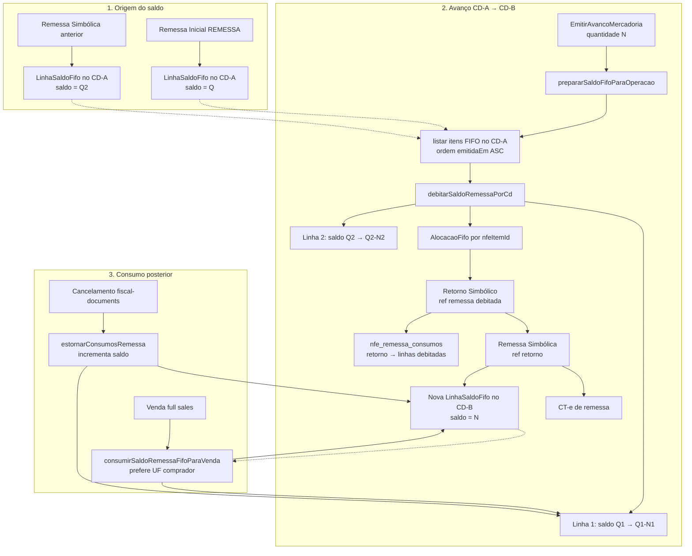

# Módulo Remessas (NF-e de Remessa + FIFO)

Bounded context **DDD purista** responsável pela emissão de **NF-e de remessa** (física e simbólica), **controle FIFO de saldo** por linha de item (`nfe_itens`), **avanço de mercadoria** entre CDs fulfillment e **CT-e** associado ao avanço.

É o núcleo logístico-fiscal do simulador ML Full: **sales** e **fiscal-documents** consomem ou estornam saldo delegando a este módulo.

---

## Visão geral

| Responsabilidade | Onde vive |
|------------------|-----------|
| Remessa inicial (seller → CD) | `EmitirRemessaInicialUseCase` + `remessa-service` |
| Avanço entre CDs | `EmitirAvancoMercadoriaUseCase` |
| Saldo FIFO | `LinhaSaldoFifo`, `remessa-fifo.ts`, `TransferidorSaldoFifo` |
| Cadeia fiscal | `cadeia-fiscal.ts`, `ValidadorCadeiaFiscal` |
| Emissão XML/tributos | `FiscalEmissorAdapter`, `fiscal-core` |

**Camadas:**

```text
domain/       → entidades, VOs, erros, ports, domain services (sem Prisma)
application/  → use cases (orquestração)
infrastructure/ → adapters Prisma, FIFO legado, emissores fiscais
presentation/ → mappers HTTP
```

---

## Regras de negócio — emissão de remessas

### Remessa inicial (`REMESSA`)

- Primeira NF-e da cadeia: envio **físico** do estoque do seller ao **CD padrão** do tenant.
- **Sem referência fiscal** ascendente (`referencia = null`).
- Ao autorizar, cria `nfe_itens` com `saldo_disponivel = quantidade` — origem do estoque FIFO no CD destino.
- Exige ao menos um produto e CD destino (padrão ou informado).

### Avanço de mercadoria (entre CDs)

Cadeia fiscal em **três passos** dentro de uma transação:

```text
[Remessa FIFO debitada] → Retorno Simbólico → Remessa Simbólica (+ CT-e)
```

1. **Débito FIFO** no CD origem (linhas mais antigas primeiro).
2. **Retorno simbólico** (`RETORNO_SIMBOLICO`) referencia a remessa debitada; registra `nfe_remessa_consumos`.
3. **Remessa simbólica** (`REMESSA_SIMBOLICA`) referencia o retorno; **cria nova linha FIFO** no CD destino com o saldo transferido.
4. **CT-e de remessa** vinculado à remessa simbólica.

Origem e destino devem ser CDs **diferentes** e **ativos**. Quantidade mínima: 1.

### Tipos que geram saldo FIFO

Apenas notas com tipo `REMESSA` ou `REMESSA_SIMBOLICA` e `saldo_disponivel > 0` entram no pool FIFO. Retornos simbólicos **consomem** saldo; não geram saldo novo (exceto indiretamente via remessa simbólica seguinte).

### Venda full (módulo sales)

- `previewRemessaPrincipalFifoParaVenda` — simula débito preferindo CDs na **UF do comprador**.
- `consumirSaldoRemessaFifoParaVenda` — debita FIFO e vincula ao retorno simbólico da venda.
- Saldo insuficiente → `SaldoRemessaInsuficienteError`.

### Cancelamento / estorno

- `estornarConsumosRemessa` — incrementa `saldo_disponivel` e remove vínculos de consumo pelo `retornoNfeId`.

---

## Regras de negócio — estoque FIFO

### LinhaSaldoFifo

Cada **linha** = um registro `nfe_itens` de uma NF-e de remessa com saldo remanescente.

| Campo | Significado |
|-------|-------------|
| `remessaNfeId` | NF-e que originou o saldo |
| `unidadeDestinoId` | CD onde o saldo está disponível |
| `saldoDisponivel` | Unidades ainda não consumidas |
| `emitidaEm` | Ordem FIFO (mais antiga debitada primeiro) |

### Alocação FIFO

O domain service `TransferidorSaldoFifo` calcula alocações **em memória** (sem I/O). A infraestrutura persiste via `debitarItensFifo` / `EstoqueFifoRepository`.

Critérios de débito:

- Apenas linhas com `saldoDisponivel > 0`
- Filtro opcional por `unidadeDestinoId` (avanço debita só no CD origem)
- Ordenação por `emitidaEm` ascendente
- Venda: preferência por UF do destinatário antes do FIFO global

### Rastreabilidade

`nfe_remessa_consumos` liga `retornoNfeId` → `nfeItemId` + quantidade, permitindo auditoria e estorno.

### Manutenção de saldo

Antes de listar ou debitar, `prepararSaldoFifoParaOperacao`:

- Realinha `product_id` por SKU (reimportação de catálogo)
- Recria `nfe_itens` faltantes em notas antigas
- Reconcilia `saldo_disponivel` com soma de consumos

---

## Entidades de domínio

| Entidade / VO | Papel |
|---------------|-------|
| `NotaFiscal` | NF-e remessa/retorno com referência fiscal |
| `LinhaSaldoFifo` | Unidade de saldo consumível |
| `AlocacaoFifo` | Quanto foi debitado de cada linha |
| `ReferenciaFiscal` | Vínculo filha → pai (id, chave, tipo) |
| `TipoNota` | `REMESSA`, `RETORNO_SIMBOLICO`, `REMESSA_SIMBOLICA` |
| `QuantidadeSaldo` | Inteiro ≥ 0 (branded type) |

---

## Ports (contratos de saída)

| Port | Implementação |
|------|---------------|
| `EstoqueFifoRepository` | `PrismaEstoqueFifoRepository` |
| `NotaFiscalRepository` | `PrismaNotaFiscalRepository` |
| `EmissorNotaPort` | `FiscalEmissorAdapter` |
| `UnidadeLogisticaPort` | `UnidadeLogisticaAdapter` → logistics |
| `MovimentacaoLogisticaPort` | `MovimentacaoLogisticaAdapter` → logistics |

---

## Casos de uso

| Use case | Descrição |
|----------|-----------|
| `EmitirRemessaInicialUseCase` | Remessa física ao CD padrão |
| `EmitirAvancoMercadoriaUseCase` | Cadeia retorno + remessa simbólica + CT-e |

---

## Fluxo FIFO no avanço de mercadoria (`graph TD`)



**Transferência:** o saldo **sai** das linhas do CD origem (débito) e **reaparece** como nova linha na remessa simbólica no CD destino — sem nova remessa física.

**Consumo:** vendas e retornos debitam linhas existentes; cancelamentos revertem via `nfe_remessa_consumos`.

---

## Erros de domínio

| Erro | Quando |
|------|--------|
| `RemessaDomainError` | Regra de negócio genérica (CD inválido, quantidade, etc.) |
| `CadeiaFiscalInvalidaError` | Referência filha/pai incompatível |
| `SaldoFifoInsuficienteError` | Domínio puro — alocação excede saldo |
| `SaldoRemessaInsuficienteError` | Infra FIFO — débito persistido impossível |

---

## Estrutura de pastas

```text
remessas/
├── domain/
│   ├── entities/       nota-fiscal, linha-saldo-fifo, cadeia-fiscal
│   ├── value-objects/  tipo-nota, referencia-fiscal, quantidade-saldo
│   ├── services/       transferidor-saldo-fifo, validador-cadeia-fiscal
│   ├── ports/          estoque, nota, emissor, unidade, movimentação
│   └── errors.ts
├── application/
│   ├── use-cases/      emitir-remessa-inicial, emitir-avanco-mercadoria
│   └── dto/
├── infrastructure/
│   ├── fifo/           remessa-fifo (legado central do FIFO)
│   ├── fiscal/         emissores, CT-e, adapters
│   ├── prisma/         repositories
│   └── factory/
├── presentation/
├── index.ts
└── README.md
```

---

## Dependências entre módulos

| Direção | Módulo | Uso |
|---------|--------|-----|
| Consome | **tax** | Regras e cálculo tributário |
| Consome | **fiscal-settings** | Emitter settings na emissão |
| Consome | **logistics** | CDs e movimentações |
| Exporta FIFO | **sales** | Preview/consumo na venda full |
| Exporta estorno | **fiscal-documents** | Cancelamento com reversão FIFO |

---

## Exports públicos

O `index.ts` reexporta use cases, erros, FIFO (`saldoRemessaDisponivel`, `debitarSaldoRemessaPorCd`, …) e serviços legados (`emitirNFeRemessa`) para compatibilidade incremental com código pré-DDD.
