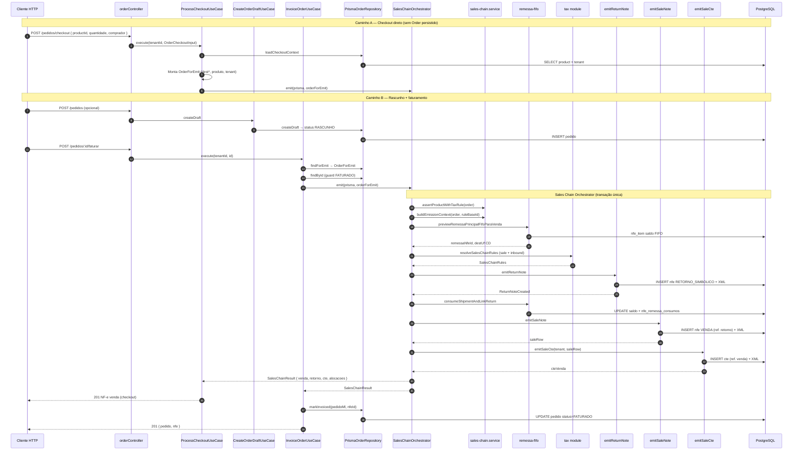
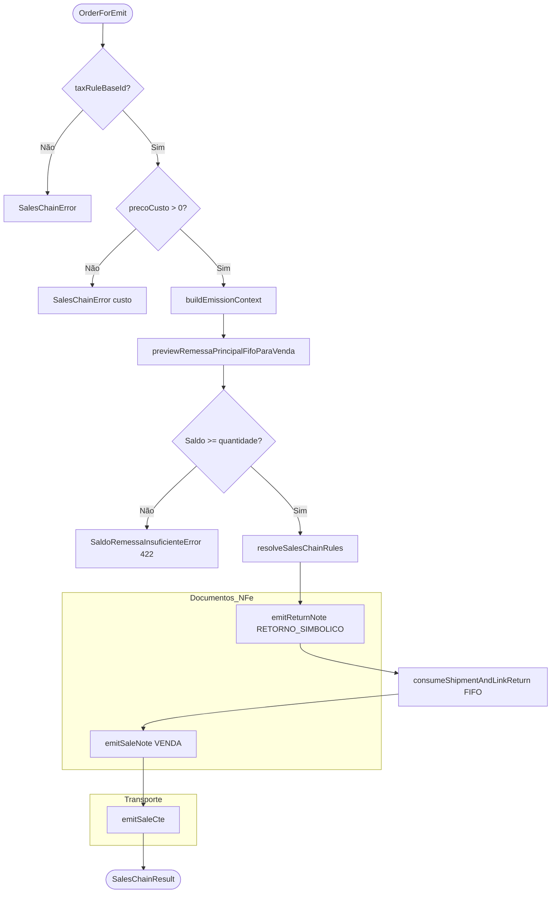

# Módulo Sales (Vendas e Pedidos)

Bounded context de **pedidos de venda** no simulador fiscal ML Full. Gere rascunhos comerciais (`Order`), checkout direto e a **Cadeia de Vendas** — orquestração fiscal que transforma uma venda ao consumidor em NF-e e CT-e encadeados.

---

## Visão geral: dois caminhos, um orquestrador

| Caminho | HTTP | Persiste `pedido`? | Emissão fiscal |
|---------|------|-------------------|----------------|
| **Checkout direto** | `POST /pedidos/checkout` | Não | `ProcessCheckoutUseCase` → `SalesChainOrchestrator` |
| **Rascunho + faturar** | `POST /pedidos` → `POST /pedidos/:id/faturar` | Sim (`RASCUNHO` → `FATURADO`) | `InvoiceOrderUseCase` → `SalesChainOrchestrator` |

Em ambos os casos o núcleo fiscal é o mesmo: **`SalesChainOrchestrator`** recebe um `OrderForEmit` (snapshot) e não distingue se veio de checkout ou de pedido persistido.

---

## Cadeia de Vendas (Sales Chain Orchestrator)

No ML Full, o stock vendido ao consumidor estava em depósito temporário (remessa física prévia). A venda exige documentos **encadeados**:

```
REMESSA FÍSICA (já emitida, saldo em nfe_item)
        │
        ▼  preview + consumo FIFO
RETORNO SIMBÓLICO  ──referencia──► remessa principal
        │
        ▼  referencia retorno
NF-e VENDA  ──destinatário──► comprador final (CPF/endereço)
        │
        ▼  referencia venda
CT-e DE VENDA  ──transporte──► CD → consumidor
```

### Responsabilidades do orquestrador

| Etapa | Componente | O que faz |
|-------|------------|-----------|
| Validação | `assertProductWithTaxRule` | Exige `taxRuleBaseId` no produto |
| Contexto | `buildEmissionContext` | Totais venda/custo, `pedidoMl`, série |
| FIFO | `previewRemessaPrincipalFifoParaVenda` | Escolhe remessa mais antiga com saldo |
| Regras | `resolveSalesChainRules` | CFOP venda + inbound (módulo **tax**) |
| Doc 1 | `emitReturnNote` | NF-e `RETORNO_SIMBOLICO` |
| FIFO | `consumeShipmentAndLinkReturn` | Debita saldo; liga retorno ↔ remessa |
| Doc 2 | `emitSaleNote` | NF-e `VENDA` ao comprador |
| Doc 3 | `emitSaleCte` | CT-e referenciando a venda |

Tudo corre em **`prisma.$transaction`** com `FISCAL_TRANSACTION_OPTIONS` — falha em qualquer etapa reverte a cadeia inteira.

### Regras de negócio

1. **Regra fiscal obrigatória** — sem `taxRuleBaseId` → `SalesChainError`
2. **Preço de custo > 0** — base do retorno simbólico; venda usa `preco` de tabela
3. **FIFO** — saldo insuficiente → `SaldoRemessaInsuficienteError` (422)
4. **Pedido faturado** — `FATURADO` bloqueia edição (`OrderLockedError`)
5. **Checkout** — não cria `pedido`; devolve só DTO da NF-e venda
6. **Faturar** — após cadeia, `markInvoiced` grava `pedidoMl`, `nfeId`, status `FATURADO`

---

## Diagrama detalhado: Checkout → Order → NF-e + CT-e



---

## Fluxograma da cadeia fiscal (orquestrador)



---

## Entidades principais

| Entidade | Papel na cadeia |
|----------|-----------------|
| `OrderCheckoutInput` | Entrada HTTP: produto, quantidade, `Buyer` |
| `Buyer` | Comprador final (destinatário NF-e VENDA) |
| `Order` | Pedido persistido; `RASCUNHO` ou `FATURADO` |
| `OrderForEmit` | Snapshot para o orquestrador (com ou sem `pedido` prévio) |
| `EmissionContext` | Totais, `pedidoMl`, série — calculados uma vez |
| `SalesChainResult` | Saída: venda, retorno, CT-e, alocações FIFO |

---

## Casos de uso

| Caso de uso | Descrição |
|-------------|-----------|
| `ProcessCheckoutUseCase` | Checkout → `OrderForEmit` → cadeia; retorna NF-e venda |
| `InvoiceOrderUseCase` | Pedido rascunho → cadeia → `markInvoiced` |
| `EmitSalesChainUseCase` | Delegação fina ao port (fachadas internas) |
| `CreateOrderDraftUseCase` | `INSERT pedido` RASCUNHO (sem emissão) |
| `UpdateOrderDraftUseCase` | Edita rascunho |
| `ListOrdersUseCase` / `GetOrderByIdUseCase` | Consultas |
| `RemoveOrderUseCase` | Remove pedido |

---

## `domain/services/sales-chain.service.ts`

Funções puras de domínio usadas pelo orquestrador e pelos emissores:

| Função | Responsabilidade |
|--------|------------------|
| `assertProductWithTaxRule` | Gate de entrada da cadeia |
| `buildEmissionContext` | Valores e identificadores da emissão |
| `saleDestinationAddress` | Normaliza destinatário da VENDA |
| `requireTaxRule` | Valida resolução do módulo tax |
| `resolveCustomerType` | Contribuinte vs consumidor final |
| `inferIcmsRateForSale` | Fallback ICMS intra/interestadual |

---

## Estrutura do módulo

```
sales/
├── domain/
│   ├── entities/       # Order, OrderForEmit, Buyer, EmissionContext
│   ├── services/       # sales-chain.service (regras puras)
│   ├── ports/          # OrderRepository, SalesChainPort
│   └── errors/
├── application/
│   ├── use-cases/      # checkout, invoice, CRUD pedido
│   └── dto/            # SalesChainResult, SalesChainRules
├── infrastructure/
│   ├── fiscal/         # SalesChainOrchestrator + emissores
│   └── prisma/         # PrismaOrderRepository
└── presentation/       # order.controller + schemas Zod
```

---

## Erros de domínio

| Erro | HTTP | Quando |
|------|------|--------|
| `CheckoutError` | 400 | Produto inválido / outro tenant |
| `OrderLockedError` | 409 | Pedido já `FATURADO` |
| `SalesChainError` | 400 | Regra fiscal, custo, validação da cadeia |
| `SaldoRemessaInsuficienteError` | 422 | FIFO sem saldo (`disponivel`, `solicitado`) |

---

## Dependências externas

- **tax** — resolução de regras e cálculo inbound/sale
- **remessas** — FIFO preview/consumo de remessa física
- **fiscal-documents** — persistência de XML NF-e/CT-e
- **catalog** — produto com NCM, custo, `taxRuleBaseId`
