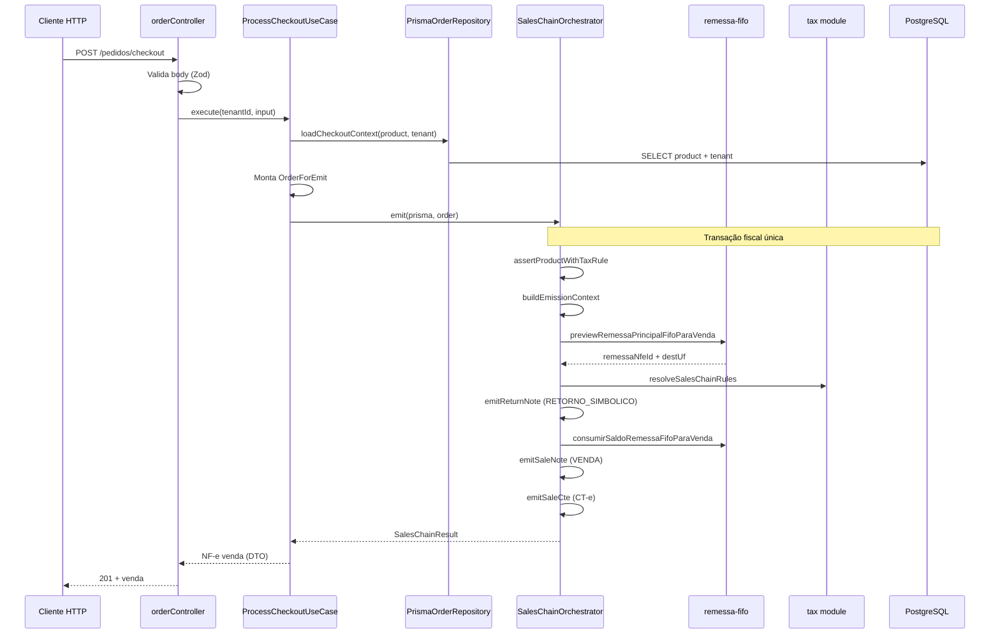
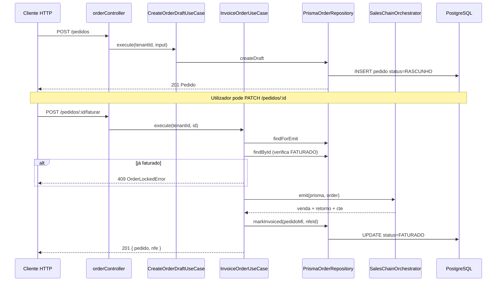
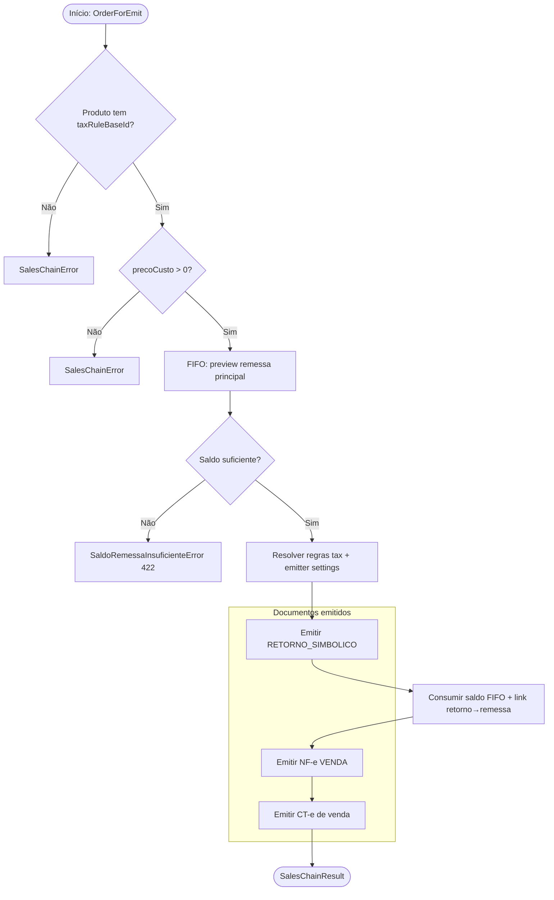

# Módulo Sales (Vendas)

Bounded context responsável por **pedidos de venda** no simulador fiscal ML Full: rascunho, checkout direto, faturamento e orquestração da **cadeia de vendas** (Sales Chain).

---

## Visão geral

O módulo modela o fluxo comercial entre o seller e o comprador final. Existem dois caminhos para emitir documentos fiscais:

| Caminho | Endpoint | Comportamento |
|---------|----------|---------------|
| **Checkout direto** | `POST /pedidos/checkout` | Emite a cadeia fiscal **sem** persistir rascunho prévio |
| **Rascunho + faturar** | `POST /pedidos` → `POST /pedidos/:id/faturar` | Guarda pedido em `RASCUNHO` e emite depois |

Em ambos os casos, a emissão passa pelo mesmo orquestrador: `SalesChainOrchestrator`.

---

## Cadeia de Vendas (Sales Chain)

No fulfillment Mercado Livre Full, a venda ao consumidor exige documentos encadeados que refletem a saída do stock que estava em depósito temporário (remessa física):

```
REMESSA (física, já emitida)
    │
    ▼  consumo FIFO do saldo em nfe_itens
RETORNO SIMBÓLICO  ← referencia a remessa principal
    │
    ▼  referencia o retorno
VENDA (NF-e ao comprador)
    │
    ▼  transporte da venda
CT-e DE VENDA
```

### Regras de negócio principais

1. **Produto com regra fiscal** — `taxRuleBaseId` obrigatório; sem ele a cadeia não inicia.
2. **Preço de custo** — necessário para o retorno simbólico (base inbound/custo); preço de venda alimenta a NF-e de venda.
3. **FIFO de remessa** — `previewRemessaPrincipalFifoParaVenda` escolhe a remessa mais antiga com saldo; `consumirSaldoRemessaFifoParaVenda` debita `nfe_itens.saldo_disponivel` e regista `nfe_remessa_consumos`.
4. **Saldo insuficiente** — `SaldoRemessaInsuficienteError` (422) com `disponivel` e `solicitado`.
5. **Pedido faturado** — status `FATURADO` bloqueia edição (`OrderLockedError`).
6. **Transação única** — toda a cadeia corre dentro de `prisma.$transaction` (rollback atómico em falha).

---

## Diagrama: Checkout direto



---

## Diagrama: Rascunho e faturamento



---

## Fluxograma da cadeia fiscal



---

## Entidades principais

| Entidade | Papel |
|----------|-------|
| `Order` | Pedido persistido (UI): status, comprador, produto, flags `editavel`/`excluivel` |
| `OrderForEmit` | Snapshot mínimo para emissão (produto, tenant, destinatário, quantidade) |
| `OrderCheckoutInput` | Entrada HTTP: `productId`, `quantidade`, `comprador` |
| `Buyer` | Dados do comprador final (CPF, endereço, indIEDest) |
| `EmissionContext` | Valores derivados na emissão: série, pedidoMl, totais venda/custo |
| `SalesChainResult` | Saída da cadeia: venda, retorno, CT-e, alocações FIFO |

---

## Casos de uso

| Caso de uso | Descrição |
|-------------|-----------|
| `ListOrdersUseCase` | Lista pedidos do tenant |
| `GetOrderByIdUseCase` | Detalhe de um pedido |
| `CreateOrderDraftUseCase` | Cria pedido em `RASCUNHO` |
| `UpdateOrderDraftUseCase` | Atualiza rascunho (bloqueado se `FATURADO`) |
| `RemoveOrderUseCase` | Remove pedido |
| `InvoiceOrderUseCase` | Fatura rascunho → Sales Chain + `markInvoiced` |
| `ProcessCheckoutUseCase` | Checkout direto → Sales Chain (sem rascunho) |
| `EmitSalesChainUseCase` | Emissão da cadeia (uso interno / extensão) |

---

## Estrutura do módulo

```
sales/
├── domain/           # Entidades, erros, ports, sales-chain.service
├── application/      # Use cases + sales-chain.dto
├── infrastructure/
│   ├── prisma/       # PrismaOrderRepository
│   └── fiscal/       # Orchestrator, emit-return/sale, CT-e adapter
└── presentation/     # order.controller + schemas
```

---

## Erros de domínio

| Erro | HTTP | Quando |
|------|------|--------|
| `CheckoutError` | 400 | Produto inválido / não pertence ao tenant |
| `OrderLockedError` | 409 | Pedido já faturado |
| `SalesChainError` | 400 | Regra fiscal, custo zero, validação da cadeia |
| `SaldoRemessaInsuficienteError` | 422 | FIFO sem saldo (módulo remessas) |

---

## Dependências externas

- **tax** — resolução de regras e cálculo inbound/sale
- **remessas** — FIFO, preview e consumo de remessa
- **fiscal-documents** — persistência de XML NF-e
- **lib/fiscal** — chaves, snapshots, retorno simbólico
