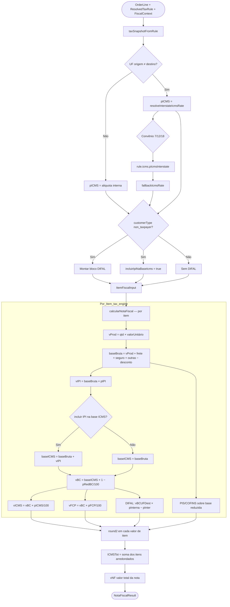
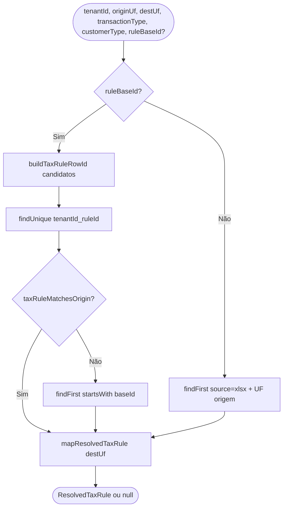

# Módulo Tax (Impostos e Regras Fiscais)

Bounded context responsável por **regras tributárias importadas**, **resolução origem×destino** e **cálculo de impostos** para emissão de NF-e no simulador ML Full.

---

## Visão geral

O módulo separa duas responsabilidades:

| Camada | Onde vive | Função |
|--------|-----------|--------|
| **Regras** | `tax_rule` + resolução | Qual CFOP/CST/alíquotas aplicar |
| **Cálculo** | `tax-calculation.service` → `lib/fiscal/tax-engine` | Quanto de ICMS, IPI, PIS, COFINS, DIFAL |

Outros módulos (**sales**, **remessas**, **catalog**) consomem via exports do `index.ts`:
`resolveTaxRule`, `buildFiscalItem`, `calculateInboundInvoice`, `assertProductTaxRuleBaseId`.

---

## Entidades de regras fiscais

### Persistência (`TaxRule`)

Linha importada da planilha ML com `ruleId` composto:

```
{baseId}-{customerType}-{transactionType}[-{originUf}]
```

O `payload` JSON contém `icmsByUf` com chaves `ICMS_{UF}_PICMS_INTERNAL`, `ICMS_{UF}_CST`, etc.

### Resolução (`ResolvedTaxRule`)

Produzida por `resolveTaxRuleFromDb` + `mapResolvedTaxRule` para um par:

- **originUf** — UF do emitente
- **destinationUf** — UF do destinatário (consumidor ou CD)
- **transactionType** — `sale` | `inbound`
- **customerType** — `taxpayer` | `non_taxpayer`
- **ruleBaseId** — vínculo do produto (`taxRuleBaseId`)

### Catálogo (`TaxRuleCatalogEntry`)

Agrupa regras por `baseId` + origem para o dropdown de produtos.

### Cálculo (`OrderLine`, `FiscalContext`)

- `OrderLine` — produto × quantidade × valor unitário + CFOP
- `FiscalContext` — UFs e perfil do comprador

---

## Fluxo: da regra ao valor da nota

```
Produto.taxRuleBaseId
    │
    ▼ resolveTaxRuleFromDb(origin, dest, sale|inbound, taxpayer|non_taxpayer)
ResolvedTaxRule (CFOP, CST, alíquotas por UF destino)
    │
    ▼ buildFiscalItem(line, rule, ctx, fallbackIcms)
ItemFiscalInput (ICMS, IPI, PIS, COFINS, DIFAL?)
    │
    ▼ calcularNotaFiscal (tax-engine puro)
NotaFiscalResult (itens + totais vNF, vICMS, …)
```

---

## Tax Engine — algoritmo de cálculo (`graph TD`)

O motor puro está em `lib/fiscal/tax-engine.ts`. O módulo tax monta a entrada via `buildFiscalItem`.



### Princípios do tax-engine (evitar rejeição SEFAZ)

1. **ICMS por dentro** — base e valor coerentes com XML NF-e 4.00
2. **IPI na base ICMS** — consumidor final (`non_taxpayer`), como XMLs ML reais
3. **Arredondamento `round2`** — por item, nunca recalcular imposto no total
4. **Totais = soma dos itens** — `vNF` bate com soma de `vProd` + impostos − descontos
5. **FCP separado** — `pFCP`/`vFCP` não somados em `pICMS`

---

## Resolução de regras (`resolveTaxRuleFromDb`)



---

## Casos de uso

| Caso de uso | Descrição |
|-------------|-----------|
| `GetTaxRuleCatalogUseCase` | Catálogo para produtos |
| `GetTaxRulesUseCase` | Lista completa (admin) |
| `BulkUpsertTaxRulesUseCase` | Importação planilha |
| `DeleteAllTaxRulesUseCase` | Limpa tenant (ADMIN) |
| `ResolveTaxRuleUseCase` | Resolução origem×destino |
| `AssertProductTaxRuleBaseIdUseCase` | Valida vínculo em produto |
| `CalculateTaxesUseCase` | Nota venda multi-item |
| `CalculateInboundTaxesUseCase` | Nota inbound (retorno/remessa) |

---

## `tax-calculation.service.ts` — funções principais

| Função | Uso |
|--------|-----|
| `buildFiscalItem` | Monta entrada do tax-engine |
| `calculateInvoiceTaxes` | Venda (vários itens) |
| `calculateInboundInvoice` | Retorno simbólico / inbound |
| `orderLineFromProduct` | Produto catálogo → linha |
| `inferIcmsRateForShipment` | Fallback remessa (4% / 18%) |
| `inferIntraStateIcmsRate` | Fallback venda (7/12/18) |

---

## Estrutura do módulo

```
tax/
├── domain/
│   ├── entities/     # TaxRule, ResolvedTaxRule, OrderLine, …
│   ├── ports/        # TaxRuleRepository
│   └── errors/       # TaxRuleError
├── application/
│   ├── services/     # tax-calculation.service (ponte → tax-engine)
│   └── use-cases/    # CRUD regras + cálculo + resolução
├── infrastructure/
│   └── prisma/       # Repository + tax-rule-resolution
└── presentation/     # tax-rule.controller
```

---

## Erros

| Erro | HTTP | Quando |
|------|------|--------|
| `TaxRuleError` | 400 | Regra inválida, baseId inexistente |
| `TaxRuleCatalogError` | 400 | Alias legado (catalog) |

---

## Dependências e consumidores

- **lib/fiscal/tax-engine** — motor puro de aritmética fiscal
- **lib/fiscal/tax-snapshot** — extrai CST/alíquotas do payload
- **sales** — `resolveTaxRule` + `buildFiscalItem` na Sales Chain
- **remessas** — inbound e remessas físicas
- **catalog** — validação `taxRuleBaseId` no produto
