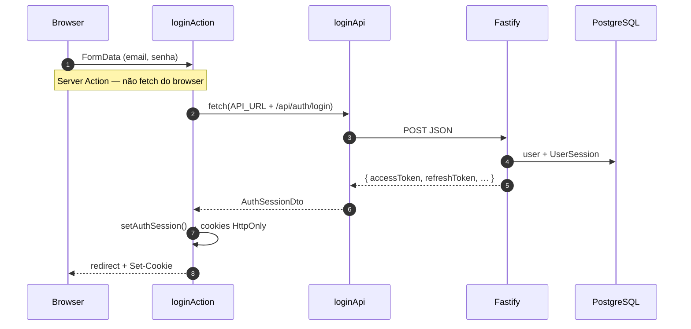
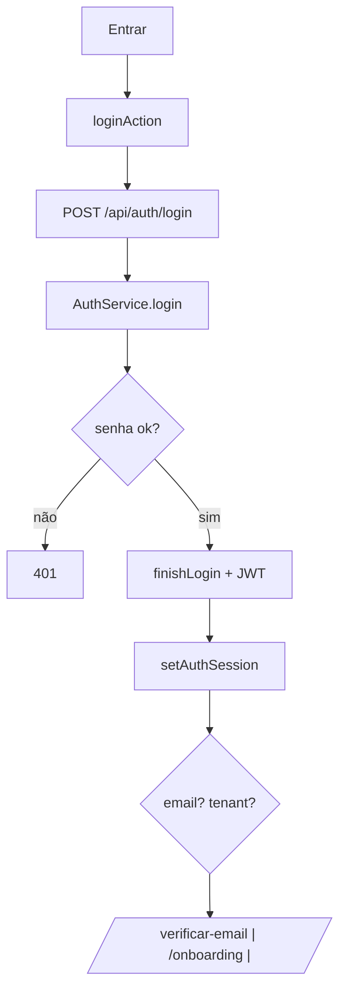
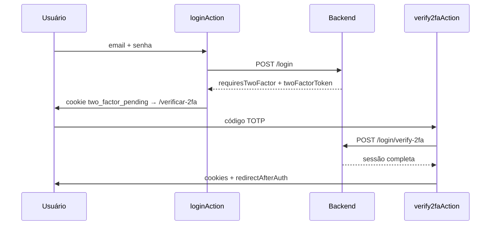
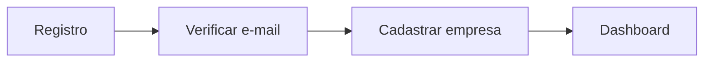

# Login e autenticação

Documentação do fluxo de **login, registro, sessão e recuperação de conta** no monorepo `msimulation-xml`. Explica o código do **backend (Fastify)**, do **frontend (Next.js 15)** e como os dois se comunicam.

> **Escopo:** JWT, cookies HttpOnly, 2FA TOTP, verificação de e-mail, reset de senha e onboarding da primeira empresa. Não cobre rotas fiscais além do que o JWT exige.

---

## Índice

1. [Resumo](#1-resumo)
2. [Arquitetura geral](#2-arquitetura-geral)
3. [Mapa de arquivos](#3-mapa-de-arquivos)
4. [Backend](#4-backend)
5. [Frontend](#5-frontend)
6. [Como frontend e backend se comunicam](#6-como-frontend-e-backend-se-comunicam)
7. [Fluxos](#7-fluxos)
8. [Contrato da API](#8-contrato-da-api)
9. [Variáveis de ambiente e cookies](#9-variáveis-de-ambiente-e-cookies)
10. [Debug](#10-debug)

---

## 1. Resumo

1. O usuário acessa `frontend/src/app/(auth)/login/`.
2. Formulários disparam **Server Actions** em `frontend/src/lib/auth/actions/`.
3. As actions chamam `frontend/src/lib/auth/api/` → `POST http://localhost:3001/api/auth/*`.
4. O **Fastify** valida com Zod, executa `AuthService` e devolve JSON com `accessToken` + `refreshToken`.
5. O Next.js grava tokens em **cookies HttpOnly** (`access_token`, `refresh_token`).
6. O **middleware** renova tokens expirados e bloqueia rotas sem sessão.
7. O layout `(app)` chama `GET /api/auth/me` para confirmar e-mail e tenant.

**Princípios:** JWT curto (30 min) + refresh opaco no banco; tokens nunca no `localStorage`; `tenantId` só no JWT; browser **nunca** chama o Fastify diretamente no login — sempre via Server Action no servidor Next.js.

---

## 2. Arquitetura geral

### Quem fala com quem

```mermaid
flowchart TB
  subgraph Browser["Navegador"]
    UI[login-panel, verify-2fa-form…]
  end

  subgraph Next["Frontend :3000"]
    MW[middleware.ts]
    SA[Server Actions]
    SESS[session.ts]
    API_CLIENT[lib/auth/api/*]
    LAYOUT["(app)/layout.tsx"]
  end

  subgraph API["Backend :3001"]
    ROUTES[routes/auth/index.ts]
    SVC[AuthService + serviços]
    JWT[@fastify/jwt]
    DB[(PostgreSQL)]
  end

  UI -->|useActionState| SA
  SA --> API_CLIENT
  SA --> SESS
  API_CLIENT -->|JSON| ROUTES
  MW -->|refresh| API_CLIENT
  LAYOUT --> API_CLIENT
  ROUTES --> SVC --> JWT --> DB
  SESS -.->|HttpOnly cookies| Browser
  MW -.->|cookies| Browser
```

### Três portões no frontend

| # | Arquivo | Verifica |
|---|---------|----------|
| 1 | `middleware.ts` | Cookies existem / refresh silencioso |
| 2 | `(onboarding)/layout.tsx` | Sessão; redireciona se já tem empresa |
| 3 | `(app)/layout.tsx` | Sessão + e-mail verificado + tenant |

```mermaid
flowchart TD
  REQ[Requisição] --> M{middleware}
  M -->|sem cookies| LOGIN[/login]
  M -->|ok| G{Route group}
  G -->|onboarding| OL[getAuthMe → sem tenant]
  G -->|app| AL[getAuthMe → email + tenant]
  OL --> ONB[/onboarding/empresa]
  AL --> APP[AppShell]
```

### Três níveis no backend

| Nível | Plugin | Exemplo |
|-------|--------|---------|
| Público | — | `POST /api/auth/login` |
| JWT sem tenant | `authenticatedLookupPlugin` | `GET /api/lookup/cep`, `POST /auth/onboarding/tenant` |
| JWT + tenant + e-mail | `protectedApiPlugin` | `/products`, `/pedidos` |

Bootstrap em `backend/src/index.ts`: `authPlugin` → `authRoutes` (público) → `protectedApiPlugin`.

---

## 3. Mapa de arquivos

### Backend

```
backend/src/
├── index.ts                         # registra authRoutes em /api
├── routes/auth/
│   ├── index.ts                     # handlers HTTP (14 rotas)
│   └── auth-errors.ts               # handleAuthError → status HTTP
├── services/auth/
│   ├── auth-service.ts              # login, register, refresh, logout, attachTenant
│   ├── email/                       # verificação, reset, Resend
│   └── mfa/two-factor-service.ts    # TOTP
├── lib/
│   └── brand.ts                     # BRAND_FULL_NAME (e-mails, TOTP, Resend)
├── lib/auth/
│   ├── types/
│   │   ├── jwt.ts                   # AccessTokenPayload, TwoFactorPendingPayload
│   │   ├── responses.ts             # AuthSessionResponse, LoginResponse, …
│   │   └── index.ts                 # barrel de tipos de contrato
│   ├── session.ts                   # buildAccessPayload, authSessionResponse
│   ├── password.ts                  # scrypt + pepper
│   ├── token.ts                     # tokens opacos (refresh, e-mail, reset)
│   ├── login-lockout.ts             # brute-force
│   └── turnstile.ts                 # CAPTCHA registro
├── plugins/auth/index.ts            # @fastify/jwt + authenticate
└── schemas/auth/schemas.ts          # Zod
```

### Frontend

```
frontend/src/
├── middleware.ts
├── app/(auth)/login/                # páginas: login, 2FA, e-mail, senha
├── app/(onboarding)/onboarding/empresa/
├── app/(app)/layout.tsx             # gate do painel
├── components/auth/                 # login-panel, verify-2fa-form…
└── lib/auth/
    ├── types.ts                     # AuthSessionDto, AuthMeDto…
    ├── cookie.ts                    # nomes, TTLs, isCookieSecure()
    ├── session.ts                   # cookies no servidor Node
    ├── edge-cookies.ts              # cookies no middleware Edge
    ├── api/
    │   ├── client.ts                # postAuthJson, AuthApiError
    │   ├── credentials.ts           # login, register, forgot, reset
    │   ├── session.ts               # refresh, logout, me
    │   └── two-factor.ts
    └── actions/
        ├── credentials.ts           # loginAction, registerAction…
        └── security.ts              # 2FA, resend verification
```

---

## 4. Backend

### AuthService — métodos principais

| Método | Rota | Função |
|--------|------|--------|
| `register()` | `POST /register` | Cria user, e-mail verificação, sessão |
| `login()` | `POST /login` | Credenciais; pode retornar 2FA pendente |
| `finishLogin()` | login / verify-2fa | Sessão + JWT access |
| `refresh()` | `POST /refresh` | Rotaciona refresh (uso único) |
| `logout()` | `POST /logout` | Revoga sessão(ões) |
| `getMe()` | `GET /me` | Perfil + tenant |
| `attachTenant()` | `POST /onboarding/tenant` | Primeira empresa → user vira ADMIN |

### Login (lógica)

```
login(email, password)
  → findUnique(user)
  → lockout? → 429
  → verifyPassword (DUMMY_HASH se user inexistente — timing-safe)
  → falha? → recordFailedLogin + 401 genérico
  → totpEnabledAt? → JWT typ:"2fa_pending" (5 min)
  → finishLogin → createSession + jwt.sign(access)
```

### JWT access (`typ: "access"`)

```json
{ "userId": "…", "tenantId": "…" | null, "tokenVersion": 0, "typ": "access" }
```

TTL: 30 min. `tokenVersion` invalida tokens após logout global.

### Sessão no banco (`UserSession`)

- `refreshTokenHash` — SHA-256 + pepper (plaintext nunca persiste)
- `expiresAt` — 7 dias
- `revokedAt` — logout ou rotação

### Rate limits

| Rota | Limite |
|------|--------|
| `/register` | 5 / hora |
| `/login` | 10 / 15 min |
| `/refresh` | 30 / 15 min |
| `/forgot-password` | 5 / hora |

Erros mapeados em `routes/auth/auth-errors.ts` (401, 409, 429, 400 com `details` do Zod).

---

## 5. Frontend

### Páginas e componentes

| Rota | Componente | Server Action |
|------|------------|---------------|
| `/login` | `LoginPanel` | `loginAction`, `registerAction` |
| `/login/verificar-2fa` | `Verify2faForm` | `verify2faAction` |
| `/login/verificar-email` | `ResendVerificationForm` | `verifyEmailAction` |
| `/login/esqueci-senha` | `ForgotPasswordForm` | `forgotPasswordAction` |
| `/login/redefinir-senha` | `ResetPasswordForm` | `resetPasswordAction` |

### loginAction (resumo)

```typescript
const result = await loginApi(email, password);

if (!isTwoFactorPending(result)) {
  await setAuthSession(result);
  redirectAfterAuth(result);  // /verificar-email | /onboarding | /
}

await clearAuthSession();
await setTwoFactorPending(result.twoFactorToken);
redirect("/login/verificar-2fa");
```

### redirectAfterAuth

```typescript
if (emailVerified === false) redirect("/login/verificar-email");
if (needsOnboarding || !tenantId) redirect("/onboarding/empresa");
redirect("/");
```

### Cookies

| Cookie | TTL | Uso |
|--------|-----|-----|
| `access_token` | 30 min | JWT access |
| `refresh_token` | 7 dias | Refresh opaco |
| `two_factor_pending` | 5 min | JWT 2FA pendente |

Gravados por `session.ts` (Server Actions). Lidos por `middleware.ts` via `edge-cookies.ts` (refresh no Edge).

### Middleware (regras principais)

- Sem cookies → `/login`
- Só `refresh_token` → `POST /api/auth/refresh`; sucesso renova cookies; falha → `/login?session=expired`
- `pending2fa` sem access → força `/login/verificar-2fa`
- Já logado em `/login` → redirect `/`

---

## 6. Como frontend e backend se comunicam



| Camada | Responsabilidade |
|--------|------------------|
| `lib/auth/api/client.ts` | `fetch`, `AuthApiError`, URL base (`API_URL`) |
| `lib/auth/api/credentials.ts` | Endpoints públicos de credencial |
| `lib/auth/api/session.ts` | refresh, logout, `/me` |
| `lib/auth/actions/credentials.ts` | Orquestra API + cookies + redirect |
| `routes/auth/index.ts` | HTTP + Zod + delega ao service |

**Importante:** o backend retorna tokens no **JSON**. O Next.js grava cookies — o Fastify **não** emite `Set-Cookie`.

### Tabela endpoint → função frontend

| Backend | Frontend | Action |
|---------|----------|--------|
| `POST /login` | `loginApi` | `loginAction` |
| `POST /login/verify-2fa` | `verify2faApi` | `verify2faAction` |
| `POST /register` | `registerApi` | `registerAction` |
| `POST /verify-email` | `verifyEmailApi` | `verifyEmailAction` |
| `POST /refresh` | `refreshSessionApi` | middleware |
| `POST /logout` | `logoutApi` | `logoutAction` |
| `GET /me` | `fetchAuthMe` | `getAuthMe` |
| `POST /onboarding/tenant` | `onboardingTenantApi` | `onboardingEmpresaAction` |

Onboarding usa `lib/onboarding/api.ts` (separado de `lib/auth`).

---

## 7. Fluxos

### Login sem 2FA



### Login com 2FA



### Registro → painel (jornada nova conta)



| Passo | Rota | Gate |
|-------|------|------|
| 1 | `/login` | — |
| 2 | `/login/verificar-email` | `emailVerified === false` |
| 3 | `/onboarding/empresa` | `tenantId === null` |
| 4 | `/` | `(app)/layout` ok |

### Refresh silencioso (middleware)

```mermaid
flowchart TD
  A[Rota protegida] --> B{access_token?}
  B -->|sim| C[next]
  B -->|não| D{refresh_token?}
  D -->|não| E[/login]
  D -->|sim| F[POST /refresh]
  F -->|ok| G[novos cookies]
  F -->|falha| H[/login?session=expired]
  G --> C
```

### Logout

`AccountMenu` → `logoutAction` → `POST /logout` + `clearAuthSession` → `/login?session=expired`

### Matriz ação → código → banco

| Ação | Action | API | Tabelas |
|------|--------|-----|---------|
| Criar conta | `registerAction` | `POST /register` | User, UserSession |
| Entrar | `loginAction` | `POST /login` | User, UserSession |
| 2FA | `verify2faAction` | `POST /login/verify-2fa` | User, UserSession |
| Confirmar e-mail | `verifyEmailAction` | `POST /verify-email` | EmailVerificationToken |
| Esqueci senha | `forgotPasswordAction` | `POST /forgot-password` | PasswordResetToken |
| Nova senha | `resetPasswordAction` | `POST /reset-password` | User, UserSession |
| Sair | `logoutAction` | `POST /logout` | UserSession |
| 1ª empresa | `onboardingEmpresaAction` | `POST /onboarding/tenant` | Tenant, User |

---

## 8. Contrato da API

Base: `http://localhost:3001/api/auth`

Erro padrão: `{ "error": "…", "details"?: { "campo": ["…"] } }`

### POST /login

**Body:** `{ "email": "…", "password": "…" }`

**200 — sucesso:**
```json
{
  "accessToken": "eyJ…",
  "refreshToken": "…",
  "expiresIn": "30m",
  "userId": "…",
  "tenantId": null,
  "needsOnboarding": true,
  "emailVerified": false
}
```

**200 — 2FA:**
```json
{ "requiresTwoFactor": true, "twoFactorToken": "eyJ…", "expiresIn": "5m" }
```

### POST /register

**Body:** `{ "email", "password", "name?", "captchaToken?" }` → **201** (mesmo formato da sessão)

### POST /login/verify-2fa

**Body:** `{ "twoFactorToken", "code" }` → **200** sessão completa

### POST /refresh

**Body:** `{ "refreshToken" }` → **200** novos tokens (anterior invalidado)

### GET /me

**Header:** `Authorization: Bearer <accessToken>`

**200:** perfil sem tokens (`userId`, `tenantId`, `tenant`, `needsOnboarding`, `emailVerified`, `role`)

### POST /logout

**Body opcional:** `{ "refreshToken" }` + Bearer → **204**

### POST /onboarding/tenant

**Bearer** + body do emitente (CNPJ, endereço…) → **200** sessão com `tenantId`

---

## 9. Variáveis de ambiente e cookies

| Variável | Onde | Função |
|----------|------|--------|
| `API_URL` | `frontend/.env.local` | Backend (server-only). Default: `http://127.0.0.1:3001` |
| `JWT_SECRET` | `backend/.env` | Assinatura JWT |
| `PASSWORD_PEPPER` | `backend/.env` | scrypt + hash de refresh |
| `REQUIRE_EMAIL_VERIFICATION` | backend | Bloqueia negócio sem e-mail confirmado |
| `NEXT_PUBLIC_TURNSTILE_SITE_KEY` | frontend | CAPTCHA registro |
| `TURNSTILE_SECRET_KEY` | backend | Valida CAPTCHA |

Cookies: `HttpOnly`, `SameSite=Strict`, `Secure` em produção/Vercel.

---

## 10. Debug

| Sintoma | Verificar |
|---------|-----------|
| Loop em `/login` | Limpar cookies; `Secure` em HTTP local |
| API indisponível | Backend `:3001` — `pnpm dev` na raiz |
| Preso em verificar-email | `REQUIRE_EMAIL_VERIFICATION` + link não aberto |
| 2FA expirado | Cookie `two_factor_pending` dura 5 min |
| Links de e-mail em dev | Console do backend (sem `RESEND_API_KEY`) |

---

*Atualizado em junho/2026 — `lib/auth/types/*` + `session.ts`, `lib/brand.ts`, `lib/auth/api/*`, `routes/auth/auth-errors.ts`, `lib/onboarding/api.ts`.*
