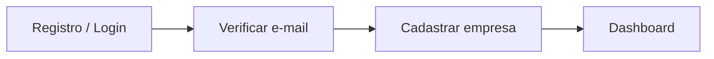
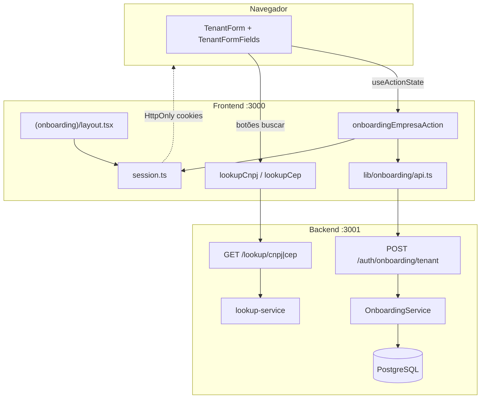
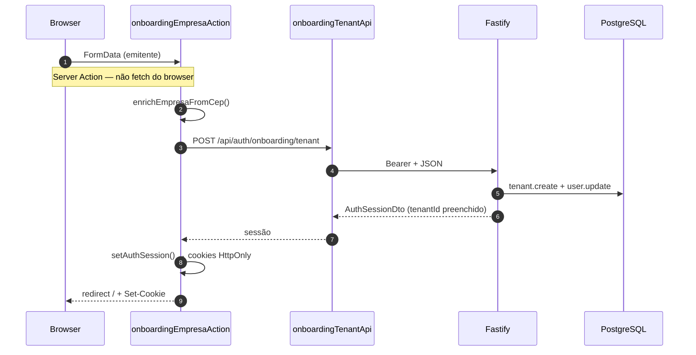
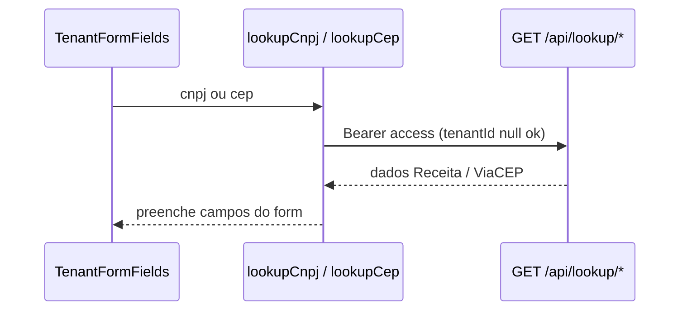
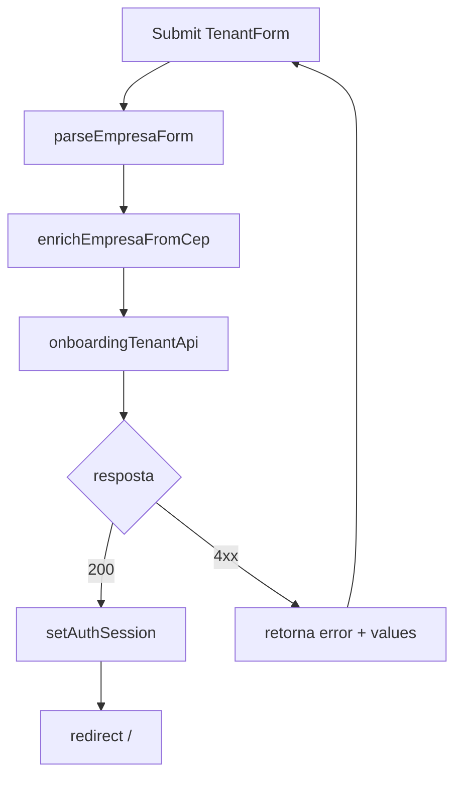

# Onboarding — primeira empresa

Documentação do fluxo de **cadastro da primeira empresa (tenant)** após login ou registro no monorepo `msimulation-xml`. Explica o código do **backend (Fastify)**, do **frontend (Next.js 15)** e como os dois se comunicam.

> **Escopo:** vincular o emitente NF-e à conta do usuário (`tenantId` no JWT), lookup de CNPJ/CEP durante o formulário e gates de rota no Next.js. Para login, sessão e verificação de e-mail, veja [login.md](./login.md).

---

## Índice

1. [Resumo](#1-resumo)
2. [Arquitetura geral](#2-arquitetura-geral)
3. [Mapa de arquivos](#3-mapa-de-arquivos)
4. [Backend](#4-backend)
5. [Frontend](#5-frontend)
6. [Como frontend e backend se comunicam](#6-como-frontend-e-backend-se-comunicam)
7. [Fluxos](#7-fluxos)
8. [Contrato da API](#8-contrato-da-api)
9. [Variáveis de ambiente](#9-variáveis-de-ambiente)
10. [Debug](#10-debug)

---

## 1. Resumo

1. Após login/registro com e-mail confirmado, o usuário chega em `/onboarding/empresa` (`tenantId === null`).
2. O formulário (`TenantForm`) coleta dados do emitente NF-e (CNPJ, IE, endereço, ambiente SEFAZ…).
3. Botões de lookup disparam **Server Actions** em `frontend/src/lib/lookup-actions.ts` → `GET /api/lookup/cnpj|cep` (JWT **sem** tenant).
4. O submit chama `onboardingEmpresaAction` em `frontend/src/lib/onboarding/actions/empresa.ts`.
5. A action enriquece o CEP (`enrichEmpresaFromCep`), chama `POST /api/auth/onboarding/tenant` e grava a **nova sessão** com `tenantId` nos cookies.
6. O backend cria `Tenant` + atualiza `User` (`role: ADMIN`) em transação e emite JWT access com `tenantId`.
7. O Next.js redireciona para `/` — o layout `(app)` libera o painel.

**Princípios:** onboarding é **uma vez por conta**; CNPJ é único no banco; lookup fiscal funciona **antes** de existir tenant; após o onboarding, rotas de negócio exigem JWT **com** `tenantId`.

---

## 2. Arquitetura geral

### Posição na jornada do usuário



| Passo | Rota | Condição |
|-------|------|----------|
| 1 | `/login` | — |
| 2 | `/login/verificar-email` | `emailVerified === false` |
| 3 | `/onboarding/empresa` | `tenantId === null` |
| 4 | `/` | `(app)/layout` ok |

### Quem fala com quem



### Três portões no frontend

| # | Arquivo | Verifica |
|---|---------|----------|
| 1 | `middleware.ts` | Cookies existem / refresh silencioso |
| 2 | `(onboarding)/layout.tsx` | Sessão + e-mail; redireciona se já tem empresa |
| 3 | `(app)/layout.tsx` | Sessão + e-mail + tenant |

```mermaid
flowchart TD
  REQ[Requisição] --> M{middleware}
  M -->|sem cookies| LOGIN[/login]
  M -->|ok| G{Route group}
  G -->|onboarding| OL[getAuthMe → sem tenant]
  G -->|app| AL[getAuthMe → email + tenant]
  OL --> ONB[/onboarding/empresa]
  AL --> APP[AppShell]
```

### Dois níveis de API no backend (relevantes ao onboarding)

| Nível | Plugin / rota | Exige tenant? | Exemplo |
|-------|---------------|---------------|---------|
| JWT sem tenant | `authenticatedLookupPlugin`, `POST /auth/onboarding/tenant` | Não | `GET /api/lookup/cep`, criar 1ª empresa |
| JWT + tenant + e-mail | `protectedApiPlugin` | Sim | `/products`, `/pedidos`, `GET /api/tenants` |

Bootstrap em `backend/src/index.ts`:

```
authRoutes (público + /me + onboarding)
  → authenticatedLookupPlugin (lookup autenticado)
  → protectedApiPlugin (negócio)
```

---

## 3. Mapa de arquivos

### Backend

```
backend/src/
├── index.ts                              # registra lookup autenticado + protected-api
├── routes/auth/
│   ├── index.ts                          # instancia OnboardingService, registra onboardingRoutes
│   ├── onboarding.routes.ts              # POST /auth/onboarding/tenant
│   ├── helpers.ts                        # authMeta, signAccess
│   └── auth-errors.ts                    # TenantConflictError → 409
├── routes/lookup/
│   └── index.ts                          # GET /lookup/cnpj/:cnpj, /lookup/cep/:cep
├── services/auth/onboarding/
│   └── onboarding-service.ts             # attachTenant (transação + finishLogin)
├── services/lookup/
│   └── lookup-service.ts                 # consulta CNPJ/CEP externa
├── services/org/
│   └── tenant-service.ts                 # TenantConflictError, CRUD pós-onboarding
├── schemas/org/
│   └── tenant.ts                         # tenantCreateBody (Zod)
├── lib/org/
│   ├── db-errors.ts                      # isPrismaUniqueError (P2002)
│   └── tenant-mapper.ts                  # mapTenant → DTO da API
├── lib/auth/
│   ├── session.ts                        # authSessionResponse (needsOnboarding)
│   └── config.ts                         # requireEmailVerification()
└── plugins/
    ├── authenticated-lookup.ts           # JWT, sem requireTenantHook
    └── protected-api.ts                  # JWT + tenant + e-mail verificado
```

### Frontend

```
frontend/src/
├── middleware.ts                         # cookies; não decide onboarding (layouts fazem)
├── app/(onboarding)/
│   ├── layout.tsx                        # gate: sessão, e-mail, sem tenant
│   └── onboarding/empresa/
│       ├── page.tsx                      # TenantForm + onboardingEmpresaAction
│       └── actions.ts                    # re-export da lib
├── app/(app)/
│   ├── layout.tsx                        # gate: exige tenant
│   └── empresas/page.tsx                 # lista empresa após onboarding
├── components/
│   ├── tenant-form.tsx                   # formulário compartilhado (onboarding + edição)
│   └── tenant-form-fields.tsx            # campos + lookup CNPJ/CEP
└── lib/
    ├── onboarding/
    │   ├── api.ts                        # onboardingTenantApi
    │   ├── actions/
    │   │   ├── empresa.ts                # onboardingEmpresaAction
    │   │   ├── types.ts                  # OnboardingEmpresaState
    │   │   └── index.ts
    │   └── index.ts
    ├── lookup-actions.ts                 # lookupCnpj, lookupCep (Server Actions)
    ├── parse-empresa-form.ts             # FormData → TenantInput
    ├── enrich-empresa-cep.ts             # completa IBGE/endereço no submit
    ├── empresa-form.ts                   # tipos de estado do formulário
    └── auth/
        └── session.ts                    # redirectAfterAuth, setAuthSession, getAuthMe
```

---

## 4. Backend

### OnboardingService.attachTenant

| Etapa | O que faz |
|-------|-----------|
| 1 | Carrega `User` por `userId` |
| 2 | Rejeita se `user.tenantId` já existe (`AuthStateError`) |
| 3 | Se `REQUIRE_EMAIL_VERIFICATION=true`, exige `emailVerifiedAt` |
| 4 | Transação: `tenant.create` + `user.update({ tenantId, role: "ADMIN" })` |
| 5 | Conflito CNPJ → `TenantConflictError` (409) |
| 6 | `auth.finishLogin` → nova sessão com JWT contendo `tenantId` |

```
attachTenant(userId, data)
  → user existe? tenantId nulo? e-mail ok?
  → $transaction:
       tenant.create(data)
       user.update({ tenantId, role: "ADMIN" })
  → finishLogin → authSessionResponse (needsOnboarding: false)
```

### Rota HTTP (`onboarding.routes.ts`)

- **Path:** `POST /api/auth/onboarding/tenant`
- **Auth:** `app.authenticate` (JWT `typ: "access"`, `tenantId` pode ser `null`)
- **Guard extra:** se `req.user.tenantId` já preenchido → **400** `"Empresa já cadastrada nesta conta"`
- **Body:** validado por `tenantCreateBody` (Zod)
- **Resposta:** `AuthSessionResponse` (tokens + perfil + `tenant`)

### Validação do emitente (`tenantCreateBody`)

| Campo | Regra |
|-------|-------|
| `cnpj` | 14 dígitos (após remover máscara) |
| `cep` | 8 dígitos |
| `codigoMunicipio` | 7 dígitos (IBGE) |
| `uf` | 2 caracteres, uppercased |
| `crt` | 1–3 (default 3 — Regime Normal) |
| `ambiente` | `HOMOLOGACAO` \| `PRODUCAO` |
| `numero` | default `"SN"` |
| `codigoPais` / `nomePais` | default 1058 / `"Brasil"` |

### Modelo de dados (Prisma)

```prisma
/// User.tenantId nulo até concluir onboarding
model User {
  tenantId  String?   @map("tenant_id")
  role      UserRole  @default(MEMBER)  // vira ADMIN no onboarding
  ...
}

model Tenant {
  cnpj  String  @unique
  ...
}
```

Após o onboarding, o JWT access inclui:

```json
{ "userId": "…", "tenantId": "uuid-do-tenant", "tokenVersion": 0, "typ": "access" }
```

### Lookup autenticado (sem tenant)

Plugin `authenticatedLookupPlugin` — irmão de `protectedApiPlugin`, **sem** `requireTenantHook`:

| Rota | Função |
|------|--------|
| `GET /api/lookup/cnpj/:cnpj` | Preenche razão social, endereço, etc. |
| `GET /api/lookup/cep/:cep` | Preenche logradouro, bairro, município, UF, IBGE |

Rate limit dedicado em `lib/lookup/lookup-rate-limit.ts`.

### Erros mapeados

| Erro | HTTP | Mensagem típica |
|------|------|-----------------|
| `ZodError` | 400 | Primeiro campo inválido + `details` |
| `AuthStateError` | 400 | Empresa já vinculada / confirme e-mail |
| `TenantConflictError` | 409 | CNPJ já cadastrado |
| Tenant já no JWT (rota) | 400 | Empresa já cadastrada nesta conta |

---

## 5. Frontend

### Página e layout

| Rota | Componente | Server Action |
|------|------------|---------------|
| `/onboarding/empresa` | `TenantForm` | `onboardingEmpresaAction` |

`(onboarding)/layout.tsx`:

```typescript
const me = await getAuthMe();
if (!me) redirect("/login?session=expired");
if (!me.emailVerified) redirect("/login/verificar-email");
if (!me.needsOnboarding && me.tenant) redirect("/");
```

Header exibe **"Passo 2 — Empresa"** (passo 1 = verificação de e-mail).

### onboardingEmpresaAction (resumo)

```typescript
const parsed = parseEmpresaForm(formData);
const accessToken = await getAccessToken();
if (!accessToken) redirect("/login");

const session = await onboardingTenantApi(
  accessToken,
  await enrichEmpresaFromCep(parsed),
);
await setAuthSession(session);
revalidatePath("/");
redirect("/");
```

Em erro de API: restaura `values` + `fieldErrors` no estado do formulário (sem redirect).

### redirectAfterAuth (entrada no onboarding)

Chamado após login, registro e 2FA em `lib/auth/session.ts`:

```typescript
if (session.emailVerified === false) redirect("/login/verificar-email");
const needsOnboarding =
  session.needsOnboarding === true || session.tenantId === null;
redirect(needsOnboarding ? "/onboarding/empresa" : "/");
```

### TenantForm e lookup no formulário

- `TenantForm` usa `useActionState` — padrão igual ao restante do app.
- `TenantFormFields` chama `lookupCnpj` / `lookupCep` (Server Actions) nos botões de busca.
- Lookup exige `access_token` no cookie; funciona **durante** o onboarding.
- No submit, `enrichEmpresaFromCep` tenta completar `codigoMunicipio` via ViaCEP se o IBGE estiver vazio (falha silenciosa).

### Gate do painel (`(app)/layout.tsx`)

```typescript
if (me.needsOnboarding || !me.tenant) {
  redirect("/onboarding/empresa");
}
```

Usuário com tenant nunca permanece no onboarding — o layout redireciona para `/`.

### Reuso do formulário

`TenantForm` é compartilhado entre onboarding (`hideCancel`, sem `cancelHref`) e telas de edição em `(app)` (ex.: empresas). Apenas o onboarding usa `onboardingEmpresaAction`; edições posteriores usam rotas protegidas de org.

---

## 6. Como frontend e backend se comunicam

### Cadastro da empresa



### Lookup CNPJ/CEP (durante preenchimento)



| Camada | Responsabilidade |
|--------|------------------|
| `lib/onboarding/api.ts` | `authBearerFetch` → onboarding tenant |
| `lib/onboarding/actions/empresa.ts` | Orquestra parse, enrich, API, cookies, redirect |
| `lib/lookup-actions.ts` | Lookup autenticado para o formulário |
| `routes/auth/onboarding.routes.ts` | HTTP + Zod + `OnboardingService` |
| `plugins/authenticated-lookup.ts` | Expõe lookup sem exigir tenant |

**Importante:** após o onboarding, o backend devolve **novos** `accessToken` e `refreshToken` no JSON. O Next.js **deve** chamar `setAuthSession` — o JWT antigo (sem `tenantId`) não serve para rotas protegidas.

### Tabela endpoint → função frontend

| Backend | Frontend | Action |
|---------|----------|--------|
| `POST /auth/onboarding/tenant` | `onboardingTenantApi` | `onboardingEmpresaAction` |
| `GET /lookup/cnpj/:cnpj` | — | `lookupCnpj` |
| `GET /lookup/cep/:cep` | — | `lookupCep` |
| `GET /auth/me` | `fetchAuthMe` | `getAuthMe` (layouts) |

Onboarding vive em `lib/onboarding/`, separado de `lib/auth/` (credenciais e sessão).

---

## 7. Fluxos

### Jornada completa (conta nova)

```mermaid
flowchart TD
  A[Registro ou login] --> B{emailVerified?}
  B -->|não| C[/login/verificar-email]
  B -->|sim| D{tenantId?}
  C --> D
  D -->|null| E[/onboarding/empresa]
  D -->|preenchido| F[/ dashboard]
  E --> G[Preenche formulário]
  G --> H[POST /onboarding/tenant]
  H --> I[setAuthSession + redirect /]
  I --> F
```

### Submit do formulário (detalhe)



### Tentativa de acessar app sem empresa

```mermaid
flowchart LR
  U[GET /] --> L["(app)/layout"]
  L --> M{tenant?}
  M -->|não| ONB[/onboarding/empresa]
  M -->|sim| APP[AppShell]
```

### Tentativa de repetir onboarding

```mermaid
flowchart LR
  U[GET /onboarding/empresa] --> L["(onboarding)/layout"]
  L --> M{needsOnboarding?}
  M -->|não| HOME[/]
  M -->|sim| FORM[TenantForm]
```

### Matriz ação → código → banco

| Ação | Action | API | Tabelas |
|------|--------|-----|---------|
| Buscar CNPJ | `lookupCnpj` | `GET /lookup/cnpj/:cnpj` | — (externo) |
| Buscar CEP | `lookupCep` | `GET /lookup/cep/:cep` | — (externo) |
| Cadastrar 1ª empresa | `onboardingEmpresaAction` | `POST /onboarding/tenant` | Tenant, User |
| Nova sessão pós-onboarding | `setAuthSession` | (resposta do POST acima) | UserSession |

---

## 8. Contrato da API

Base auth: `http://localhost:3001/api/auth`  
Base lookup: `http://localhost:3001/api/lookup`

Erro padrão: `{ "error": "…", "details"?: { "campo": ["…"] } }`

### POST /auth/onboarding/tenant

**Header:** `Authorization: Bearer <accessToken>` (aceita `tenantId: null`)

**Body (exemplo):**

```json
{
  "razaoSocial": "Empresa Exemplo LTDA",
  "nomeFantasia": "Exemplo",
  "cnpj": "12345678000199",
  "ie": "123456789",
  "crt": 3,
  "logradouro": "Rua das Flores",
  "numero": "100",
  "bairro": "Centro",
  "codigoMunicipio": "3550308",
  "municipio": "São Paulo",
  "uf": "SP",
  "cep": "01310100",
  "ambiente": "HOMOLOGACAO"
}
```

**200 — sucesso (sessão completa):**

```json
{
  "accessToken": "eyJ…",
  "refreshToken": "…",
  "expiresIn": "30m",
  "userId": "…",
  "tenantId": "uuid-da-empresa",
  "email": "user@example.com",
  "tenant": { "id": "…", "cnpj": "…", "razaoSocial": "…", "ambiente": "HOMOLOGACAO" },
  "needsOnboarding": false,
  "emailVerified": true,
  "role": "ADMIN"
}
```

**400 — empresa já vinculada (rota ou serviço):**

```json
{ "error": "Empresa já cadastrada nesta conta" }
```

**409 — CNPJ duplicado:**

```json
{ "error": "CNPJ já cadastrado" }
```

### GET /lookup/cnpj/:cnpj

**Header:** `Authorization: Bearer <accessToken>`

**200:** dados para preencher o formulário (`razaoSocial`, `nomeFantasia`, endereço, `codigoMunicipio`, etc.)

**404:** CNPJ não encontrado

### GET /lookup/cep/:cep

**Header:** `Authorization: Bearer <accessToken>`

**200:** `logradouro`, `bairro`, `municipio`, `uf`, `codigoMunicipio`

### GET /auth/me (gate dos layouts)

**200 (antes do onboarding):**

```json
{
  "userId": "…",
  "tenantId": null,
  "needsOnboarding": true,
  "emailVerified": true,
  "tenant": null,
  "role": "MEMBER"
}
```

**200 (após onboarding):** `tenantId` preenchido, `needsOnboarding: false`, `role: "ADMIN"`.

---

## 9. Variáveis de ambiente

| Variável | Onde | Função no onboarding |
|----------|------|----------------------|
| `API_URL` | `frontend/.env.local` | Backend (server-only). Default: `http://127.0.0.1:3001` |
| `REQUIRE_EMAIL_VERIFICATION` | `backend/.env` | Bloqueia `attachTenant` sem `emailVerifiedAt` |
| `JWT_SECRET` | `backend/.env` | Assinatura do novo access token com `tenantId` |

Demais variáveis de auth (cookies, refresh, Resend) estão em [login.md § 9](./login.md#9-variáveis-de-ambiente-e-cookies).

---

## 10. Debug

| Sintoma | Verificar |
|---------|-----------|
| Loop entre `/` e `/onboarding/empresa` | `GET /me` — `tenantId` e `needsOnboarding` consistentes; cookies atualizados após submit |
| Submit ok mas app bloqueia | `setAuthSession` não chamado ou JWT antigo sem `tenantId` |
| "Confirme seu e-mail antes…" | `REQUIRE_EMAIL_VERIFICATION=true` e link não aberto |
| CNPJ já cadastrado (409) | Outro tenant com mesmo CNPJ na tabela `tenants` |
| Lookup falha no formulário | Backend `:3001`; sessão válida; rota em `authenticated-lookup`, não `protected-api` |
| API indisponível no lookup | `pnpm dev` na raiz — mensagem em `lookup-actions.ts` |
| Preso no onboarding com empresa | `user.tenantId` no banco — layout deveria redirecionar para `/` |
| Campos de endereço incompletos | CEP sem IBGE — `enrichEmpresaFromCep` no submit; botão buscar CEP no form |

### Checklist manual

1. Registrar conta → verificar e-mail (se exigido).
2. Confirmar redirect para `/onboarding/empresa`.
3. Buscar CNPJ/CEP — campos preenchidos.
4. Submeter → redirect `/` com `AppShell`.
5. `GET /api/auth/me` → `tenantId` não nulo, `role: "ADMIN"`.
6. Tentar `/onboarding/empresa` de novo → redirect `/`.

---

*Atualizado em junho/2026 — `OnboardingService`, `routes/auth/onboarding.routes.ts`, `lib/onboarding/*`, `authenticated-lookup.ts`, `TenantForm`, `lookup-actions.ts`.*
