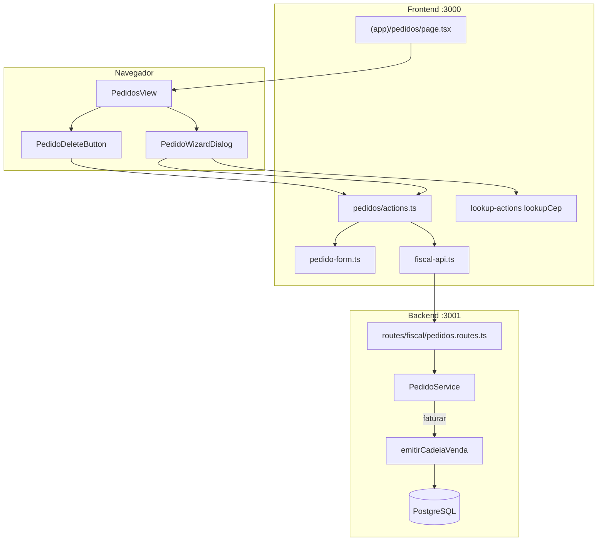
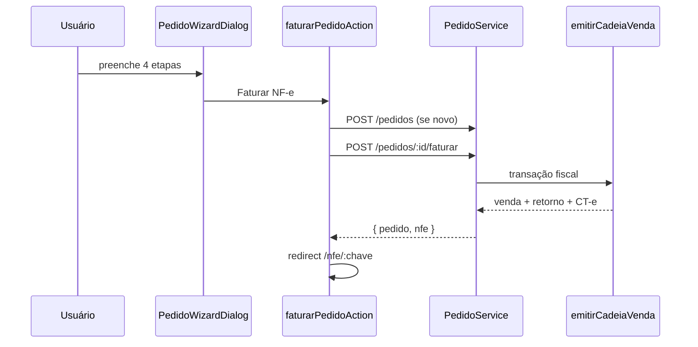
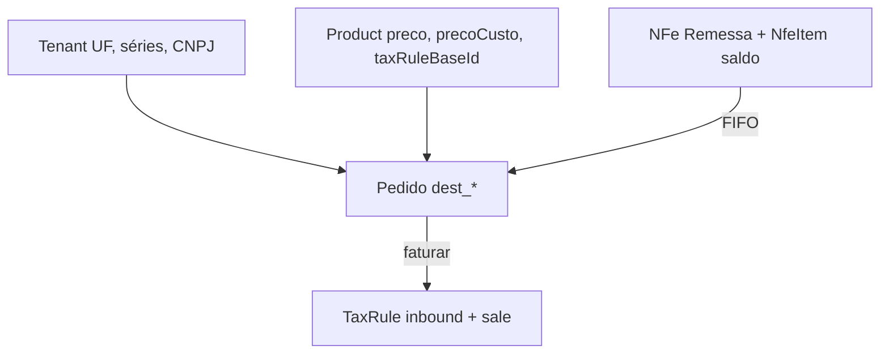

# Pedidos ML

Documentação do módulo de **pedidos Mercado Livre** com rascunho editável e faturamento fiscal (cadeia retorno + venda + CT-e) no monorepo `msimulation-xml`. Explica o código do **backend (Fastify)**, do **frontend (Next.js 15)** e como os dois se comunicam.

> **Escopo:** CRUD de pedidos em rascunho, wizard de cadastro, emissão da cadeia fiscal e checkout one-shot. Para produtos, veja [produto.md](./produto.md). Para regras tributárias, veja [regras-tributarias.md](./regras-tributarias.md). Para onboarding e tenant, veja [onboarding.md](./onboarding.md).

---

## Índice

1. [Resumo](#1-resumo)
2. [Arquitetura geral](#2-arquitetura-geral)
3. [Mapa de arquivos](#3-mapa-de-arquivos)
4. [Backend](#4-backend)
5. [Frontend](#5-frontend)
6. [Como frontend e backend se comunicam](#6-como-frontend-e-backend-se-comunicam)
7. [Fluxos](#7-fluxos)
8. [Contrato da API](#8-contrato-da-api)
9. [Variáveis de ambiente](#9-variáveis-de-ambiente)
10. [Debug](#10-debug)

---

## 1. Resumo

1. O usuário acessa `/pedidos` no painel (`AppShell` → "Pedidos ML").
2. Cria ou edita pedidos via **wizard de 4 etapas** (Produto → Comprador → Endereço → Revisão).
3. **Salvar rascunho** persiste o pedido com `status = RASCUNHO` sem emitir NF-e.
4. **Faturar NF-e** dispara `emitirCadeiaVenda` em transação única:
   - Retorno simbólico (consome saldo FIFO da remessa)
   - NF-e de venda ao comprador
   - CT-e de transporte
5. Após faturar: `status = FATURADO`, `pedidoMl` e `nfeId` preenchidos — pedido **bloqueado** para edição.
6. Exclusão remove o registro do pedido; NF-e/CT-e **permanecem** para auditoria.

**Princípios:** faturamento exige **saldo de remessa** (FIFO) e produto com `taxRuleBaseId` + `precoCusto > 0`; `POST /pedidos/checkout` emite direto sem criar rascunho (uso programático).

---

## 2. Arquitetura geral

### Papel no sistema

```mermaid
flowchart LR
  UI[/pedidos wizard] --> RASC[RASCUNHO]
  RASC -->|faturar| CADEIA[emitirCadeiaVenda]
  CADEIA --> RET[NF-e Retorno Simbólico]
  CADEIA --> VENDA[NF-e Venda]
  CADEIA --> CTE[CT-e Venda]
  RET --> FIFO[Consumo FIFO remessa]
  VENDA --> FAT[FATURADO]
  PROD[Product] --> UI
  REGRAS[tax_rules] --> CADEIA
  REM[NFe Remessa] --> FIFO
```

### Quem fala com quem



### Modelo de dados (Prisma)

**Tabela:** `pedidos`

| Campo | Tipo | Descrição |
|-------|------|-----------|
| `id` | UUID | PK |
| `tenantId` | string | FK → tenant (multi-tenant) |
| `productId` | string | FK → `products` (Restrict on delete) |
| `quantidade` | int | Default 1 |
| `status` | `PedidoStatus` | `RASCUNHO` \| `FATURADO` |
| `pedidoMl` | string? | Número ML gerado no faturamento |
| `nfeId` | string? (unique) | FK → NF-e de **venda** |
| `destCpf` … `destIndIeDest` | — | Dados do comprador (destinatário NF-e) |

**Enum `PedidoStatus`:** `RASCUNHO` | `FATURADO`

### Transições de status

```
[criação] ──► RASCUNHO ──► FATURADO
                 │              │
              editável       bloqueado (PedidoLockedError)
              excluível      excluível (NF-e permanece)
```

---

## 3. Mapa de arquivos

### Backend

```
backend/src/
├── routes/fiscal/
│   └── pedidos.routes.ts             # CRUD + faturar + checkout
├── schemas/orders/
│   └── pedido.ts                     # pedidoCheckoutBody, compradorCheckoutBody
├── services/fiscal/venda/
│   ├── pedido-service.ts             # ciclo de vida do pedido
│   ├── checkout-service.ts           # checkout one-shot
│   └── chain/
│       ├── emit-cadeia.ts            # orquestrador transacional
│       ├── emit-retorno.ts           # NF-e retorno simbólico + FIFO
│       ├── emit-venda.ts             # NF-e venda
│       ├── resolver-regras.ts        # resolveTaxRule (inbound + sale)
│       ├── context.ts                # assertProdutoComRegra, buildContextoEmissao
│       └── types.ts                  # PedidoForEmit, VendaChainError
├── services/fiscal/venda/
│   └── cte-venda-service.ts          # CT-e vinculado à venda
├── services/fiscal/remessa/
│   └── remessa-fifo.ts               # preview + consumo FIFO
└── lib/fiscal/
    └── pedido-mapper.ts              # mapPedido → PedidoDto
```

### Frontend

```
frontend/src/
├── app/(app)/pedidos/
│   ├── page.tsx                      # RSC: listPedidos + listProducts
│   └── actions.ts                    # salvar rascunho, faturar, excluir
├── components/
│   ├── pedidos-view.tsx              # tabela + ações por status
│   ├── pedido-wizard-dialog.tsx      # wizard 4 etapas
│   └── pedido-delete-button.tsx      # confirmação com aviso fiscal
└── lib/
    ├── pedido-form.ts                # PedidoFormValues, parsePedidoForm
    └── fiscal-api.ts                 # listPedidos, faturarPedido…
```

---

## 4. Backend

### PedidoService

| Método | O que faz |
|--------|-----------|
| `list(tenantId)` | Pedidos do tenant; rascunhos primeiro, depois `updatedAt desc` |
| `getById(id, tenantId)` | Um pedido com `product` e `nfe` resumida |
| `createDraft(tenantId, input)` | Cria com `status = RASCUNHO` |
| `updateDraft(id, tenantId, input)` | Atualiza rascunho; `PedidoLockedError` se faturado |
| `faturar(id, tenantId)` | `emitirCadeiaVenda` + marca `FATURADO` |
| `remove(id, tenantId)` | Apaga registro (NF-e permanece se faturado) |

### Faturamento — `emitirCadeiaVenda`

Transação única (`FISCAL_TRANSACTION_OPTIONS`):

| # | Etapa | Resultado |
|---|-------|-----------|
| 1 | `previewRemessaPrincipalFifoParaVenda` | Seleciona remessa com saldo ≥ quantidade (FIFO, prefere UF destino) |
| 2 | `resolverRegrasFiscais` | Regra `inbound` (retorno) + `sale` (venda) via `taxRuleBaseId` do produto |
| 3 | `emitirNotaRetorno` | `NFe(tipo=RETORNO_SIMBOLICO)` — valor = `precoCusto × qtd` |
| 4 | `consumirRemessaEVincularRetorno` | Debita `nfe_itens.saldo_disponivel`; persiste consumo |
| 5 | `emitirNotaVenda` | `NFe(tipo=VENDA)` — valor = `preco × qtd`; referencia retorno |
| 6 | `emitirCteVenda` | CT-e vinculado à NF-e de venda |

Após a transação, `PedidoService.faturar` atualiza:

- `status = FATURADO`
- `pedidoMl` ← da NF-e de venda
- `nfeId` ← id da NF-e de venda

### Pré-requisitos do produto

| Validação | Erro |
|-----------|------|
| `taxRuleBaseId` vazio | `VendaChainError` |
| `precoCusto <= 0` | `VendaChainError` |
| Saldo remessa insuficiente | `SaldoRemessaInsuficienteError` (422) |

### Regras fiscais na venda

- `indIEDest = 9` → `customerType = "non_taxpayer"` (regra `sale`)
- Outros valores → `"taxpayer"`
- Regra `inbound` sempre com `customerType = "taxpayer"` (retorno ao CD)
- Alíquota ICMS: `ICMS_{destUf}_PICMS_INTERNAL` no `payload` da `TaxRule`

### Checkout one-shot (`CheckoutService`)

`POST /api/pedidos/checkout` → chama `emitirCadeiaVenda` **sem** criar registro em `pedidos`. Retorna `NFeDto` da venda.

### Erros mapeados nas rotas

| Erro | HTTP | Corpo extra |
|------|------|-------------|
| `PedidoLockedError` | 409 | — |
| `CheckoutError` | 400 | — |
| `SaldoRemessaInsuficienteError` | 422 | `disponivel`, `solicitado` |
| Pedido/produto não encontrado | 404 | — |

---

## 5. Frontend

### Página `/pedidos`

Server Component:

```typescript
const [pedidos, products] = await Promise.all([listPedidos(), listProducts()]);
return <PedidosView pedidos={pedidos} products={products} />;
```

### `PedidosView` — tabela

| Coluna | Conteúdo |
|--------|----------|
| Pedido | `pedidoMl` ou `RASC-{id.slice(0,8)}` |
| Status | Badge Rascunho / Faturado |
| Comprador | Nome + CPF |
| Valor | `preco × quantidade` |
| NF-e | Link `numero/serie` |
| Ações | Por status (ver abaixo) |

**Ações por status:**

| Status | Ações |
|--------|-------|
| `RASCUNHO` | Editar (wizard), Faturar rápido (⊙), Excluir |
| `FATURADO` | Somente leitura, Ver NF-e, Excluir |

### `PedidoWizardDialog` — 4 etapas

| Step | Campos |
|------|--------|
| 0 — Produto | Select produto (SKU + nome), quantidade, total calculado |
| 1 — Comprador | CPF, nome, telefone |
| 2 — Endereço | CEP (lookup automático), logradouro, número, complemento, bairro, município, código IBGE, UF |
| 3 — Revisão | Resumo; botões "Salvar rascunho" e "Faturar NF-e" |

- Botão **"Exemplo"** no step 0 preenche dados de teste (`PEDIDO_FORM_EXAMPLE`).
- Pedidos faturados abrem em modo somente leitura.

### Server Actions (`pedidos/actions.ts`)

| Action | Fluxo |
|--------|-------|
| `salvarPedidoRascunhoAction` | `POST` ou `PATCH /pedidos` conforme `pedidoId` no form |
| `faturarPedidoAction` | Cria/atualiza rascunho se necessário → `POST /pedidos/:id/faturar` → `redirect(/nfe/:chave)` |
| `excluirPedidoAction` | `DELETE /pedidos/:id` |

### `PedidoDeleteButton`

- **Rascunho:** "Rascunhos excluídos não geram NF-e."
- **Faturado:** avisa que a NF-e `numero/serie` permanece e a numeração não será reutilizada.

---

## 6. Como frontend e backend se comunicam

```
Browser
  → Server Action (pedidos/actions.ts)
    → parsePedidoForm(formData)
    → fiscal-api.ts
      → Fastify protected-api (/api/pedidos…)
        → tenantIdFromRequest(req)
        → PedidoService / CheckoutService
```

- Lookup de CEP no wizard: `lookupCep` (Server Action) → rota autenticada de lookup (sem exigir tenant extra além do JWT).
- Após faturar: `revalidatePath` em `/pedidos`, `/nfe`, `/operacoes`, `/unidades-logisticas`, `/`.
- Redirect para detalhe da NF-e: `/nfe/{chave}`.

---

## 7. Fluxos

### 7.1 Rascunho + faturamento (fluxo principal)



### 7.2 Salvar rascunho sem emitir

```
Wizard step 3 → Salvar rascunho
  → salvarPedidoRascunhoAction
  → POST /pedidos (novo) ou PATCH /pedidos/:id
  → status permanece RASCUNHO
  → dialog fecha; tabela atualizada
```

### 7.3 Faturar rápido (tabela)

Botão ⊙ na linha do rascunho → `faturarPedidoAction` com `pedidoId` existente, sem abrir o wizard.

### 7.4 Edição de rascunho

```
PATCH /pedidos/:id
  → assertPedidoEditavel (bloqueia se FATURADO)
  → atualiza productId, quantidade, dest_*
```

### 7.5 Exclusão

```
DELETE /pedidos/:id
  → apaga registro
  → se FATURADO: NF-e, retorno e CT-e permanecem no banco
```

### 7.6 Checkout one-shot (API direta)

```
POST /pedidos/checkout
  → CheckoutService.checkout()
  → emitirCadeiaVenda() sem criar pedido
  → 201 NFeDto (venda)
```

Útil para integrações; o frontend atual usa o fluxo rascunho + faturar.

### 7.7 Dependências entre domínios



---

## 8. Contrato da API

Todas as rotas: prefixo `/api`, header `Authorization: Bearer <accessToken>`.

### GET /pedidos

**200:** `PedidoDto[]` — ordenação: rascunhos primeiro, depois `updatedAt desc`.

### GET /pedidos/:id

**200:** `PedidoDto`  
**404:** `{ "error": "Pedido não encontrado" }`

### POST /pedidos

Cria rascunho. **Body:**

```json
{
  "productId": "uuid",
  "quantidade": 1,
  "comprador": {
    "cpf": "07951603996",
    "nome": "Claudilene Aparecida Bonfim",
    "logradouro": "Rua Cafarnaum",
    "numero": "260",
    "complemento": "casa",
    "bairro": "canaa",
    "codigoMunicipio": "4122701",
    "municipio": "Sabaudia",
    "uf": "PR",
    "cep": "86720000",
    "telefone": "43999999999",
    "codigoPais": 1058,
    "nomePais": "Brasil",
    "indIEDest": 9
  }
}
```

**201:** `PedidoDto` com `status: "RASCUNHO"`.

### PATCH /pedidos/:id

Mesmo body do POST. **200:** `PedidoDto`. **409** se já faturado.

### POST /pedidos/:id/faturar

Sem body. **201:**

```json
{
  "pedido": { "...PedidoDto", "status": "FATURADO", "pedidoMl": "ML-...", "nfe": { "chave": "...", "numero": 42, "serie": 5, "status": "AUTORIZADA" } },
  "nfe": { "...NFeDto completo da venda" }
}
```

**422** (saldo insuficiente):

```json
{
  "error": "Saldo de remessa insuficiente…",
  "disponivel": 0,
  "solicitado": 1
}
```

### DELETE /pedidos/:id

**204** sem corpo.

### POST /pedidos/checkout

Mesmo body do `POST /pedidos`. **201:** `NFeDto` da venda (sem criar pedido).

### PedidoDto (resposta)

```json
{
  "id": "uuid",
  "tenantId": "uuid",
  "status": "RASCUNHO",
  "pedidoMl": null,
  "productId": "uuid",
  "quantidade": 1,
  "product": { "id": "uuid", "sku": "ABC-123", "nome": "Produto X", "preco": 199.9 },
  "comprador": { "cpf": "07951603996", "nome": "...", "uf": "PR", "cep": "86720000", "indIEDest": 9 },
  "valorTotal": 199.9,
  "nfe": null,
  "createdAt": "2026-01-01T00:00:00.000Z",
  "updatedAt": "2026-01-01T00:00:00.000Z",
  "editavel": true,
  "excluivel": true
}
```

### Validações Zod (resumo)

| Campo | Regra |
|-------|-------|
| `productId` | UUID |
| `quantidade` | Positivo, máx 9999, default 1 |
| `cpf` | 11 dígitos |
| `cep` | 8 dígitos |
| `uf` | 2 chars uppercase |
| `codigoMunicipio` | 7 dígitos IBGE |
| `nome` | 1–120 chars |
| `indIEDest` | 1, 2 ou 9 (default 9) |

---

## 9. Variáveis de ambiente

| Variável | Onde | Função |
|----------|------|--------|
| `API_URL` | `frontend/.env.local` | Backend para `fiscal-api.ts` |
| `DATABASE_URL` | `backend/.env` | PostgreSQL (`pedidos`, `nfes`, `nfe_itens`) |

Configurações fiscais do tenant (séries, certificado, hub ML) impactam a emissão — ver documentação de NF-e e tenant.

---

## 10. Debug

| Sintoma | Verificar |
|---------|-----------|
| 401 em `/api/pedidos` | JWT com `tenantId`; onboarding concluído |
| Pedido já faturado (409) | Tentativa de PATCH em pedido `FATURADO` |
| Saldo remessa insuficiente (422) | Remessa física emitida para o produto; `nfe_itens.saldo_disponivel` |
| Produto sem regra fiscal | `taxRuleBaseId` no produto; regras em `/regras` |
| `precoCusto` inválido | Deve ser > 0 para faturar |
| CEP não preenche endereço | Backend lookup; `lookupCep` no wizard |
| Faturou mas pedido sumiu da lista | `revalidatePath`; refresh manual |
| Excluiu pedido faturado — NF-e sumiu? | NF-e permanece em `/nfe`; só o pedido foi removido |

### Checklist manual

1. Cadastrar produto com regra fiscal e preços válidos.
2. Emitir remessa física com saldo para o produto.
3. Criar pedido rascunho via wizard → salvar → confirmar na tabela.
4. Faturar → redirect para `/nfe/:chave` com status AUTORIZADA.
5. Tentar editar pedido faturado → bloqueio.
6. Excluir rascunho → some sem NF-e.
7. Excluir faturado → pedido some; NF-e ainda visível em `/nfe`.

---

*Atualizado em junho/2026 — `PedidoService`, `pedidos.routes.ts`, `emitirCadeiaVenda`, `PedidoWizardDialog`, `PedidosView`.*
