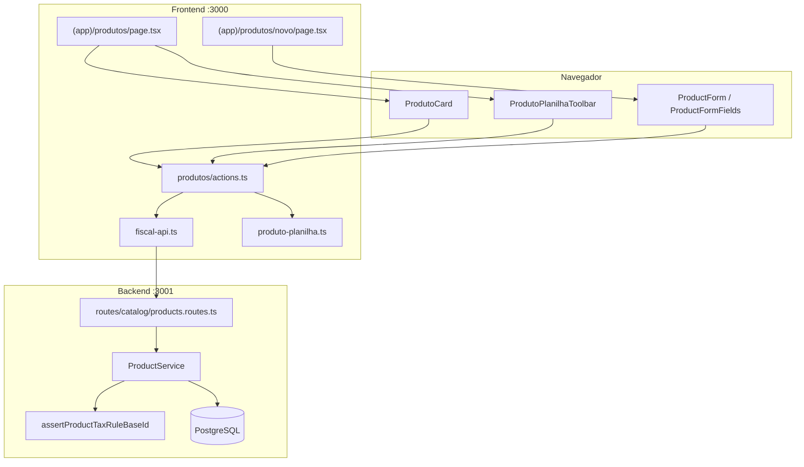
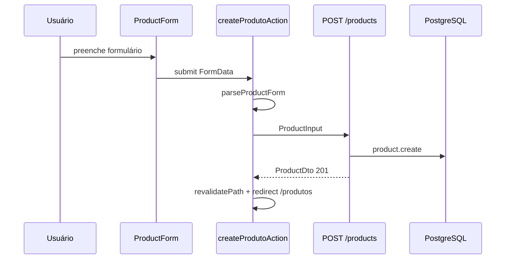

# Catálogo de produtos

Documentação do módulo de **cadastro e gestão de produtos** (bloco `<prod>` da NF-e) no monorepo `msimulation-xml`. Explica o código do **backend (Fastify)**, do **frontend (Next.js 15)** e como os dois se comunicam.

> **Escopo:** CRUD de produtos, importação/exportação por planilha, vínculo com regras tributárias e papel do produto na emissão fiscal. Para regras tributárias, veja [regras-tributarias.md](./regras-tributarias.md). Para pedidos e faturamento, veja [pedido.md](./pedido.md).

---

## Índice

1. [Resumo](#1-resumo)
2. [Arquitetura geral](#2-arquitetura-geral)
3. [Mapa de arquivos](#3-mapa-de-arquivos)
4. [Backend](#4-backend)
5. [Frontend](#5-frontend)
6. [Como frontend e backend se comunicam](#6-como-frontend-e-backend-se-comunicam)
7. [Fluxos](#7-fluxos)
8. [Contrato da API](#8-contrato-da-api)
9. [Variáveis de ambiente](#9-variáveis-de-ambiente)
10. [Debug](#10-debug)

---

## 1. Resumo

1. O usuário acessa `/produtos` no painel (`AppShell` → "Produtos").
2. Pode **cadastrar manualmente** (`/produtos/novo`), **editar/excluir** via cards na listagem ou **importar planilha** `.xlsx`/`.csv`.
3. Cada produto pertence ao **tenant** atual; o **SKU é único por empresa**.
4. Campos fiscais (`ncm`, `cest`, `origem`, `exTipi`) alimentam o bloco `<prod>` da NF-e.
5. `preco` é usado na **venda**; `precoCusto` na **remessa** e no **retorno simbólico**.
6. `taxRuleBaseId` referencia uma regra da planilha ML importada em `/regras` — validada contra a UF do emitente.
7. `estoque` é saldo **cadastral** declarado pelo usuário; o saldo FIFO de remessa fica em `nfe_itens`.

**Princípios:** rotas de produto exigem JWT **com** `tenantId` (`protectedApiPlugin`); exclusão bloqueia se houver pedidos **faturados**; importação em lote tolera erros por linha sem abortar o lote inteiro.

---

## 2. Arquitetura geral

### Papel no sistema

```mermaid
flowchart LR
  UI[/produtos] --> CRUD[CRUD + planilha]
  CRUD --> DB[(products)]
  REGRAS[/regras tax_rules] --> CAT[GET /tax-rules/catalog]
  CAT --> UI
  DB --> PED[Pedidos]
  DB --> NFE[NF-e remessa / venda]
  DB --> MOV[Movimentações]
```

### Quem fala com quem



### Modelo de dados (Prisma)

| Campo | Tipo | Tag NF-e | Uso |
|-------|------|----------|-----|
| `sku` | string | `<cProd>` | Código interno; único por tenant |
| `ean` | string? | `<cEAN>` | GTIN; vazio → "SEM GTIN" |
| `nome` | string (max 120) | `<xProd>` | Descrição do item |
| `ncm` | string (8 dígitos) | `<NCM>` | Classificação fiscal |
| `cest` | string (7 dígitos) | `<CEST>` | Substituição tributária |
| `exTipi` | string? (2–3) | `<EXTIPI>` | Exceção de IPI |
| `origem` | int (0–8) | `<orig>` | Origem da mercadoria (ICMS) |
| `unidade` | string (max 6) | `<uCom>` / `<uTrib>` | UN, UNID, KG… |
| `preco` | Decimal(15,8) | `vUnCom` | Preço de **venda** |
| `precoCusto` | Decimal(15,8) | `vUnCom` | Preço de **remessa** / retorno |
| `estoque` | int ≥ 0 | — | Saldo cadastral |
| `taxRuleBaseId` | string? | — | ID base da regra ML |

Constraint: `@@unique([tenantId, sku])`.

---

## 3. Mapa de arquivos

### Backend

```
backend/src/
├── routes/catalog/
│   ├── products.routes.ts          # GET/POST/PATCH/DELETE /products + bulk-upsert
│   └── index.ts
├── plugins/contexts/
│   └── catalog.plugin.ts             # registra productRoutes no protected-api
├── schemas/catalog/
│   └── product.ts                    # productCreateBody, productUpdateBody, productBulkUpsertBody
├── services/catalog/
│   └── product-service.ts            # CRUD + bulkUpsert + regras de exclusão
├── lib/catalog/
│   └── product-mapper.ts             # mapProduct → ProductDto
└── services/fiscal/tax/
    └── tax-rule-catalog-service.ts   # assertProductTaxRuleBaseId
```

### Frontend

```
frontend/src/
├── app/(app)/produtos/
│   ├── page.tsx                      # listagem + toolbar de planilha
│   ├── novo/page.tsx                 # formulário de criação
│   └── actions.ts                    # create, update, delete, import planilha
├── components/
│   ├── produto-card.tsx              # card com modais editar/excluir
│   ├── produto-planilha-toolbar.tsx  # modelo, exportar, importar
│   ├── product-form.tsx              # wrapper com useActionState
│   └── product-form-fields.tsx       # 3 seções: Identificação, Fiscal, Comercial
└── lib/
    ├── produto-form.ts               # parseProductForm, inputToFormValues
    ├── produto-planilha.ts           # parser/builder CSV e XLSX
    └── fiscal-api.ts                 # listProducts, createProduct, bulkUpsertProducts…
```

### Pacote compartilhado

```
packages/fiscal-core/src/product-pricing.ts   # productUnitPrice por tipo de NF-e
```

---

## 4. Backend

### ProductService

| Método | O que faz |
|--------|-----------|
| `list(tenantId)` | Todos os produtos do tenant, ordenados por `sku` |
| `getById(id, tenantId)` | Um produto ou `null` |
| `create(tenantId, data)` | Valida `taxRuleBaseId`, cria registro |
| `update(id, tenantId, data)` | Atualização parcial; valida regra se informada |
| `remove(id, tenantId)` | Exclui com regras de integridade (ver abaixo) |
| `bulkUpsert(tenantId, rows)` | Importação em lote por SKU |

### Validação de regra fiscal

No `create`, `update` e cada linha do `bulkUpsert`:

```
assertProductTaxRuleBaseId(prisma, tenantId, taxRuleBaseId, tenant.uf)
  → busca TaxRule com ruleId LIKE "${baseId}-%" e origin = tenant.uf
  → TaxRuleCatalogError (400) se não encontrar
```

### Exclusão (`remove`)

```
1. Conta pedidos FATURADO vinculados ao productId
2. Se faturados > 0 → ProductConflictError (409)
3. $transaction:
     pedido.deleteMany({ productId, status: RASCUNHO })
     product.delete({ id })
4. FK violation (movimentações, NF-e) → ProductConflictError (409)
```

### Bulk upsert

- Deduplica por SKU (mantém **última** ocorrência da planilha).
- Por linha: UPDATE se SKU existe, CREATE se novo.
- Erros isolados em `failed[]` — o lote continua.
- Máximo **500 linhas** por requisição.

### Erros mapeados nas rotas

| Erro | HTTP |
|------|------|
| `ProductConflictError` | 409 |
| `TaxRuleCatalogError` | 400 |
| Produto não encontrado | 404 |

---

## 5. Frontend

### Página `/produtos`

Server Component que carrega em paralelo:

- `listProducts()` → grid de `ProdutoCard`
- `listTaxRuleCatalog()` → select de regra fiscal nos modais

Toolbar `ProdutoPlanilhaToolbar`:

| Botão | Ação |
|-------|------|
| Baixar modelo | `buildProdutoPlanilhaTemplateXlsx()` |
| Exportar catálogo | `buildProdutoPlanilhaXlsx(products)` |
| Importar | `importProdutosPlanilhaAction` |

### Página `/produtos/novo`

- `ProductForm` com `createProdutoAction`
- Após sucesso: `revalidatePath` + `redirect("/produtos")`

### Formulário (`ProductFormFields`)

**Seção 1 — Identificação**
- `sku`, `ean`, `nome`

**Seção 2 — Classificação fiscal**
- `taxRuleBaseId` (select; valor codificado `baseId::origin`)
- `ncm`, `cest`, `exTipi`, `origem` (0–8)

**Seção 3 — Comercial**
- `unidade`, `precoCusto`, `preco`, `estoque`

### Server Actions (`produtos/actions.ts`)

| Action | Endpoint |
|--------|----------|
| `createProdutoAction` | `POST /api/products` |
| `updateProdutoModalAction` | `PATCH /api/products/:id` |
| `deleteProdutoAction` | `DELETE /api/products/:id` |
| `importProdutosPlanilhaAction` | parse local + `POST /api/products/bulk-upsert` |

Importação: limite **15 MB**; formatos `.xlsx` e `.csv`.

---

## 6. Como frontend e backend se comunicam

```
Browser
  → Server Action (produtos/actions.ts)
    → fiscal-api.ts (fetch com Authorization: Bearer)
      → Fastify protected-api (/api/products…)
        → tenantIdFromRequest(req)  // JWT
        → ProductService
```

- Todas as rotas exigem **JWT com `tenantId`** (usuário com empresa cadastrada).
- O frontend faz **parse da planilha no servidor Next.js** antes de enviar JSON ao backend.
- `revalidatePath` em `/produtos`, `/nfe`, `/cte`, `/` após mutações.

---

## 7. Fluxos

### 7.1 Criação manual



### 7.2 Edição inline (modal no card)

1. `ProdutoCard` abre `Dialog` com `ProductFormFields` pré-preenchido.
2. Submit → `updateProdutoModalAction.bind(null, id)`.
3. Sucesso → `{ success: true }` → dialog fecha → `router.refresh()`.

### 7.3 Importação de planilha

```
Arquivo .xlsx/.csv
  → parseProdutoPlanilhaXlsx / parseProdutoPlanilhaCsv
  → rowToProductInput (validação por linha)
  → dedupeRowsBySku
  → bulkUpsertProducts → POST /products/bulk-upsert
  → banner: criados / atualizados / erros por linha
```

**Colunas padrão** (CSV com `;`):

```
sku; ean; nome; ncm; cest; ex_tipi; origem; unidade; preco; preco_custo; estoque; tax_rule_base_id
```

Aliases aceitos: `cprod`→`sku`, `xprod`→`nome`, `gtin`→`ean`, `vuncom`→`preco`, `regra_fiscal`→`tax_rule_base_id`, entre outros (ver `produto-planilha.ts`).

### 7.4 Exclusão

- Rascunhos de pedido vinculados são removidos em cascata.
- Pedidos **faturados** impedem exclusão (histórico NF-e).
- Movimentações fiscais ou NF-e vinculadas → erro de FK.

### 7.5 Produto na emissão fiscal

| Tipo NF-e | Preço usado | Regra exigida? |
|-----------|-------------|----------------|
| `REMESSA`, `REMESSA_SIMBOLICA`, `RETORNO_SIMBOLICO` | `precoCusto` | Sim (`taxRuleBaseId`) |
| `VENDA`, `DEVOLUCAO` | `preco` | Sim |

Lógica em `packages/fiscal-core/src/product-pricing.ts` → `productUnitPrice(product, tipo)`.

---

## 8. Contrato da API

Todas as rotas: prefixo `/api`, header `Authorization: Bearer <accessToken>`.

### GET /products

**200:** `ProductDto[]`

### GET /products/:id

**200:** `ProductDto`  
**404:** `{ "error": "Produto não encontrado" }`

### POST /products

**Body:**

```json
{
  "sku": "300002137",
  "ean": "7897180513306",
  "nome": "Fogão 4 Bocas Atlas Atenas Glass",
  "ncm": "73211100",
  "cest": "2100100",
  "exTipi": "01",
  "origem": 0,
  "unidade": "UNID",
  "preco": 846.00,
  "precoCusto": 520.00,
  "estoque": 0,
  "taxRuleBaseId": "eletrodomesticos"
}
```

**201:** `ProductDto`  
**409:** SKU duplicado  
**400:** regra fiscal inválida

### PATCH /products/:id

Body parcial (mesmos campos do POST). **200:** `ProductDto`.

### DELETE /products/:id

**204** sem corpo. **409** se bloqueado por pedidos faturados ou FK.

### POST /products/bulk-upsert

**Body:**

```json
{
  "rows": [ /* ProductCreateInput[], max 500 */ ]
}
```

**200:**

```json
{
  "created": 12,
  "updated": 5,
  "failed": [{ "line": 8, "sku": "SKU-X", "error": "NCM deve ter 8 dígitos" }],
  "total": 17
}
```

### ProductDto (resposta)

```json
{
  "id": "uuid",
  "tenantId": "uuid",
  "sku": "300002137",
  "ean": "7897180513306",
  "nome": "Fogão 4 Bocas…",
  "ncm": "73211100",
  "cest": "2100100",
  "exTipi": "01",
  "origem": 0,
  "unidade": "UNID",
  "preco": 846,
  "precoCusto": 520,
  "estoque": 0,
  "taxRuleBaseId": "eletrodomesticos"
}
```

### Validações Zod (resumo)

| Campo | Regra |
|-------|-------|
| `sku` | 1–60 chars |
| `ean` | Opcional; 8/12/13/14 dígitos |
| `nome` | 1–120 chars |
| `ncm` | 8 dígitos |
| `cest` | 7 dígitos |
| `exTipi` | Opcional; 2–3 dígitos; `0`/`na`/`-` → omitido |
| `origem` | 0–8 |
| `preco` | > 0 |
| `precoCusto` | ≥ 0 |
| `estoque` | ≥ 0, default 0 |

---

## 9. Variáveis de ambiente

| Variável | Onde | Função |
|----------|------|--------|
| `API_URL` | `frontend/.env.local` | Backend para `fiscal-api.ts` (default `http://127.0.0.1:3001`) |
| `DATABASE_URL` | `backend/.env` | PostgreSQL (tabela `products`) |

Demais variáveis de auth em [login.md § 9](./login.md#9-variáveis-de-ambiente-e-cookies).

---

## 10. Debug

| Sintoma | Verificar |
|---------|-----------|
| 401 em `/api/products` | JWT válido com `tenantId`; onboarding concluído |
| SKU já cadastrado (409) | Outro produto com mesmo SKU no tenant |
| Regra fiscal inválida (400) | `taxRuleBaseId` existe em `/regras` para a UF do emitente |
| Importação: nenhuma linha válida | Cabeçalhos da planilha; aliases em `produto-planilha.ts` |
| Não consigo excluir produto | Pedidos faturados ou movimentações/NF-e vinculadas |
| NF-e de venda falha no produto | `taxRuleBaseId` vazio ou `precoCusto <= 0` |
| Select de regra vazio | Importar planilha em `/regras` antes de cadastrar produtos |

### Checklist manual

1. Importar regras tributárias em `/regras`.
2. Cadastrar produto com `taxRuleBaseId`, `preco` e `precoCusto` > 0.
3. Confirmar listagem em `/produtos`.
4. Exportar catálogo e reimportar — contadores de created/updated corretos.
5. Tentar excluir produto com pedido faturado — deve bloquear com 409.

---

*Atualizado em junho/2026 — `ProductService`, `products.routes.ts`, `produto-planilha.ts`, `ProductFormFields`, `ProdutoCard`.*
