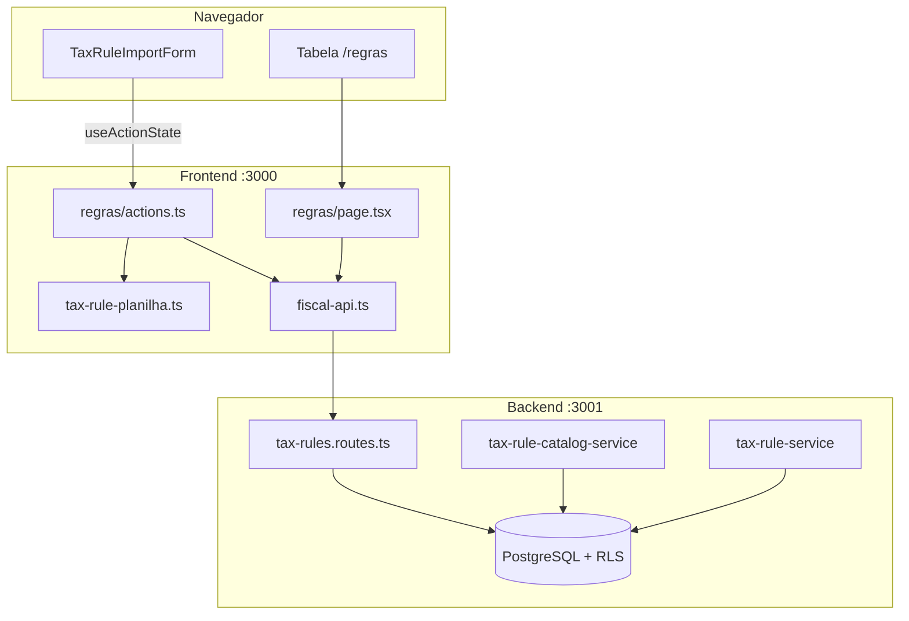
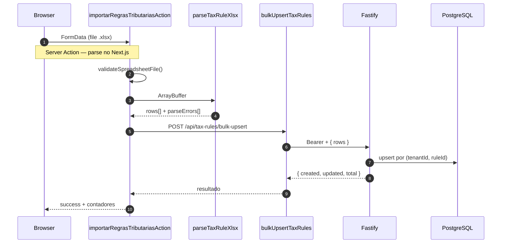
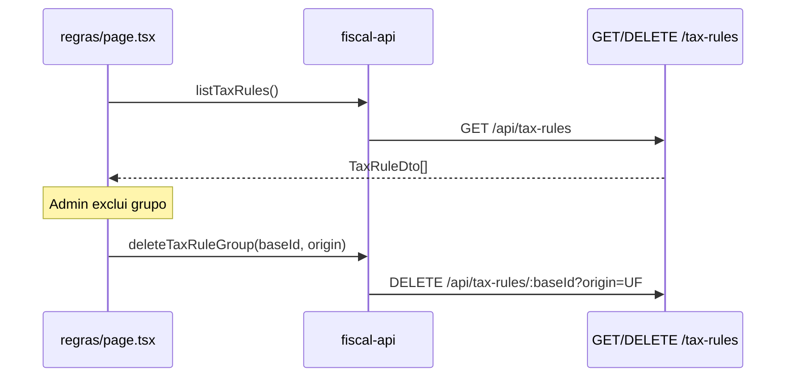
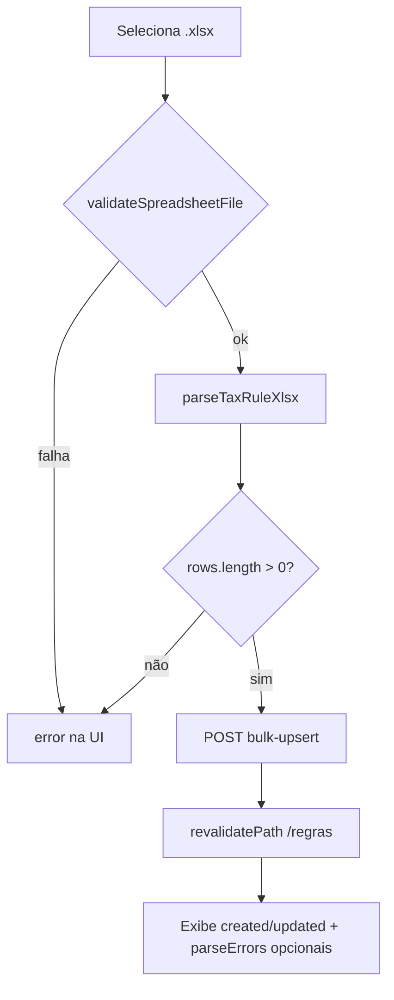
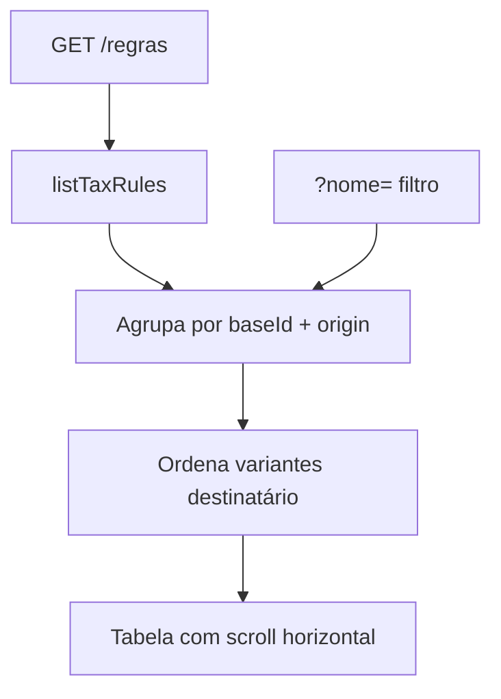
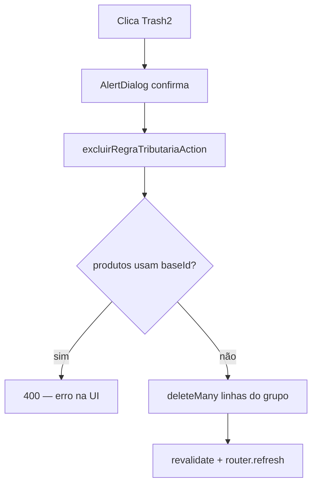
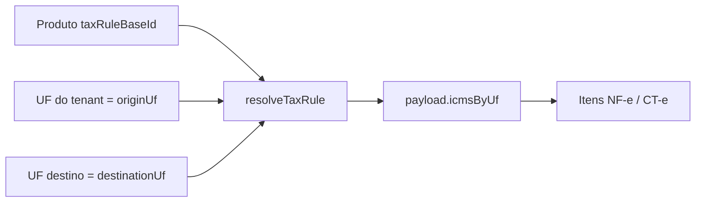

# Planilha de regras tributárias

Documentação do módulo de **importação, visualização e gestão de regras tributárias** (planilha Mercado Livre) no monorepo `msimulation-xml`. Explica o código do **backend (Fastify)**, do **frontend (Next.js 15)** e como os dois se comunicam.

> **Escopo:** upload `.xlsx`, parser da aba "Regras tributárias", persistência em `tax_rules`, catálogo para produtos e resolução de alíquotas na emissão fiscal. Não cobre emissão de NF-e em detalhe — veja `docs/remessa-fisica.md` para o consumo das regras.

---

## Índice

1. [Resumo](#1-resumo)
2. [Arquitetura geral](#2-arquitetura-geral)
3. [Mapa de arquivos](#3-mapa-de-arquivos)
4. [Backend](#4-backend)
5. [Frontend](#5-frontend)
6. [Como frontend e backend se comunicam](#6-como-frontend-e-backend-se-comunicam)
7. [Fluxos](#7-fluxos)
8. [Contrato da API](#8-contrato-da-api)
9. [Variáveis de ambiente](#9-variáveis-de-ambiente)
10. [Debug](#10-debug)

---

## 1. Resumo

1. O admin acessa `/regras` no painel (`AppShell` → "Regras Tributárias").
2. Faz upload de uma planilha `.xlsx` exportada do Mercado Livre (aba **"Regras tributárias"**).
3. A **Server Action** valida o arquivo, faz o **parse no servidor Next.js** (`parseTaxRuleXlsx`) e envia as linhas para `POST /api/tax-rules/bulk-upsert`.
4. O backend faz **upsert** por `(tenantId, ruleId)` — cria ou atualiza — com `source: "xlsx"`.
5. A página lista as regras em uma **tabela espelhando a planilha ML** (IPI, PIS, COFINS, IBS/CBS + 19 campos ICMS × 27 UFs).
6. Produtos referenciam a regra pelo **`taxRuleBaseId`** (ID base da planilha, ex.: `4133250001`).
7. Na emissão fiscal, `resolveTaxRule` busca a linha certa e lê `ICMS_{UF_DESTINO}_*` do `payload`.

**Princípios:** parse no frontend, persistência no backend; **não há exportação** de planilha — só importação e visualização; CFOP **não** vem da planilha (resolvido na emissão); exclusão exige **role ADMIN** e bloqueia se produtos usam a regra.

---

## 2. Arquitetura geral

### Papel no sistema

```mermaid
flowchart LR
  XLSX[Planilha ML .xlsx] --> PARSE[parseTaxRuleXlsx]
  PARSE --> API[POST /tax-rules/bulk-upsert]
  API --> DB[(tax_rules)]
  DB --> UI[/regras — tabela]
  DB --> CAT[GET /tax-rules/catalog]
  CAT --> PROD[Produtos taxRuleBaseId]
  DB --> EMIT[resolveTaxRule na NF-e]
```

### Quem fala com quem



### Nível de API

Todas as rotas de regras ficam em `protectedApiPlugin`:

| Requisito | Detalhe |
|-----------|---------|
| JWT | `typ: "access"` |
| Tenant | `tenantId` obrigatório no token |
| E-mail | Verificado (`requireEmailVerifiedHook`) |
| ADMIN | Apenas `DELETE` (excluir grupo ou todas) |

Registro: `fiscalContextPlugin` → `fiscalRoutes` → `registerTaxRuleRoutes`.

Rate limit global do plugin protegido: **300 req/min** por IP.

### Identificadores de regra

Cada linha importada gera um `ruleId` composto:

```
{baseId}-{UF}-{customerType}-{transactionType}
```

Exemplo: `4133250001-SP-non_taxpayer-sale`

| Parte | Origem |
|-------|--------|
| `baseId` | Coluna `RULE_ID` da planilha ML |
| `UF` | Primeiros 2 caracteres de `ORIGIN` |
| `customerType` | `taxpayer` \| `non_taxpayer` (inferido de `TRANSACTION_TYPE`) |
| `transactionType` | `sale` \| `inbound` (inferido de `TRANSACTION_TYPE`) |

O produto guarda só o **`baseId`** (`taxRuleBaseId`). A resolução na emissão monta o ID completo conforme origem, destino e tipo de operação.

---

## 3. Mapa de arquivos

### Backend

```
backend/src/
├── prisma/schema.prisma                    # model TaxRule
├── routes/fiscal/
│   ├── documents.routes.ts                 # registra registerTaxRuleRoutes
│   └── tax-rules.routes.ts                 # GET, POST bulk-upsert, DELETE
├── schemas/fiscal/tax-rules.ts             # Zod: rows, baseId, origin query
├── services/fiscal/tax/
│   ├── tax-rule-service.ts                 # resolveTaxRule (emissão)
│   ├── tax-rule-catalog-service.ts         # catálogo, exclusão, validação produto
│   └── index.ts
├── services/catalog/product-service.ts     # assertProductTaxRuleBaseId ao salvar
├── lib/fiscal/
│   ├── tax-rule-ids.ts                     # baseId, buildTaxRuleRowId, origin UF
│   ├── tax-engine.ts                       # consome resolveTaxRule
│   └── tax-snapshot.ts
├── lib/shared/spreadsheet-upload.ts        # validação XLSX (espelho do frontend)
└── plugins/contexts/
    ├── fiscal.plugin.ts                    # monta rotas fiscais
    └── guards.ts                           # requireAdminHook
```

### Frontend

```
frontend/src/
├── app/(app)/regras/
│   ├── page.tsx                            # listagem em tabela (Server Component)
│   └── actions.ts                          # importar, excluir grupo, excluir todas
├── components/
│   ├── tax-rule-import-form.tsx            # upload .xlsx
│   ├── tax-rule-delete-all-button.tsx      # exclusão total (admin)
│   └── tax-rule-group-delete-button.tsx    # exclusão por grupo (admin)
└── lib/
    ├── tax-rule-planilha.ts                # parseTaxRuleXlsx (lib xlsx)
    ├── spreadsheet-upload.ts               # magic bytes, MIME, 15 MB
    ├── fiscal-api.ts                       # listTaxRules, bulkUpsert, delete…
    └── fiscal-types.ts                     # TaxRuleDto, TaxRuleCatalogEntry
```

---

## 4. Backend

### Modelo Prisma (`tax_rules`)

```prisma
model TaxRule {
  id              String   @id @default(uuid())
  tenantId        String   @map("tenant_id")
  ruleId          String   @map("rule_id")       // único por tenant
  nome            String
  tipo            String                         // "MELI_RULE" na importação
  uf              String                         // UF origem (2 letras)
  cfop            String                         // sempre "" na importação
  aliquota        String
  transactionType String?  @map("transaction_type")
  customerType    String?  @map("customer_type")
  origin          String?  @map("origin")        // texto livre da coluna ORIGIN
  source          String   @default("manual")    // "xlsx" após import
  payload         Json?                          // ICMS por UF + impostos federais
  createdAt       DateTime @default(now())
  updatedAt       DateTime @updatedAt

  @@unique([tenantId, ruleId])
  @@index([tenantId])
}
```

Produtos referenciam regras via `Product.taxRuleBaseId` (string, ID base da planilha).

### Estrutura do `payload` (JSON)

```json
{
  "operation": {
    "transactionType": "sale",
    "customerType": "non_taxpayer"
  },
  "taxes": {
    "ipi":    { "st": "…", "aliquota": 0, "codEnq": "…" },
    "pis":    { "st": "…", "aliquota": 0 },
    "cofins": { "st": "…", "aliquota": 0 },
    "ibsCbs": { "st": "…", "cClassTrib": "…", "reducao": 0 }
  },
  "icmsByUf": {
    "ICMS_SP_CST": "00",
    "ICMS_SP_PICMS_INTERNAL": 18,
    "ICMS_RJ_PICMS_INTERSTATE": 12
  }
}
```

Chaves `ICMS_{UF}_{SUFIXO}` espelham as colunas da planilha ML (27 UFs × 19 campos).

### Rotas (`tax-rules.routes.ts`)

| Método | Path | Auth | Função |
|--------|------|------|--------|
| `GET` | `/tax-rules` | JWT + tenant | Lista todas as regras do tenant |
| `GET` | `/tax-rules/catalog` | JWT + tenant | Catálogo deduplicado para select de produtos |
| `POST` | `/tax-rules/bulk-upsert` | JWT + tenant | Upsert em lote (importação) |
| `DELETE` | `/tax-rules` | JWT + tenant + **ADMIN** | Remove todas as regras do tenant |
| `DELETE` | `/tax-rules/:baseId?origin=UF` | JWT + tenant + **ADMIN** | Remove grupo (baseId + origem) |

### Bulk upsert

```
POST body.rows[]
  → para cada row:
       findUnique(tenantId, ruleId)
       upsert(create | update) com source: "xlsx"
  → { created, updated, total }
```

Limite Zod: **1–5000** linhas por requisição.

### Catálogo (`listTaxRuleCatalog`)

- Filtra `source = "xlsx"`.
- Mantém só regras cuja **UF de origem** coincide com a UF do tenant.
- Deduplica por `(baseId, origin)`.
- Retorna `{ baseId, nome, origin, label }` — `label` = `"Nome · origem SP"`.

### Exclusão

**Grupo** (`deleteTaxRuleGroup`):

1. Conta produtos com `taxRuleBaseId = baseId` → se > 0, erro 400.
2. Busca linhas com `ruleId` começando em `{baseId}-`.
3. Filtra pela `origin` (UF).
4. `deleteMany` nas linhas do grupo.

**Todas** (`deleteAllTaxRules`):

- Erro se `count === 0`.
- `deleteMany({ tenantId })`.

### Resolução na emissão (`resolveTaxRule`)

Entrada: `{ originUf, destinationUf, transactionType, customerType, ruleBaseId? }`

```
findTaxRuleRow
  → tenta ruleId exato: {base}-{originUf}-{customerType}-{transactionType}
  → tenta legado sem origem: {base}-{customerType}-{transactionType}
  → fallback findFirst por prefixo + UF/origin
  → lê ICMS_{destinationUf}_* do payload.icmsByUf
```

Usado pelo motor fiscal em remessa, venda e demais operações.

### Validação de produto (`assertProductTaxRuleBaseId`)

Ao criar/atualizar produto com `taxRuleBaseId`:

- Exige que exista ao menos uma linha com prefixo `{baseId}-`.
- Se a UF do tenant estiver definida, exige linhas para essa origem.
- Mensagens orientam importar planilha ou ajustar UF da empresa.

---

## 5. Frontend

### Página `/regras`

Server Component que:

1. Chama `listTaxRules()` e `getAuthMe()` em paralelo.
2. Agrupa regras em **RuleGroups** por `(baseRuleId, origin, nomeBase)`.
3. Dentro de cada grupo, ordena linhas: contribuinte → não contribuinte → envio de estoque.
4. Renderiza tabela com:
   - Colunas fixas (sticky): nome, origem, tipo destinatário.
   - Blocos IPI / PIS / COFINS / IBS-CBS.
   - 27 UFs × 19 campos ICMS (~500+ colunas, scroll horizontal, min-width ~9800px).
5. Filtro por nome via `?nome=...` (formulário GET).

Formatação de percentuais segue convenção ML: `325` → `3,25%`, `17` → `17%`.

### Componentes

| Componente | Função |
|------------|--------|
| `TaxRuleImportForm` | Upload `.xlsx`, feedback created/updated/parseErrors |
| `TaxRuleDeleteAllButton` | AlertDialog → `excluirTodasRegrasTributariasAction` (só admin) |
| `TaxRuleGroupDeleteButton` | Trash por grupo → `excluirRegraTributariaAction` (só admin) |

### Server Actions (`regras/actions.ts`)

| Action | Fluxo |
|--------|-------|
| `importarRegrasTributariasAction` | valida arquivo → parse → bulkUpsert → revalidate `/regras` |
| `excluirRegraTributariaAction` | DELETE grupo → revalidate `/regras`, `/produtos`, `/configuracoes-fiscais` |
| `excluirTodasRegrasTributariasAction` | DELETE todas → mesmos revalidates |

### Parser da planilha (`tax-rule-planilha.ts`)

| Etapa | Regra |
|-------|-------|
| Aba | `"regras tributárias"` ou `"regras tributarias"` (case-insensitive) |
| Linha 2 (índice 1) | Cabeçalhos (`RULE_ID`, `RULE_NAME`, `ORIGIN`, `TRANSACTION_TYPE`, `ICMS_*`…) |
| Linhas 1 e 3 | Ignoradas (título/subtítulo ML) |
| Dados | A partir da linha 4 (índice 3) |
| Células mescladas | `RuleIdentityState` propaga `RULE_ID`, `RULE_NAME`, `ORIGIN` vazios |
| `TRANSACTION_TYPE` | "envio de estoque"/"transfer"/"remessa" → `inbound`; senão `sale` |
| Destinatário | "não contribuinte"/"consumidor final" → `non_taxpayer`; senão `taxpayer` |
| `tipo` | Sempre `"MELI_RULE"` |
| `cfop` | Sempre `""` |
| `aliquota` | `ICMS_{UF}_PICMS_INTERNAL` ou fallback `IPI_ALIQUOTA` |
| Valores | `"Não aplicável"` / `"Calculada automaticamente"` → omitidos; vírgula → ponto |

Linhas inválidas vão para `errors[]` e são **puladas** — não abortam o parse inteiro.

### Validação de arquivo (`spreadsheet-upload.ts`)

| Regra | Valor |
|-------|-------|
| Tamanho máximo | 15 MB |
| Extensão | `.xlsx` ou `.xls` |
| MIME | OOXML, MS Excel ou `application/octet-stream` |
| Magic bytes | `50 4B 03 04` (ZIP/OOXML) |

### Integração com produtos

- `GET /tax-rules/catalog` alimenta o select de regra fiscal em cadastro/edição de produto.
- `taxRuleBaseId` no produto é validado no backend ao salvar.
- Excluir regra com produtos vinculados retorna erro explícito.

---

## 6. Como frontend e backend se comunicam

### Importação



| Camada | Responsabilidade |
|--------|------------------|
| `tax-rule-planilha.ts` | Leitura XLSX, normalização, montagem de `ruleId` e `payload` |
| `spreadsheet-upload.ts` | Segurança do arquivo antes do parse |
| `regras/actions.ts` | Orquestra validação → parse → API → revalidate |
| `fiscal-api.ts` | HTTP autenticado (`authHeaders`) |
| `tax-rules.routes.ts` | Validação Zod + upsert Prisma |

**Importante:** o backend **não** recebe o arquivo `.xlsx` — só o JSON das linhas já parseadas.

### Listagem e exclusão



### Tabela endpoint → função frontend

| Backend | Frontend | Action / uso |
|---------|----------|--------------|
| `GET /tax-rules` | `listTaxRules` | `regras/page.tsx` |
| `GET /tax-rules/catalog` | `listTaxRuleCatalog` | formulário de produto |
| `POST /tax-rules/bulk-upsert` | `bulkUpsertTaxRules` | `importarRegrasTributariasAction` |
| `DELETE /tax-rules` | `deleteAllTaxRules` | `excluirTodasRegrasTributariasAction` |
| `DELETE /tax-rules/:baseId` | `deleteTaxRuleGroup` | `excluirRegraTributariaAction` |

---

## 7. Fluxos

### Importar planilha ML



### Visualizar regras



### Excluir grupo (admin)



### Uso na emissão fiscal



### Matriz ação → código → banco

| Ação | Action / função | API | Tabelas |
|------|-----------------|-----|---------|
| Importar planilha | `importarRegrasTributariasAction` | `POST /bulk-upsert` | `tax_rules` |
| Listar | `listTaxRules` | `GET /tax-rules` | `tax_rules` |
| Catálogo produto | `listTaxRuleCatalog` | `GET /catalog` | `tax_rules`, `tenants` |
| Excluir grupo | `excluirRegraTributariaAction` | `DELETE /:baseId` | `tax_rules` |
| Excluir todas | `excluirTodasRegrasTributariasAction` | `DELETE /tax-rules` | `tax_rules` |
| Emitir documento | `resolveTaxRule` | — (leitura interna) | `tax_rules`, `products` |

---

## 8. Contrato da API

Base: `http://localhost:3001/api`

**Header:** `Authorization: Bearer <accessToken>` (tenant obrigatório)

Erro padrão: `{ "error": "…", "details"?: { "campo": ["…"] } }`

### GET /tax-rules

**200:**

```json
[
  {
    "id": "4133250001-SP-non_taxpayer-sale",
    "nome": "Regra Exemplo (Não contribuinte)",
    "tipo": "MELI_RULE",
    "uf": "SP",
    "origin": "SP",
    "cfop": "",
    "aliquota": "18",
    "transactionType": "sale",
    "customerType": "non_taxpayer",
    "source": "xlsx",
    "payload": { "operation": {}, "taxes": {}, "icmsByUf": {} }
  }
]
```

> O campo `id` na resposta é o `ruleId` (não o UUID interno do Prisma).

### GET /tax-rules/catalog

**200:**

```json
[
  {
    "baseId": "4133250001",
    "nome": "Regra Exemplo",
    "origin": "SP",
    "label": "Regra Exemplo · origem SP"
  }
]
```

### POST /tax-rules/bulk-upsert

**Body:**

```json
{
  "rows": [
    {
      "ruleId": "4133250001-SP-non_taxpayer-sale",
      "nome": "Regra Exemplo (Não contribuinte)",
      "tipo": "MELI_RULE",
      "uf": "SP",
      "cfop": "",
      "aliquota": "18",
      "transactionType": "sale",
      "customerType": "non_taxpayer",
      "origin": "SP",
      "payload": {}
    }
  ]
}
```

**200:**

```json
{ "created": 120, "updated": 15, "total": 135 }
```

**400:** Zod (`rows` vazio, > 5000, `uf` ≠ 2 chars, etc.)

### DELETE /tax-rules

**200:** `{ "deleted": 270 }`

**400:** `"Nenhuma regra cadastrada para esta empresa"`

**403:** usuário não é ADMIN

### DELETE /tax-rules/:baseId?origin=SP

**200:** `{ "deleted": 3, "nome": "Regra Exemplo" }`

**400:** regra não encontrada, origem inválida, ou produtos vinculados

**403:** usuário não é ADMIN

---

## 9. Variáveis de ambiente

Não há variáveis específicas do módulo. Depende das gerais:

| Variável | Onde | Função |
|----------|------|--------|
| `API_URL` | `frontend/.env.local` | Backend para `fiscal-api.ts` |
| `DATABASE_URL` | `backend/.env` | Prisma / `tax_rules` |
| `JWT_SECRET` | `backend/.env` | Auth nas rotas protegidas |

Autenticação e cookies: [login.md § 9](./login.md#9-variáveis-de-ambiente-e-cookies).

---

## 10. Debug

| Sintoma | Verificar |
|---------|-----------|
| "Aba 'Regras tributárias' não encontrada" | Nome exato da aba na planilha ML exportada |
| "Nenhuma regra válida na planilha" | Linhas 4+ com `RULE_ID`, `RULE_NAME`, `ORIGIN`, `TRANSACTION_TYPE` |
| Linhas ignoradas após import | `parseErrors` — células mescladas sem identidade propagada |
| Catálogo vazio no produto | `source=xlsx` e UF da regra = UF do tenant |
| "Regra fiscal não encontrada" no produto | Importar planilha; `taxRuleBaseId` deve ser o `RULE_ID` base |
| "Não é possível excluir: N produto(s)…" | Alterar `taxRuleBaseId` dos produtos antes |
| 403 ao excluir | Usuário precisa `role: ADMIN` |
| Tabela vazia mas import ok | Filtro `?nome=` ativo; conferir `tenantId` no JWT |
| Alíquota errada na emissão | `resolveTaxRule` — `destinationUf` e `transactionType`/`customerType` |
| Arquivo rejeitado | Tamanho > 15 MB, extensão, magic bytes inválidos |

### Checklist manual

1. Empresa com UF definida (ex.: SP) no onboarding.
2. Importar planilha ML com aba "Regras tributárias" e `ORIGIN=SP`.
3. Confirmar contadores `created`/`updated` na UI.
4. Ver tabela em `/regras` com grupos e variantes (contribuinte / não contribuinte / envio).
5. `GET /api/tax-rules/catalog` retorna entrada com `baseId` esperado.
6. Cadastrar produto com essa regra — salvar sem erro.
7. (Admin) Excluir grupo sem produtos vinculados — linhas somem da tabela.
8. Tentar excluir com produto vinculado — mensagem de bloqueio.

### Formato esperado da planilha ML

| Linha | Conteúdo |
|-------|----------|
| 1 | Título (ignorada) |
| 2 | Cabeçalhos de coluna |
| 3 | Subtítulo (ignorada) |
| 4+ | Dados — uma linha por combinação destinatário/operação |

Colunas-chave: `RULE_ID`, `RULE_NAME`, `ORIGIN`, `TRANSACTION_TYPE`, `IPI_ST`, `PIS_ST`, `COFINS_ST`, `IBS_CBS_*`, `ICMS_{UF}_*`.

---

*Atualizado em junho/2026 — `tax-rules.routes.ts`, `tax-rule-planilha.ts`, `tax-rule-catalog-service.ts`, `tax-rule-service.ts`, `regras/page.tsx`, `regras/actions.ts`.*
