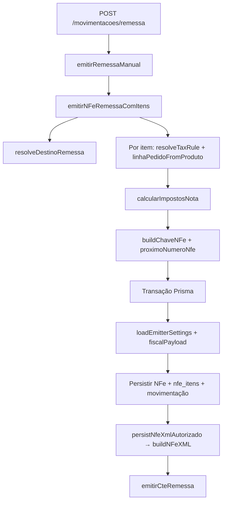

# NF-e de remessa física — funções e fluxo

Documentação das funções necessárias para emitir uma **NF-e de remessa física** (`NFeTipo.REMESSA`) para depósito temporário (Mercado Livre Full), incluindo o **CT-e de transporte** vinculado e a geração do XML.

> **Ponto de entrada único (UI):** `POST /movimentacoes/remessa` → `emitirRemessaManual`.  
> O fluxo interno também é reutilizado por `emitirNFeRemessa` (ex.: avanço entre CDs).

---

## Visão geral do pipeline



---

## Pré-requisitos de dados

| Dado | Onde | Usado por |
|------|------|-----------|
| Tenant (emitente: UF, CNPJ, série remessa) | `tenants` | Chave, XML, regra fiscal |
| Produto com `precoCusto > 0` | `products` | `productUnitPrice(..., "REMESSA")` |
| Produto com `taxRuleBaseId` | `products` | `resolveTaxRule` |
| Regra `{baseId}-taxpayer-inbound` na planilha | `tax_rules` | CST, alíquotas, IPI/PIS/COFINS |
| CD ML ativo (padrão ou selecionado) | `meli_unidades_logisticas` | Destinatário + UF destino |
| Configurações fiscais do emissor (opcional) | `fiscal_emitter_settings` | Bases, frete, textos no XML |

---

## Fase 1 — Entrada HTTP

| Função / rota | Arquivo | Responsabilidade |
|---------------|---------|------------------|
| `registerMovimentacoesRoutes` | `backend/src/routes/logistics/movimentacoes.routes.ts` | Registra `POST /movimentacoes/remessa` |
| `remessaManualBody` (Zod) | `backend/src/schemas/logistics/unidades-logisticas.ts` | Valida `unidadeDestinoId` + itens |
| `tenantIdFromRequest` | `backend/src/lib/auth/request-context.js` | Isola tenant do JWT |
| `emitirRemessaManual` | `backend/src/services/fiscal/remessa/remessa-service.ts` | Carrega tenant/produtos e delega ao núcleo |

---

## Fase 2 — Destinatário (CD logístico)

| Função | Arquivo | Responsabilidade |
|--------|---------|------------------|
| `UnidadeLogisticaService.resolveDestinoRemessa` | `backend/src/services/logistics/unidade-logistica-service.ts` | Unidade explícita ou CD padrão do tenant |
| `getUnidadeAtivaDoTenant` | `backend/src/services/logistics/unidade-logistica-service.ts` | Garante unidade ativa e vinculada |
| `unidadeParaDestinoFiscal` | `backend/src/lib/logistics/meli-unidade.ts` | Converte cadastro ML → campos `dest*` da NF-e |
| `destinoToNfeFields` | `backend/src/services/fiscal/remessa/remessa-service.ts` | Mapeia `UnidadeDestinoFiscal` → colunas Prisma |

Constantes de fallback legado (não usadas quando há unidade cadastrada):

| Constante | Arquivo |
|-----------|---------|
| `REMESSA_ML_DEST`, `REMESSA_ML_INTERMED` | `backend/src/lib/fiscal/remessa-dest.ts` |

---

## Fase 3 — Regra tributária e CFOP (por item)

| Função | Arquivo | Responsabilidade |
|--------|---------|------------------|
| `productUnitPrice` | `packages/fiscal-core/src/product-pricing.ts` | Remessa usa **preço de custo** |
| `buildTaxRuleRowId` | `backend/src/lib/fiscal/tax-rule-ids.ts` | Monta ID `{base}-taxpayer-inbound` |
| `resolveTaxRule` | `backend/src/services/fiscal/tax/tax-rule-service.ts` | Busca linha da planilha; extrai ICMS por UF destino |
| `resolveRemessaCfop` | `backend/src/services/fiscal/remessa/helpers/remessa-dest.ts` | **5949** mesma UF / **6949** interestadual |
| `linhaPedidoFromProduto` | `backend/src/services/fiscal/tax/tax-calculation-service.ts` | Monta linha (NCM, CFOP, qtd, valor) |
| `inferAliqIcmsRemessa` | `backend/src/services/fiscal/tax/tax-calculation-service.ts` | Fallback ICMS se planilha não trouxer alíquota |

Parâmetros fixos da remessa inbound B2B:

- `transactionType: "inbound"`
- `customerType: "taxpayer"` (sem DIFAL)

---

## Fase 4 — Cálculo de impostos

| Função | Arquivo | Responsabilidade |
|--------|---------|------------------|
| `taxSnapshotFromRule` | `backend/src/lib/fiscal/tax-snapshot.ts` | Normaliza CST/alíquotas IPI/PIS/COFINS da regra |
| `montarItemFiscal` | `backend/src/services/fiscal/tax/tax-calculation-service.ts` | Traduz regra + contexto UF → entrada da engine |
| `calcularImpostosNota` | `backend/src/services/fiscal/tax/tax-calculation-service.ts` | Agrega itens e delega aritmética |
| `calcularNotaFiscal` | `backend/src/lib/fiscal/tax-engine.ts` | Engine pura: BC, ICMS, PIS, COFINS, totais |

Saída usada na persistência: `nota.totais.vNF`, `nota.totais.vICMS`, `nota.itens[]`.

---

## Fase 5 — Identificação do documento

| Função | Arquivo | Responsabilidade |
|--------|---------|------------------|
| `proximoNumeroNfe` | `backend/src/lib/fiscal/nfe-sequencia.ts` | Numeração sequencial por tenant/série |
| `buildChaveNFe` | `backend/src/lib/fiscal/nfe-chave.ts` | Chave 44 dígitos (modelo 55) |
| `gerarPedidoMl` | `backend/src/lib/fiscal/nfe-chave.ts` | ID do pedido ML (`pedidoMl` / `obsCont`) |
| `REMESSA_NAT_OP` | `backend/src/services/fiscal/remessa/helpers/remessa-dest.ts` | Natureza da operação no cabeçalho |

---

## Fase 6 — Configurações do emissor e payload fiscal

| Função | Arquivo | Responsabilidade |
|--------|---------|------------------|
| `loadEmitterSettings` | `backend/src/lib/fiscal/fiscal-emitter-runtime.ts` | Lê `fiscal_emitter_settings` + defaults |
| `mergeFiscalEmitterSettings` | `backend/src/lib/fiscal/fiscal-emitter-settings-defaults.ts` | Defaults de composição de BC, frete, DIFAL |
| `enrichTaxSnapshot` | `packages/fiscal-core/src/fiscal-emitter-runtime.ts` | Bases ICMS/PIS/COFINS canal `remessa` |
| `enrichFiscalPayloadWithXTexto` | `packages/fiscal-core/src/nfe-xtexto.ts` | `obsCont/xTexto` padrão ML (`INBOUND-inbound-...`) |

O `fiscalPayload` persistido combina: snapshot tributário + `engine` (resultado matemático) + `obsContXTexto`.

---

## Fase 7 — Persistência (transação única)

| Função | Arquivo | Responsabilidade |
|--------|---------|------------------|
| `prisma.$transaction` | `remessa-service.ts` | Atomicidade NF-e + itens + XML + CT-e |
| `tx.nFe.create` | `remessa-service.ts` | Cabeçalho `tipo: REMESSA`, destinatário, totais |
| `tx.nfeItem.create` | `remessa-service.ts` | Itens com `saldoDisponivel` (base FIFO futura) |
| `registrarMovimentacaoProduto` | `backend/src/services/logistics/movimentacao-produto-service.ts` | Histórico logístico `OperacaoFiscalTipo.REMESSA` |

---

## Fase 8 — XML da NF-e

| Função | Arquivo | Responsabilidade |
|--------|---------|------------------|
| `persistNfeXmlAutorizado` | `backend/src/services/fiscal/shared/nfe-xml-service.ts` | Orquestra geração e grava `xmlAutorizado` |
| `mapNfe` | `backend/src/lib/fiscal/fiscal-mappers.ts` | Row Prisma → DTO XML |
| `mapEmitente` | `backend/src/lib/org/tenant-mapper.ts` | Tenant → emitente XML |
| `mapProduct` | `backend/src/lib/catalog/product-mapper.ts` | Produto → DTO de item |
| `buildNfeXmlAutorizado` | `backend/src/services/fiscal/shared/nfe-xml-service.ts` | Chama pacote `nfe-xml` |
| `buildNFeXML` | `packages/nfe-xml/src/nfe-xml-generator.ts` | Roteia por `tipo` |
| `buildRemessaNFeXML` | `packages/nfe-xml/src/nfe-xml-generator.ts` | Layout NF-e remessa (tpNF=1, idDest dinâmico) |
| `formatNfeDateTime` | `packages/fiscal-core/src/nfe-datetime.ts` | `dhEmi`/`dhSaiEnt` com offset `-03:00` |
| `buildSimulationXmlSignature` | `packages/fiscal-core/src/xml-signature.ts` | Bloco `<Signature>` válido no XSD |
| `parseEngineFromFiscalPayload` | `packages/nfe-xml/src/fiscal-engine-xml.ts` | Lê tributos calculados do payload |
| `xTextoFromNfe` | `packages/fiscal-core/src/nfe-xtexto.ts` | Texto `external_id` no XML |

---

## Fase 9 — CT-e de remessa (mesma transação)

| Função | Arquivo | Responsabilidade |
|--------|---------|------------------|
| `emitirCteRemessa` | `backend/src/services/fiscal/remessa/cte-remessa-service.ts` | CT-e 1:1 vinculado à NF-e remessa |
| `proximoNumeroCte` | `backend/src/lib/fiscal/cte-sequencia.ts` | Numeração CT-e |
| `buildChaveCTe` | `backend/src/lib/fiscal/cte-chave.ts` | Chave modelo 57 |
| `calcularValorFreteRemessa` | `backend/src/lib/fiscal/cte-remessa-template.ts` | Valor do frete simulado |
| `calcularPesoCarga` | `backend/src/lib/fiscal/cte-remessa-template.ts` | Peso estimado por quantidade |
| `mapCte` | `backend/src/lib/fiscal/fiscal-mappers.ts` | DTO com `nfeChaveRef` |

XML do CT-e (frontend): `frontend/src/lib/cte-xml-generator.ts` → `buildCTeXML`.

---

## Fase 10 — Resposta da API

| Função | Arquivo | Responsabilidade |
|--------|---------|------------------|
| `mapNfe` | `backend/src/lib/fiscal/fiscal-mappers.ts` | NF-e + itens para JSON |
| `mapCte` | `backend/src/lib/fiscal/fiscal-mappers.ts` | CT-e vinculado |

---

## Tratamento de erros

| Classe | Quando |
|--------|--------|
| `RemessaError` | Validação de negócio (custo zero, sem regra, item inválido) |
| `UnidadeLogisticaError` | CD não encontrado ou sem padrão |
| `TaxRuleCatalogError` | Regra inexistente no catálogo (cadastro de produto) |

---

## Funções auxiliares (pós-emissão)

Usadas em outros fluxos, não na emissão inicial:

| Função | Arquivo | Uso |
|--------|---------|-----|
| `debitarSaldoRemessaPorCd` | `backend/src/services/fiscal/remessa/remessa-fifo.ts` | Avanço entre CDs / venda consome saldo FIFO |
| `prepararRemessaSimbolicaFiscal` | `backend/src/services/fiscal/remessa/remessa-simbolica-fiscal.ts` | Remessa **simbólica** (CFOP 5949 fixo, outro tipo) |

---

## Ordem de chamada resumida

```
emitirRemessaManual
  └─ emitirNFeRemessaComItens
       ├─ resolveDestinoRemessa → unidadeParaDestinoFiscal
       ├─ [por item]
       │    ├─ productUnitPrice
       │    ├─ resolveTaxRule
       │    ├─ resolveRemessaCfop
       │    └─ linhaPedidoFromProduto
       ├─ calcularImpostosNota → montarItemFiscal → calcularNotaFiscal
       ├─ proximoNumeroNfe + buildChaveNFe + gerarPedidoMl
       └─ $transaction
            ├─ loadEmitterSettings
            ├─ taxSnapshotFromRule + enrichTaxSnapshot + enrichFiscalPayloadWithXTexto
            ├─ nFe.create + nfeItem.create + registrarMovimentacaoProduto
            ├─ persistNfeXmlAutorizado → buildNFeXML → buildRemessaNFeXML
            └─ emitirCteRemessa
```

---

## Referência rápida por pacote

| Pacote / pasta | Papel na remessa |
|----------------|------------------|
| `backend/src/services/fiscal/remessa/` | Orquestrador + FIFO + CT-e remessa |
| `backend/src/services/fiscal/tax/` | Regras e cálculo |
| `backend/src/services/README.md` | Mapa geral de domínios |
| `backend/src/lib/fiscal/` | Chave, sequência, CFOP, snapshot |
| `backend/src/services/logistics/` | CD destino e movimentação |
| `packages/fiscal-core/` | Preço custo, payload, data/hora, assinatura |
| `packages/nfe-xml/` | Geração do XML NF-e |
