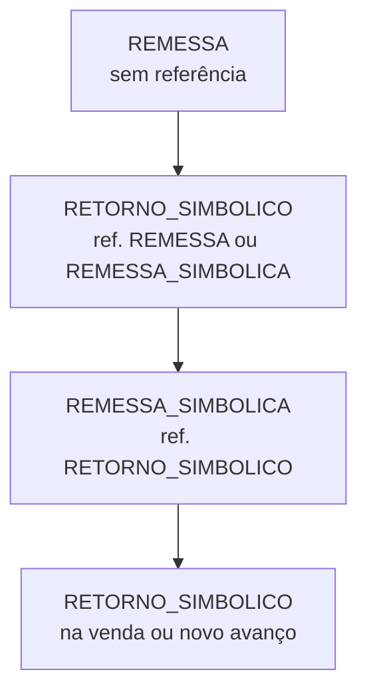
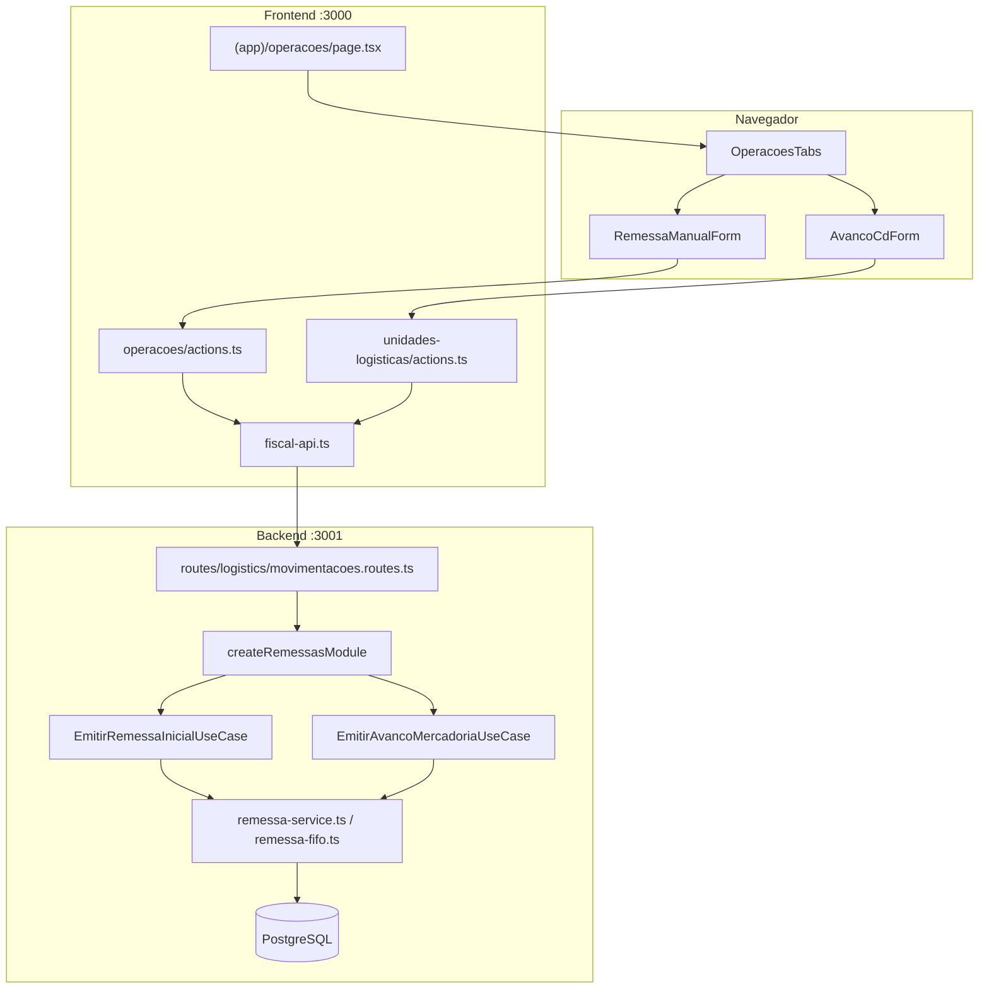

# Remessas e avanço de mercadoria

Documentação do módulo de **remessa física** (envio ao CD Mercado Livre) e **avanço de mercadoria entre CDs** no monorepo `msimulation-xml`. Explica o código do **backend (Fastify)**, do **frontend (Next.js 15)** e como os dois se comunicam.

> **Escopo:** emissão de NF-e de remessa física, controle de saldo FIFO por CD, avanço entre unidades logísticas (retorno simbólico + remessa simbólica) e papel da remessa no faturamento de pedidos. Para produtos, veja [produto.md](./produto.md). Para pedidos e consumo FIFO na venda, veja [pedido.md](./pedido.md). Para regras tributárias, veja [regras-tributarias.md](./regras-tributarias.md). Para unidades logísticas (CDs), veja a tela `/unidades-logisticas`.

---

## Índice

1. [Resumo](#1-resumo)
2. [Arquitetura geral](#2-arquitetura-geral)
3. [Mapa de arquivos](#3-mapa-de-arquivos)
4. [Backend](#4-backend)
5. [Frontend](#5-frontend)
6. [Como frontend e backend se comunicam](#6-como-frontend-e-backend-se-comunicam)
7. [Fluxos](#7-fluxos)
8. [Contrato da API](#8-contrato-da-api)
9. [Variáveis de ambiente](#9-variáveis-de-ambiente)
10. [Debug](#10-debug)

---

## 1. Resumo

1. O usuário acessa `/operacoes` no painel (`AppShell` → "Remessas").
2. Na aba **Remessa física**, seleciona um ou mais produtos, quantidades e o **CD destino** (unidade logística ML).
3. A emissão gera **NF-e `REMESSA`** + **CT-e** de transporte, sem alterar o `estoque` cadastral do produto.
4. Cada linha da nota cria registro em `nfe_itens` com `saldoDisponivel` — esse saldo alimenta o **FIFO** usado em avanços e vendas.
5. Na aba **Avanço CD**, transfere saldo de um CD origem para outro: debita FIFO, emite **retorno simbólico** e **remessa simbólica**; o saldo passa a existir no CD destino.
6. Pedidos ML só faturam se houver saldo de remessa suficiente para o produto (ver [pedido.md](./pedido.md)).

**Princípios:** remessa valoriza `precoCusto` (não `preco` de venda); exige `taxRuleBaseId` com linha `inbound` na UF do CD; CFOP **5949** (mesma UF) ou **6949** (interestadual); série NF-e = `tenant.serieRemessa`.

---

## 2. Arquitetura geral

### Papel no sistema

```mermaid
flowchart LR
  UI[/operacoes] --> REM[NF-e REMESSA física]
  REM --> ITENS[nfe_itens saldo FIFO]
  ITENS --> AVANCO[Avanço entre CDs]
  AVANCO --> RET[RETORNO_SIMBOLICO]
  AVANCO --> SIMB[REMESSA_SIMBOLICA]
  SIMB --> ITENS
  ITENS --> VENDA[Faturamento pedido ML]
  VENDA --> CONS[nfe_remessa_consumos]
  CD[Unidades ML] --> REM
  CD --> AVANCO
  PROD[Product precoCusto + regra] --> REM
```

### Cadeia fiscal permitida



| Tipo filho | Tipo pai obrigatório |
|------------|----------------------|
| `REMESSA` | — (nota raiz) |
| `RETORNO_SIMBOLICO` | `REMESSA` ou `REMESSA_SIMBOLICA` |
| `REMESSA_SIMBOLICA` | `RETORNO_SIMBOLICO` |

### Quem fala com quem



### Modelo de dados (Prisma)

**Tipos de NF-e relevantes (`NFeTipo`):**

| Tipo | Papel |
|------|-------|
| `REMESSA` | Envio físico seller → CD; gera saldo FIFO |
| `REMESSA_SIMBOLICA` | Crédito simbólico no CD destino (avanço) |
| `RETORNO_SIMBOLICO` | Débito simbólico / retorno ao estoque do seller |

**Tabela `nfe_itens`** — saldo FIFO por produto e CD:

| Campo | Descrição |
|-------|-----------|
| `nfeId` | NF-e de remessa ou remessa simbólica |
| `productId` | Produto da linha |
| `quantidade` | Quantidade emitida na nota |
| `saldoDisponivel` | Saldo restante para consumo (avanço/venda) |

**Tabela `nfe_remessa_consumos`** — vínculo retorno → linhas debitadas:

| Campo | Descrição |
|-------|-----------|
| `retornoNfeId` | NF-e `RETORNO_SIMBOLICO` |
| `remessaNfeId` | NF-e de origem do saldo |
| `nfeItemId` | Linha FIFO debitada |
| `quantidade` | Unidades consumidas |

**Tabela `movimentacoes_produto`** — auditoria operacional:

| `tipoOperacao` | Quando |
|----------------|--------|
| `REMESSA` | Cada item da remessa física |
| `AVANCO_CD` | Após avanço entre CDs |

**Campos de unidade na NF-e:**

| Campo | Uso |
|-------|-----|
| `unidadeDestinoId` | CD que recebe o saldo (remessa física / remessa simbólica) |
| `unidadeOrigemId` | CD de origem (avanço) |
| `nfeReferenciaId` | Nota pai na cadeia fiscal |

---

## 3. Mapa de arquivos

### Backend — módulo dedicado

```
backend/src/modules/remessas/
├── application/
│   ├── dto/
│   │   ├── emitir-remessa-inicial.command.ts
│   │   └── emitir-avanco-mercadoria.command.ts
│   └── use-cases/
│       ├── emitir-remessa-inicial.ts      # validação + delega emissão legada
│       └── emitir-avanco-mercadoria.ts    # cadeia retorno + remessa simbólica
├── domain/
│   ├── entities/
│   │   ├── nota-fiscal.ts                 # criarRemessaInicial, criarRetorno…
│   │   └── cadeia-fiscal.ts               # regras de referência pai/filho
│   ├── services/
│   │   ├── validador-cadeia-fiscal.ts
│   │   └── transferidor-saldo-fifo.ts
│   ├── ports/                             # estoque, emissor, unidade logística…
│   └── errors.ts                          # RemessaDomainError
├── infrastructure/
│   ├── factory/remessas-module.factory.ts # Composition Root
│   ├── prisma/                            # repositórios FIFO e NF-e
│   ├── fiscal/fiscal-emissor-adapter.ts
│   └── logistics/                         # unidade + movimentação
├── presentation/
│   └── avanco-api.mapper.ts               # contrato legado POST avanco-cd
└── index.ts
```

### Backend — serviços fiscais legados (núcleo de emissão)

```
backend/src/services/fiscal/remessa/
├── remessa-service.ts           # emitirRemessaManual, emitirNFeRemessaComItens
├── remessa-fifo.ts              # saldo, débito FIFO, listagem por CD, realinhamento
├── remessa-simbolica-fiscal.ts  # tributos da remessa simbólica
├── cte-remessa-service.ts       # CT-e 1:1 com NF-e de remessa
└── helpers/
    ├── remessa-dest.ts          # CFOP 5949/6949, natOp
    └── remessa-simbolica-dest.ts

backend/src/services/logistics/
├── avanco-cd-service.ts         # implementação legada (não usada pelas rotas atuais)
├── avanco-product-resolve.ts    # resolve produto + saldo para avanço
└── unidade-logistica-service.ts # CD padrão, destino fiscal
```

### Backend — rotas e schemas

```
backend/src/routes/logistics/movimentacoes.routes.ts
backend/src/schemas/logistics/unidades-logisticas.ts   # remessaManualBody, avancoCdBody…
```

### Frontend

```
frontend/src/
├── app/(app)/operacoes/
│   ├── page.tsx                 # RSC: produtos + unidades ativas
│   └── actions.ts               # emitirRemessaManualAction
├── app/(app)/unidades-logisticas/
│   └── actions.ts               # emitirAvancoCdAction, saldo CD, remessa no CD origem
├── components/
│   ├── operacoes-tabs.tsx       # abas: remessa, avanço, placeholders futuros
│   ├── remessa-manual-form.tsx
│   └── avanco-cd-form.tsx
└── lib/
    └── fiscal-api.ts            # emitirRemessaManual, emitirAvancoCd, listSaldo…
```

---

## 4. Backend

### Composition Root — `createRemessasModule`

Expõe dois casos de uso:

| Use case | Delegação |
|----------|-----------|
| `emitirRemessaInicial` | Valida domínio → `emitirRemessaManual` (legado) |
| `emitirAvancoMercadoria` | Orquestra FIFO + retorno + remessa simbólica + CT-e |

### Remessa física — `emitirRemessaManual`

Fases principais (`remessa-service.ts`):

| # | Etapa | Detalhe |
|---|-------|---------|
| 1 | Resolver destino | `UnidadeLogisticaService.resolveDestinoRemessa` — CD informado ou padrão |
| 2 | Validar produtos | `precoCusto > 0`, `taxRuleBaseId` preenchido |
| 3 | Regra tributária | `resolveTaxRule` com `transactionType: "inbound"`, `customerType: "taxpayer"` |
| 4 | CFOP | `resolveRemessaCfop(emitUf, destUf)` → 5949 ou 6949 |
| 5 | Engine fiscal | `calcularImpostosNota` — ICMS, PIS, COFINS |
| 6 | Persistência | `NFe(tipo=REMESSA)` + `nfe_itens` com `saldoDisponivel = quantidade` |
| 7 | XML | `persistNfeXmlAutorizado` — `buildRemessaNFeXML` |
| 8 | CT-e | `emitirCteRemessa` — vinculado 1:1 à NF-e |
| 9 | Movimentação | `MovimentacaoProduto(tipo=REMESSA)` por item |

**NatOp fixa:** `Outras Saidas - Remessa para Deposito Temporario`

**Não altera:** campo `products.estoque` (saldo cadastral).

### Avanço de mercadoria — `EmitirAvancoMercadoriaUseCase`

Transação fiscal única (`FISCAL_TRANSACTION_OPTIONS`):

| # | Etapa | Resultado |
|---|-------|-----------|
| 1 | Resolver produto e CDs | Origem com saldo FIFO; destino ativo |
| 2 | `debitarSaldoRemessaPorCd` | Consome linhas FIFO no CD origem (ordem cronológica) |
| 3 | `prepararRetornoSimbolicoAvanco` | `NFe(tipo=RETORNO_SIMBOLICO)` referenciando remessa debitada |
| 4 | `registrarConsumoRemessa` | Persiste `nfe_remessa_consumos` |
| 5 | `prepararRemessaSimbolicaAvanco` | `NFe(tipo=REMESSA_SIMBOLICA)` referenciando o retorno |
| 6 | `nfeItem.create` | Nova linha com `saldoDisponivel` no CD destino |
| 7 | `emitirCteRemessa` | CT-e da remessa simbólica |
| 8 | Movimentação | `MovimentacaoProduto(tipo=AVANCO_CD)` |

**Importante:** o avanço atual **não** emite nova remessa física para o CD destino. O saldo fica na remessa simbólica (`nfe_itens` com `unidadeDestinoId` do destino).

### FIFO — `remessa-fifo.ts`

| Função | Papel |
|--------|-------|
| `saldoRemessaDisponivel` | Soma `saldoDisponivel` por produto/CD |
| `listarSaldoRemessaPorCd` | Breakdown por CD para a UI |
| `debitarSaldoRemessaPorCd` | Débito atômico em ordem FIFO |
| `resolveUnidadeFifoOrigemId` | Casa UUID do dropdown com ID legado gravado na NF-e (reimportação de CDs) |
| `realignRemessaFifoProductIdsBySku` | Corrige `product_id` em linhas FIFO após reimportação de produtos |
| `collectRemessaSaldoProductIds` | Une cadastro atual + IDs legados pelo SKU |

Tipos com saldo FIFO: `REMESSA` e `REMESSA_SIMBOLICA`.

### Pré-requisitos do produto

| Validação | Erro típico |
|-----------|-------------|
| Produto não encontrado | 400 — cadastre em Produtos |
| `precoCusto <= 0` | `RemessaError` |
| `taxRuleBaseId` vazio | `RemessaError` |
| Sem linha inbound para UF do CD | `RemessaError` — regra inexistente na planilha |
| CD padrão indefinido (remessa sem destino) | `RemessaDomainError` |
| Saldo insuficiente (avanço/venda) | `SaldoRemessaInsuficienteError` / `RemessaDomainError` |

### Erros mapeados nas rotas

| Erro | HTTP |
|------|------|
| `RemessaDomainError`, `RemessaError`, `SaldoRemessaInsuficienteError` | 400 |
| `UnidadeLogisticaError` | 400 |
| Timeout Prisma `P2028` | 503 — emissão demorou demais |

---

## 5. Frontend

### Página `/operacoes`

Server Component carrega dados:

```typescript
const [products, unidades] = await Promise.all([
  listProducts(),
  listUnidadesLogisticas({ ativa: true }),
]);
return <OperacoesTabs products={products} unidades={unidades} />;
```

### Abas (`OperacoesTabs`)

| Aba | Status | Componente |
|-----|--------|------------|
| Remessa física | Implementada | `RemessaManualForm` |
| Transferência filial | Planejada (fase 2) | Placeholder |
| Avanço CD | Implementada | `AvancoCdForm` |
| Remessa simbólica avulsa | Planejada (fase 3) | Placeholder — hoje só via avanço/devolução |

### `RemessaManualForm`

- Linhas dinâmicas de produto + quantidade (multi-item na mesma NF-e).
- Select de CD destino; pré-seleciona unidade `padrao`.
- Server Action `emitirRemessaManualAction` → `POST /movimentacoes/remessa`.
- Sucesso: exibe últimos 8 dígitos da chave NF-e e CT-e; link para `/nfe`.

### `AvancoCdForm`

- Ao escolher produto, carrega saldo FIFO por CD (`listarSaldoCdRemessaAction`).
- Origem: apenas CDs com `saldo > 0`; destino: qualquer unidade ativa ≠ origem.
- Botão principal: **Emitir avanço entre CDs**.
- Botão auxiliar: **Emitir remessa física no CD origem** — realinha FIFO por SKU e emite remessa quando o saldo aparece mas o avanço falha por vínculo legado.

---

## 6. Como frontend e backend se comunicam

```
Browser (form) → Server Action → fiscal-api.ts → Fastify /api/*
```

| Ação UI | Server Action | Client API | Rota backend |
|---------|---------------|------------|--------------|
| Emitir remessa | `emitirRemessaManualAction` | `emitirRemessaManual` | `POST /movimentacoes/remessa` |
| Emitir avanço | `emitirAvancoCdAction` | `emitirAvancoCd` | `POST /movimentacoes/avanco-cd` |
| Saldo por CD | `listarSaldoCdRemessaAction` | `listSaldoRemessaPorCd` | `GET /movimentacoes/saldo-cd` |
| Realinhar FIFO | (interno na remessa origem) | `realignRemessaFifo` | `POST /movimentacoes/remessa/realign-fifo` |
| Histórico | — | `listMovimentacoesProduto` | `GET /movimentacoes-produto` |

Todas as rotas exigem JWT com `tenantId` (`protectedApiPlugin`).

Após emissão bem-sucedida, as actions chamam `revalidatePath` em `/operacoes`, `/nfe`, `/cte`, `/` e (avanço) `/unidades-logisticas`.

---

## 7. Fluxos

### 7.1 Remessa física inicial

```
Usuário preenche produtos + CD destino
        │
        ▼
EmitirRemessaInicialUseCase (valida rascunhos de domínio)
        │
        ▼
emitirRemessaManual → NF-e REMESSA + nfe_itens (saldo) + CT-e
        │
        ▼
Saldo FIFO disponível no CD destino para avanço ou venda
```

### 7.2 Avanço de mercadoria entre CDs

```
Usuário seleciona produto, CD origem (com saldo), CD destino, quantidade
        │
        ▼
debitarSaldoRemessaPorCd (origem)
        │
        ├──► RETORNO_SIMBOLICO (ref. remessa debitada)
        │         └── nfe_remessa_consumos
        │
        ├──► REMESSA_SIMBOLICA (ref. retorno) + nfe_item com saldo no destino
        │
        └──► CT-e + MovimentacaoProduto AVANCO_CD
```

### 7.3 Consumo na venda (contexto)

Quando um pedido ML é faturado, `emitirCadeiaVenda` consome o mesmo saldo FIFO (ver [pedido.md § 4](./pedido.md#faturamento--emitircadeiavenda)):

1. `previewRemessaPrincipalFifoParaVenda` — escolhe remessa com saldo (prefere UF do comprador).
2. Emite `RETORNO_SIMBOLICO` e debita `nfe_itens`.
3. Emite `VENDA` + CT-e ao comprador final.

Sem remessa prévia, o faturamento retorna **422** com `disponivel` / `solicitado`.

---

## 8. Contrato da API

Base: `http://127.0.0.1:3001/api` (proxy Next em `/api/*`). Header: `Authorization: Bearer <token>`.

### POST /movimentacoes/remessa

Emite remessa física manual (um ou mais produtos na mesma nota).

**Body:**

```json
{
  "unidadeDestinoId": "uuid-do-cd",
  "items": [
    {
      "productId": "uuid",
      "productSku": "300002137",
      "quantidade": 10
    }
  ]
}
```

**200:**

```json
{
  "nfe": {
    "id": "uuid",
    "chave": "3526…",
    "numero": 15,
    "serie": 2,
    "tipo": "REMESSA",
    "valor": 5200.00,
    "itens": [{ "productId": "uuid", "quantidade": 10, "saldoDisponivel": 10 }]
  },
  "cte": {
    "chave": "3526…",
    "numero": 8,
    "serie": 1
  }
}
```

**400:** produto sem custo/regra, CD inválido, payload Zod inválido.

### POST /movimentacoes/avanco-cd

Transfere saldo entre CDs (retorno + remessa simbólica).

**Body:**

```json
{
  "productId": "uuid",
  "productSku": "300002137",
  "quantidade": 5,
  "unidadeOrigemId": "uuid-cd-origem",
  "unidadeDestinoId": "uuid-cd-destino"
}
```

**200:**

```json
{
  "remessaSimbolica": { "id": "uuid", "chave": "3526…", "tipo": "REMESSA_SIMBOLICA", "nfeReferenciaChave": "3526…" },
  "retornoSimbolico": { "id": "uuid", "chave": "3526…", "tipo": "RETORNO_SIMBOLICO", "nfeReferenciaChave": "3526…" },
  "cte": { "chave": "3526…", "numero": 9, "serie": 1 },
  "alocacoesOrigem": [{ "remessaNfeId": "uuid", "quantidade": 5 }]
}
```

**400:** saldo insuficiente, origem = destino, produto não cadastrado (com ou sem saldo FIFO órfão).

### GET /movimentacoes/saldo-cd

**Query:** `productId` (obrigatório UUID), `productSku` (opcional).

**200:**

```json
[
  {
    "unidadeDestinoId": "uuid-catalogo",
    "fifoUnidadeDestinoId": "uuid-gravado-na-nfe",
    "productId": "uuid",
    "saldo": 12,
    "unidade": { "codigo": "SP02", "nome": "CD São Paulo", "uf": "SP" }
  }
]
```

### POST /movimentacoes/remessa/realign-fifo

**Body:** `{ "productSku": "300002137" }`

**200:** `{ "atualizados": 3, "productId": "uuid" }`

### GET /movimentacoes-produto

**Query:** `productId?`, `limit?` (máx. 200)

Lista movimentações (`REMESSA`, `AVANCO_CD`, etc.) com NF-es vinculadas.

### Validações Zod (resumo)

| Campo | Regra |
|-------|-------|
| `unidadeDestinoId` / `unidadeOrigemId` | UUID |
| `productId` | UUID |
| `quantidade` | Inteiro ≥ 1 |
| `items` | Array com ≥ 1 item na remessa manual |
| `productSku` | Opcional; trim min 1 quando informado |

---

## 9. Variáveis de ambiente

| Variável | Onde | Função |
|----------|------|--------|
| `API_URL` | `frontend/.env.local` | Backend para `fiscal-api.ts` |
| `DATABASE_URL` | `backend/.env` | PostgreSQL (`nfes`, `nfe_itens`, `nfe_remessa_consumos`, `meli_unidades_logisticas`) |

Configurações fiscais do tenant impactam a emissão:

| Campo tenant | Uso na remessa |
|--------------|----------------|
| `serieRemessa` | Numeração NF-e de remessa / simbólica / retorno |
| `serieCte` | Numeração CT-e de transporte |
| `uf`, `cnpj` | Chave NF-e e destinatário |

Demais variáveis de auth em [login.md § 9](./login.md#9-variáveis-de-ambiente-e-cookies).

---

## 10. Debug

| Sintoma | Verificar |
|---------|-----------|
| 401 nas rotas de movimentação | JWT com `tenantId`; onboarding concluído |
| "Defina o CD padrão" | Marcar unidade padrão em `/unidades-logisticas` |
| "Preço de custo zero" | `precoCusto > 0` no produto |
| "Sem regra fiscal" | `taxRuleBaseId` + planilha importada em `/regras` |
| "Regra sem linha inbound" | Regra `{baseId}-taxpayer-inbound` para UF emitente → UF do CD |
| Saldo 0 no avanço | Emitir remessa física para o CD; conferir `GET /saldo-cd` |
| Saldo aparece mas avanço falha | IDs de CD reimportados — usar "Emitir remessa física no CD origem" ou `realign-fifo` |
| Faturamento pedido 422 | Saldo FIFO insuficiente — ver [pedido.md § 10](./pedido.md#10-debug) |
| Emissão 503 (P2028) | Transação longa; reduzir quantidade ou tentar novamente |
| `estoque` do produto não mudou | Comportamento esperado — saldo fiscal está em `nfe_itens` |

### Checklist manual

1. Importar unidades ML em `/unidades-logisticas` e definir CD padrão.
2. Cadastrar produto com `taxRuleBaseId` e `precoCusto > 0`.
3. Emitir remessa física em `/operacoes` → aba Remessa física.
4. Confirmar NF-e `REMESSA` e CT-e em `/nfe` e `/cte`.
5. Conferir saldo: aba Avanço CD → painel "Saldo FIFO por CD".
6. Emitir avanço entre dois CDs → retorno + remessa simbólica + CT-e.
7. Verificar saldo debitado na origem e creditado no destino.
8. Criar pedido ML e faturar — consumo FIFO da remessa/simbólica.

### Consultas úteis (PostgreSQL)

```sql
-- Saldo FIFO por produto
SELECT ni.product_id, n.unidade_destino_id, SUM(ni.saldo_disponivel) AS saldo
FROM nfe_itens ni
JOIN nfes n ON n.id = ni.nfe_id
WHERE ni.tenant_id = :tenant
  AND ni.saldo_disponivel > 0
  AND n.tipo IN ('REMESSA', 'REMESSA_SIMBOLICA')
  AND n.deleted_at IS NULL
GROUP BY ni.product_id, n.unidade_destino_id;

-- Cadeia de um avanço
SELECT tipo, chave, nfe_referencia_id, unidade_origem_id, unidade_destino_id
FROM nfes
WHERE pedido_ml = :pedidoMl
ORDER BY emitida_em;
```

---

*Atualizado em junho/2026 — `createRemessasModule`, `movimentacoes.routes.ts`, `remessa-service.ts`, `remessa-fifo.ts`, `RemessaManualForm`, `AvancoCdForm`.*
