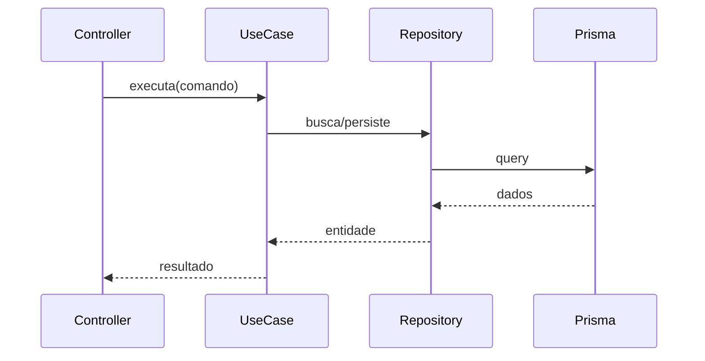

# Reestruturação da Documentação — Implementation Plan

> **For agentic workers:** REQUIRED SUB-SKILL: Use superpowers:subagent-driven-development (recommended) or superpowers:executing-plans to implement this plan task-by-task. Steps use checkbox (`- [ ]`) syntax for tracking.

**Goal:** Transformar o `README.md` raiz num portal enxuto e reorganizar toda a documentação em `docs/` por audiência (dev / IA / fiscal), com docs completos por módulo e referência fiscal consolidada.

**Architecture:** Documentação como conteúdo estático em Markdown. O README raiz vira portal (~150-200 linhas) que delega para `docs/`. Conteúdo por audiência em `docs/dev/`, `docs/ia/`, `docs/fiscal/`. `docs/superpowers/` permanece intacto. READMEs mínimos nos módulos do backend apontam para `docs/dev/modulos/`.

**Tech Stack:** Markdown, diagramas Mermaid, `git mv` para preservar histórico, `rg` para verificação de links/caminhos.

**Spec:** [`docs/superpowers/specs/2026-07-03-reestruturacao-documentacao-design.md`](../specs/2026-07-03-reestruturacao-documentacao-design.md)

**Convenção de verificação (docs, sem testes unitários):** cada task termina com (a) checagem de links relativos, (b) `rg` por caminhos antigos quando aplicável, (c) commit. Não há TDD; a "verificação" é a validação de links, cobertura e ausência de caminhos órfãos.

---

## Task 0: Reconciliar working tree (restaurar docs deletados)

O working tree tem deleções não commitadas em `docs/` (pré-existentes). A spec assume que esses arquivos existem. Restaurá-los antes de qualquer reorganização.

**Files:**
- Restore: `docs/fiscal/mcp-nfe-validation-flow.md`
- Restore: `docs/superpowers/**` (exceto o que já está commitado)

- [ ] **Step 1: Inspecionar deleções pendentes**

Run: `git status --short docs/`
Expected: linhas com `D` para `docs/fiscal/mcp-nfe-validation-flow.md` e vários `docs/superpowers/*`.

- [ ] **Step 2: Restaurar os arquivos deletados do HEAD**

```bash
git restore docs/fiscal/mcp-nfe-validation-flow.md
git restore docs/superpowers/
```

- [ ] **Step 3: Confirmar que o working tree está limpo em docs/**

Run: `git status --short docs/`
Expected: nenhuma linha `D`. Apenas arquivos novos (untracked) desta iniciativa aparecerão depois.

- [ ] **Step 4: Confirmar que o overlay de plans voltou**

Run: `test -f docs/superpowers/writing-plans-overlay.md && echo OK`
Expected: `OK`

- [ ] **Step 5: Commit**

```bash
git add -A docs/
git commit -m "chore(docs): restaura arquivos de docs deletados no working tree"
```

---

## Task 1: Consolidar referência fiscal em `docs/fiscal/`

Mover os dois arquivos fiscais do backend para `docs/fiscal/` e criar o índice.

**Files:**
- Move: `backend/docs/fiscal/manual-nfe-moc.md` → `docs/fiscal/manual-nfe-moc.md`
- Move: `backend/docs/fiscal/regras-fulfillment-cat31.md` → `docs/fiscal/regras-fulfillment-cat31.md`
- Create: `docs/fiscal/README.md`

- [ ] **Step 1: Mover com git mv (preserva histórico)**

```bash
git mv backend/docs/fiscal/manual-nfe-moc.md docs/fiscal/manual-nfe-moc.md
git mv backend/docs/fiscal/regras-fulfillment-cat31.md docs/fiscal/regras-fulfillment-cat31.md
```

- [ ] **Step 2: Criar índice `docs/fiscal/README.md`**

```markdown
# Referência Fiscal

Documentação de domínio fiscal do simulador (NF-e, CT-e, regras ML Full).

> Simulador **educacional**: XMLs em homologação (`tpAmb=2`), sem validade jurídica.

## Documentos

| Documento | Conteúdo |
|-----------|----------|
| [Manual NF-e (MOC)](./manual-nfe-moc.md) | Referência estrutural da NF-e (Manual de Orientação do Contribuinte) |
| [Regras Fulfillment / CAT 31](./regras-fulfillment-cat31.md) | Operação Mercado Livre Full e Portaria CAT 31/2019 |
| [Fluxo de validação MCP](./mcp-nfe-validation-flow.md) | Envio de XML ao validador fiscal e devolutiva persistida |

## Regras de referência rápida

- Arredondamento comercial em 2 casas por item antes de somar totais.
- `vNF = vProd - vDesc + vOutro + vSeg + vFrete + vST + vIPI + vII`.
- DIFAL obrigatório em operação interestadual para consumidor final não contribuinte.
- Regras executáveis do agente fiscal: `.cursor/rules/especialista-fiscal.mdc`.
```

- [ ] **Step 3: Verificar que backend/docs/fiscal ficou vazio**

Run: `ls backend/docs/fiscal/ 2>/dev/null | wc -l`
Expected: `0` (remover a pasta se vazia: `rmdir backend/docs/fiscal backend/docs 2>/dev/null || true`)

- [ ] **Step 4: Verificar links do índice**

Run: `for f in docs/fiscal/manual-nfe-moc.md docs/fiscal/regras-fulfillment-cat31.md docs/fiscal/mcp-nfe-validation-flow.md; do test -f "$f" && echo "OK $f" || echo "FALTA $f"; done`
Expected: 3 linhas `OK`.

- [ ] **Step 5: Corrigir referências a `backend/docs/fiscal` no repo**

Run: `rg -l "backend/docs/fiscal"`
Ação: em cada arquivo retornado (esperado: `README.md`, `backend/README.md`), trocar `backend/docs/fiscal/` por `docs/fiscal/`. A regra `.cursor/rules/especialista-fiscal.mdc` já referencia `docs/fiscal/` genericamente — não alterar.
Run (após corrigir): `rg "backend/docs/fiscal" -g '!docs/superpowers/**'`
Expected: nenhum resultado.

- [ ] **Step 6: Commit**

```bash
git add -A
git commit -m "docs(fiscal): consolida referência fiscal em docs/fiscal/ com índice"
```

---

## Task 2: Criar hub `docs/README.md`

Índice de navegação por audiência.

**Files:**
- Create: `docs/README.md`

- [ ] **Step 1: Criar `docs/README.md`**

```markdown
# Documentação — MSimulation XML

Hub central da documentação. Escolha por objetivo:

| Você quer... | Vá para |
|--------------|---------|
| Rodar o projeto e entender a arquitetura | [`dev/`](./dev/) |
| Referência de um módulo do backend | [`dev/modulos/`](./dev/modulos/) |
| Contexto para agentes de IA | [`ia/`](./ia/) |
| Regras fiscais (NF-e, CT-e, CAT 31) | [`fiscal/`](./fiscal/) |
| Fluxo de specs / plans / code review | [`superpowers/`](./superpowers/) |

## Mapa rápido

- **Portal do projeto:** [`../README.md`](../README.md)
- **Backend (API):** [`../backend/README.md`](../backend/README.md)
- **Frontend (UI):** [`../frontend/README.md`](../frontend/README.md)
- **Regras executáveis do agente:** `../.cursor/rules/`
```

- [ ] **Step 2: Verificar links relativos**

Run: `cd docs && for l in dev dev/modulos ia fiscal superpowers ../README.md ../backend/README.md ../frontend/README.md; do test -e "$l" && echo "OK $l" || echo "FALTA $l"; done; cd ..`
Expected: as pastas `dev`, `dev/modulos`, `ia` ainda não existem (serão criadas nas próximas tasks) — anotar. `fiscal`, `superpowers` e os READMEs devem dar `OK`.

- [ ] **Step 3: Commit**

```bash
git add docs/README.md
git commit -m "docs: adiciona hub de navegação em docs/README.md"
```

---

## Task 3: Guias de desenvolvimento em `docs/dev/`

Migrar o conteúdo extenso do README raiz para guias focados.

**Files:**
- Create: `docs/dev/setup.md`
- Create: `docs/dev/arquitetura.md`
- Create: `docs/dev/fluxo-requisicao.md`
- Create: `docs/dev/testes-qualidade.md`
- Create: `docs/dev/onboarding.md`
- Read (fonte): `README.md` (seções indicadas na tabela 4.1 da spec)

- [ ] **Step 1: `docs/dev/setup.md`** — migrar do README raiz as seções "Como rodar localmente", "Variáveis obrigatórias", "Scripts úteis", "Problemas comuns" e a seção Docker do validador. Estrutura:

```markdown
# Setup e execução local

## Pré-requisitos
Node 20+, pnpm 9, Docker.

## Passo a passo
(comandos: pnpm install, cp .env, pnpm db:setup, pnpm dev)

## URLs de serviço
(tabela frontend/backend/health/validador/prisma studio)

## Variáveis de ambiente
(tabela das obrigatórias do backend — copiar do README raiz)

## Scripts úteis
(tabela de scripts pnpm)

## Validador MCP (Docker opcional)
(pnpm docker:up, smoke test, FISCAL_VALIDATOR_ENABLED=false)
Ver detalhe fiscal em ../fiscal/mcp-nfe-validation-flow.md

## Problemas comuns
(migrar a seção correspondente do README raiz)
```

- [ ] **Step 2: `docs/dev/arquitetura.md`** — migrar "Visão geral do monorepo", "Stack tecnológica", "Fluxos de negócio (diagramas)" e "Multi-tenant, auth e segurança". Manter o diagrama Mermaid do monorepo. Terminar com link para `./modulos/` e `../ia/convencoes.md`.

- [ ] **Step 3: `docs/dev/fluxo-requisicao.md`** — migrar "Fluxo de uma requisição HTTP" (BFF → Fastify → módulo → Prisma), com o diagrama existente.

- [ ] **Step 4: `docs/dev/testes-qualidade.md`** — migrar "Testes e qualidade": comandos de teste/typecheck por workspace e referência ao pipeline `unified-code-review` (`../superpowers/README.md`).

- [ ] **Step 5: `docs/dev/onboarding.md`** — migrar "Guia do estagiário: por onde começar" (a trilha por níveis). Ajustar links internos que apontavam para `backend/docs/fiscal/` → `../fiscal/`.

- [ ] **Step 6: Verificar links relativos dos 5 guias**

Run: `rg -o '\]\(([^)]+\.md)\)' -r '$1' docs/dev/*.md | sort -u`
Ação: para cada caminho listado, confirmar que resolve a partir de `docs/dev/`. Corrigir os que não resolverem.

- [ ] **Step 7: Commit**

```bash
git add docs/dev/
git commit -m "docs(dev): migra guias de setup, arquitetura, fluxo, testes e onboarding"
```

---

## Task 4: Índice e template dos módulos (`docs/dev/modulos/README.md`)

**Files:**
- Create: `docs/dev/modulos/README.md`

- [ ] **Step 1: Criar índice com diagrama de interação e o template**

```markdown
# Módulos do Backend

Cada módulo é um bounded context em `backend/src/modules/<nome>/` seguindo Clean Architecture + DDD.

## Interação entre módulos

​```mermaid
graph TD
  auth --> org
  org --> catalog
  catalog --> tax
  logistics --> remessas
  tax --> remessas
  remessas --> fiscal-documents
  sales --> remessas
  sales --> fiscal-documents
  fiscal-settings --> fiscal-documents
  fiscal-documents --> fiscal-validation
  lookup -.consulta.-> catalog
​```

## Índice

| Módulo | Responsabilidade |
|--------|------------------|
| [auth](./auth.md) | Autenticação, sessão, 2FA, reset de senha |
| [org](./org.md) | Tenants, filiais, usuários |
| [catalog](./catalog.md) | Produtos e importação de planilhas |
| [tax](./tax.md) | Regras tributárias e resolução de impostos |
| [logistics](./logistics.md) | Unidades logísticas (CDs) e movimentações |
| [remessas](./remessas.md) | NF-e de remessa física/simbólica e FIFO |
| [sales](./sales.md) | Pedidos e venda |
| [fiscal-documents](./fiscal-documents.md) | NF-e/CT-e: persistência, XML, consulta |
| [fiscal-settings](./fiscal-settings.md) | Configuração do emitente e numeração |
| [fiscal-validation](./fiscal-validation.md) | Validação de XML via MCP |
| [lookup](./lookup.md) | Consultas auxiliares |
| [health](./health.md) | Health check |

## Template padrão (para novos módulos)

​```markdown
# Módulo: <nome>

## Visão geral
## Diagrama de fluxo (Mermaid sequenceDiagram)
## Entidades principais
## Casos de uso
## Integração com outros módulos
​```
```

Nota: substituir `​` (zero-width) — os blocos mermaid/markdown internos usam ``` reais no arquivo final.

- [ ] **Step 2: Validar sintaxe do diagrama Mermaid**

Ação: revisar o bloco mermaid — sem caracteres inválidos, setas `-->`/`-.->` corretas.

- [ ] **Step 3: Commit**

```bash
git add docs/dev/modulos/README.md
git commit -m "docs(modulos): índice, diagrama de interação e template dos módulos"
```

---

## Tasks 5-16: Documentar cada módulo

**Procedimento idêntico para cada módulo** (uma task por módulo). Para o módulo `<nome>`:

**Files (por módulo):**
- Create: `docs/dev/modulos/<nome>.md`
- Read (fonte): `backend/src/modules/<nome>/application/use-cases/`, `.../domain/entities/`, `.../domain/ports/`, `.../presentation/controllers/`

**Steps (por módulo):**

- [ ] **Step A: Listar o conteúdo real do módulo**

Run: `ls backend/src/modules/<nome>/application/use-cases/ backend/src/modules/<nome>/domain/entities/ backend/src/modules/<nome>/presentation/controllers/ 2>/dev/null`
Objetivo: extrair nomes reais de use-cases, entidades e controllers.

- [ ] **Step B: Escrever `docs/dev/modulos/<nome>.md`** seguindo o template:

```markdown
# Módulo: <nome>

## Visão geral
<1 parágrafo: responsabilidade de negócio do bounded context>

## Diagrama de fluxo (caso de uso principal)


## Entidades principais
- `<Entidade>` — <regra de negócio>

## Casos de uso
- `<NomeUseCase>` — <o que faz>

## Integração com outros módulos
- Depende de: <...>
- É consumido por: <...>
```

- [ ] **Step C: Verificar que todo use-case/entidade citado existe no código**

Run: `rg -c "class|export" backend/src/modules/<nome>/application/use-cases/`
Ação: garantir que nomes no doc batem com arquivos reais (sem inventar use-cases).

- [ ] **Step D: Commit** — `git add docs/dev/modulos/<nome>.md && git commit -m "docs(modulos): documenta módulo <nome>"`

### Lista de tasks:

- [ ] **Task 5:** `auth` — foco no caso de uso de login/sessão.
- [ ] **Task 6:** `org` — tenants/filiais/usuários; multi-tenant.
- [ ] **Task 7:** `catalog` — produtos e importação de planilha.
- [ ] **Task 8:** `tax` — resolução de regra tributária (`ResolvedTaxRule`, `FiscalContext`).
- [ ] **Task 9:** `logistics` — unidades logísticas e `product-movement`.
- [ ] **Task 10:** `remessas` — remessa física/simbólica, FIFO, portas `emissor-nota`/`movimentacao-logistica`.
- [ ] **Task 11:** `sales` — pedidos e venda.
- [ ] **Task 12:** `fiscal-documents` — NF-e/CT-e, XML, observability, inutilização.
- [ ] **Task 13:** `fiscal-settings` — emitente e numeração NF-e.
- [ ] **Task 14:** `fiscal-validation` — validação MCP (linkar `../../fiscal/mcp-nfe-validation-flow.md`).
- [ ] **Task 15:** `lookup` — consultas auxiliares.
- [ ] **Task 16:** `health` — health check.

---

## Task 17: READMEs mínimos nos módulos do backend

**Files:**
- Create: `backend/src/modules/<nome>/README.md` (12 arquivos)

- [ ] **Step 1: Criar README mínimo em cada módulo** (conteúdo por módulo, `<nome>` e a frase de responsabilidade específica):

```markdown
# <nome>

<Responsabilidade em 1-2 frases — reaproveitar a do índice docs/dev/modulos/README.md>

📄 Documentação completa: [`docs/dev/modulos/<nome>.md`](../../../../docs/dev/modulos/<nome>.md)
```

Nota de profundidade: de `backend/src/modules/<nome>/README.md` até a raiz são 4 níveis (`<nome>`→`modules`→`src`→`backend`→raiz), por isso `../../../../docs/...`.

- [ ] **Step 2: Verificar que cada link resolve**

Run: `for m in auth org catalog tax logistics remessas sales fiscal-documents fiscal-settings fiscal-validation lookup health; do test -f "docs/dev/modulos/$m.md" && test -f "backend/src/modules/$m/README.md" && echo "OK $m" || echo "FALTA $m"; done`
Expected: 12 linhas `OK`.

- [ ] **Step 3: Commit**

```bash
git add backend/src/modules/*/README.md
git commit -m "docs(modulos): README mínimo por módulo apontando para docs/dev/modulos"
```

---

## Task 18: Atualizar `backend/README.md`

A tabela de módulos deve apontar para `docs/dev/modulos/` em vez de READMEs inexistentes.

**Files:**
- Modify: `backend/README.md` (seção "Documentação por módulo")

- [ ] **Step 1: Reescrever a tabela de módulos**

Trocar cada linha `| auth | src/modules/auth/README.md |` por `| auth | ../docs/dev/modulos/auth.md |` (repetir para os 12 módulos). Ajustar o parágrafo introdutório para citar `docs/dev/modulos/`.

- [ ] **Step 2: Verificar links**

Run: `rg -o '\]\(([^)]+)\)' -r '$1' backend/README.md | rg 'modulos' | while read l; do (cd backend && test -e "$l" && echo "OK $l" || echo "FALTA $l"); done`
Expected: 12 linhas `OK`.

- [ ] **Step 3: Commit**

```bash
git add backend/README.md
git commit -m "docs(backend): aponta tabela de módulos para docs/dev/modulos"
```

---

## Task 19: Contexto para agentes de IA em `docs/ia/`

**Files:**
- Create: `docs/ia/README.md`
- Create: `docs/ia/mapa-repositorio.md`
- Create: `docs/ia/convencoes.md`
- Create: `docs/ia/glossario.md`

- [ ] **Step 1: `docs/ia/README.md`** — orientação ao agente:

```markdown
# Contexto para Agentes de IA

Camada de contexto **estável** do projeto. Complementa (não substitui):
- `../../.cursor/rules/` — regras executáveis (aplicadas automaticamente).
- `../superpowers/` — workflow de specs/plans/code review.

## Ordem de leitura sugerida
1. [`mapa-repositorio.md`](./mapa-repositorio.md) — onde vive cada coisa.
2. [`convencoes.md`](./convencoes.md) — naming e camadas.
3. [`glossario.md`](./glossario.md) — termos fiscais e do domínio.
```

- [ ] **Step 2: `docs/ia/mapa-repositorio.md`** — migrar a seção "Mapa de arquivos importantes" do README raiz (tabela de arquivos-chave: tax-engine, geradores XML, controllers, factories, etc.).

- [ ] **Step 3: `docs/ia/convencoes.md`** — resumo navegável das regras `.cursor/rules/`: naming (kebab/camel/Pascal/UPPER_SNAKE), camadas Clean Architecture e regra de dependências, isolamento de XML (objetos, nunca template strings), thin client no frontend. Cada item com link para a rule correspondente.

- [ ] **Step 4: `docs/ia/glossario.md`** — migrar a seção "Conceitos básicos" do README raiz + termos fiscais (NF-e, CT-e, DIFAL, CST, CSOSN, CFOP, FCP, FIFO, remessa simbólica, tenant, BFF, use case).

- [ ] **Step 5: Verificar links**

Run: `rg -o '\]\(([^)]+\.md)\)' -r '$1' docs/ia/*.md | sort -u`
Ação: confirmar que cada caminho resolve a partir de `docs/ia/`.

- [ ] **Step 6: Commit**

```bash
git add docs/ia/
git commit -m "docs(ia): contexto estável para agentes (mapa, convenções, glossário)"
```

---

## Task 20: Reescrever `README.md` raiz como portal

Última task de conteúdo: enxugar o README raiz de ~1.078 para ~150-200 linhas.

**Files:**
- Modify: `README.md`

- [ ] **Step 1: Reescrever o README raiz** com esta estrutura:

```markdown
# MSimulation XML

<pitch de 2 linhas> Simulador fiscal educacional para fulfillment Mercado Livre Full.

> Simulador **educacional**: XMLs em homologação (`tpAmb=2`), sem validade jurídica.

## Quick start
​```bash
pnpm install
cp .env.example .env && cp backend/.env.example backend/.env
pnpm db:setup
pnpm dev
​```
| Serviço | URL |
|---------|-----|
| Frontend | http://localhost:3000 |
| Backend | http://localhost:3001 |
| Health | http://localhost:3001/api/health |

## Monorepo
<diagrama Mermaid do monorepo — reaproveitar o atual>

## Documentação
| Área | Onde |
|------|------|
| Setup, arquitetura, módulos | [`docs/dev/`](./docs/dev/) |
| Contexto para IA | [`docs/ia/`](./docs/ia/) |
| Regras fiscais | [`docs/fiscal/`](./docs/fiscal/) |
| Specs / plans / review | [`docs/superpowers/`](./docs/superpowers/) |
| Hub de docs | [`docs/`](./docs/README.md) |
```

- [ ] **Step 2: Garantir que nenhum conteúdo foi perdido**

Ação: conferir a tabela 4.1 da spec — cada seção antiga do README tem destino em `docs/`. Verificar que setup, arquitetura, fluxo, testes, onboarding, mapa, glossário e validador estão cobertos nos arquivos criados.

- [ ] **Step 3: Verificar links do portal**

Run: `rg -o '\]\(([^)]+)\)' -r '$1' README.md | while read l; do test -e "$l" && echo "OK $l" || echo "FALTA $l"; done`
Expected: todas as linhas `OK` (ignorar URLs http).

- [ ] **Step 4: Confirmar tamanho do portal**

Run: `wc -l README.md`
Expected: ≤ ~200 linhas.

- [ ] **Step 5: Commit**

```bash
git add README.md
git commit -m "docs: transforma README raiz em portal enxuto"
```

---

## Task 21: Verificação final de consistência

**Files:** nenhum (só verificação); corrigir inline se necessário.

- [ ] **Step 1: Nenhum caminho antigo remanescente**

Run: `rg "backend/docs/fiscal" -g '!docs/superpowers/**'`
Expected: nenhum resultado.

- [ ] **Step 2: Cobertura de módulos completa**

Run: `ls docs/dev/modulos/*.md | wc -l && ls backend/src/modules/*/README.md | wc -l`
Expected: `13` (12 módulos + README) e `12`.

- [ ] **Step 3: Varredura global de links quebrados em docs/**

Run: `for f in $(rg -l --glob 'docs/**/*.md' ''); do rg -o '\]\(([^)#]+\.md)\)' -r '$1' "$f" | while read l; do d=$(dirname "$f"); test -e "$d/$l" || echo "QUEBRADO em $f -> $l"; done; done`
Expected: nenhuma linha `QUEBRADO`.

- [ ] **Step 4: docs/superpowers intacto**

Run: `git status --short docs/superpowers/ | rg '^ ?D' || echo "OK sem deleções"`
Expected: `OK sem deleções`.

- [ ] **Step 5: Commit final (se houver correções)**

```bash
git add -A
git commit -m "docs: correções finais de links e consistência" || echo "nada a commitar"
```

---

## Self-Review (preenchido)

**Cobertura da spec:** cada entregável da seção 9 da spec tem task correspondente — portal (T20), hub (T2), guias dev (T3), módulos completos (T4-16), READMEs mínimos (T17), fiscal consolidado (T1), docs/ia (T19), backend/README (T18), caminhos antigos (T1/T21). ✅

**Reconciliação de deleções:** T0 restaura o estado assumido pela spec antes de qualquer move. ✅

**Sem placeholders bloqueantes:** os `<...>` nos templates de módulo são marcadores de conteúdo a extrair do código real (com comandos `ls`/`rg` que dizem exatamente onde olhar), não TODOs vagos. ✅

**Consistência de nomes:** os 12 módulos aparecem com o mesmo nome em T4 (índice), T5-16 (docs), T17 (README mínimo), T18 (backend/README) e T21 (verificação). ✅
