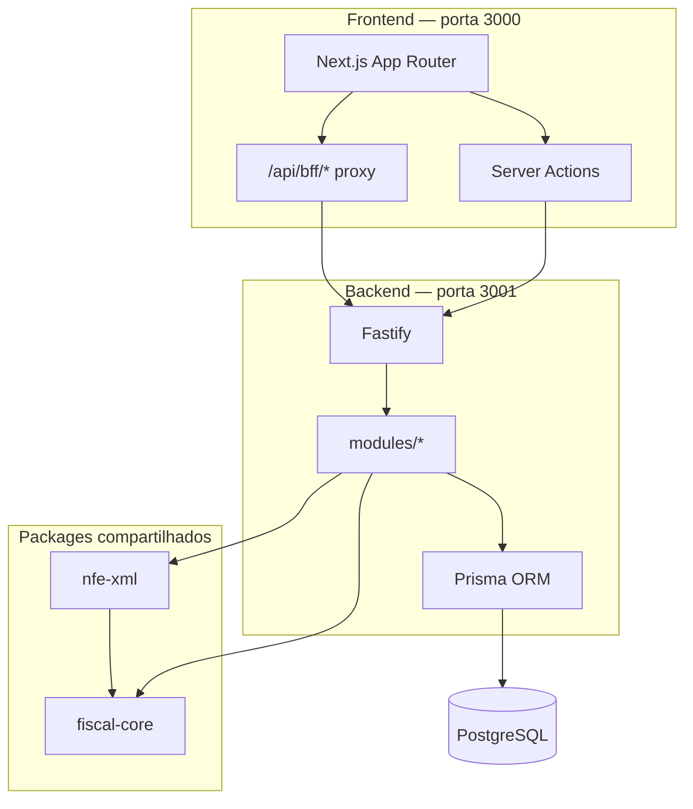

# README Portal no Mesmo Arquivo — Implementation Plan

> **For agentic workers:** REQUIRED SUB-SKILL: Use superpowers:subagent-driven-development (recommended) or superpowers:executing-plans to implement this plan task-by-task. Steps use checkbox (`- [ ]`) syntax for tracking.

**Goal:** Reestruturar o `README.md` raiz em portal (~80–120 linhas) + cinco capítulos no mesmo arquivo, com dedupe controlado e Cap. 5 (MCP) em `<details>` fechado.

**Architecture:** Documentação Markdown em arquivo único. O conteúdo atual é reordenado por headings `##`, sem extrair para `docs/`. Portal no topo; capítulos 1–5 abaixo. Verificação por âncoras, links relativos e checklist da spec — sem testes unitários.

**Tech Stack:** Markdown, Mermaid, HTML `<details>`/`<summary>` (GitHub), shell/`rg` para verificação.

**Spec:** [`docs/superpowers/specs/2026-07-14-readme-portal-mesmo-arquivo-design.md`](../specs/2026-07-14-readme-portal-mesmo-arquivo-design.md)

**Commits:** Só criar commit se o usuário pedir explicitamente nesta sessão. Os passos de commit abaixo estão marcados como opcionais.

**Convenção de verificação (docs):** cada task termina com (a) arquivo abre/parseável, (b) checagem pontual de headings, (c) sem paths inventados para `docs/dev/` ou `docs/ia/`.

---

## Mapa de arquivos

| Arquivo | Responsabilidade |
|---|---|
| `README.md` | Único artefato de implementação — portal + capítulos |
| `docs/superpowers/specs/2026-07-14-readme-portal-mesmo-arquivo-design.md` | Spec (já escrita; só atualizar status para Aprovada) |
| `docs/superpowers/plans/2026-07-14-readme-portal-mesmo-arquivo.md` | Este plano |

Nenhum outro arquivo deve ser criado ou movido (YAGNI da spec).

---

## Ordem alvo dos headings `##`

Após a implementação, a lista flat de `##` no arquivo deve ser exatamente:

1. `## Índice` (dentro do portal)
2. `## O que é este projeto?` (portal)
3. `## Quick start` (portal — renomear a parte curta de “Como rodar localmente”)
4. `## Visão geral do monorepo` (portal — tree + Mermaid; sem stack aqui)
5. `## 1. Começar`
6. `## 2. Arquitetura`
7. `## 3. Fluxos`
8. `## 4. Referência`
9. `## 5. Operação — Validador MCP` (conteúdo interno do MCP dentro de `<details>`)

Headings `###` dentro dos capítulos: ver Tasks 3–7. Não inventar seções novas.

---

### Task 0: Atualizar status da spec

**Files:**
- Modify: `docs/superpowers/specs/2026-07-14-readme-portal-mesmo-arquivo-design.md`

- [ ] **Step 1: Marcar spec como aprovada**

Trocar a linha de status:

```markdown
- **Status:** Aprovada
```

(antes: `Aguardando revisão do usuário`)

- [ ] **Step 2: Confirmar**

Run:

```bash
rg -n "^\- \*\*Status:\*\*" docs/superpowers/specs/2026-07-14-readme-portal-mesmo-arquivo-design.md
```

Expected: `- **Status:** Aprovada`

- [ ] **Step 3: Commit (opcional — só se o usuário pedir)**

```bash
git add docs/superpowers/specs/2026-07-14-readme-portal-mesmo-arquivo-design.md
git commit -m "$(cat <<'EOF'
docs(specs): marca design do README portal como aprovado

EOF
)"
```

---

### Task 1: Snapshot do README atual

**Files:**
- Read: `README.md`
- Create (temporário, gitignored mentalmente — pode ficar untracked e apagar no fim): `/tmp/readme-msimulation-before.md`

- [ ] **Step 1: Copiar baseline**

```bash
cp README.md /tmp/readme-msimulation-before.md
wc -l README.md /tmp/readme-msimulation-before.md
rg -n "^## " README.md
```

Expected: ~1078 linhas; lista de ~19 headings `##` começando por `## Índice` e terminando em `## Problemas comuns`.

- [ ] **Step 2: Listar links relativos atuais (baseline)**

```bash
rg -oN '\[[^\]]*\]\(([^)]+)\)' README.md -r '$1' | rg -v '^https?://|^#' | sort -u
```

Expected: paths como `backend/README.md`, `backend/docs/fiscal/...`, `.env.example`, `docs/superpowers/...`, etc. Guardar mentalmente: a lista final não pode inventar `docs/dev/` nem `docs/ia/`.

Não commit nesta task.

---

### Task 2: Escrever o portal (topo do novo README)

**Files:**
- Create: `/tmp/readme-portal.md` (rascunho)
- Modify: será concatenado na Task 8

- [ ] **Step 1: Criar o arquivo do portal com este conteúdo exato**

Escrever `/tmp/readme-portal.md`:

```markdown
# MSimulation XML

Simulador fiscal educacional para operações de **fulfillment Mercado Livre Full** — NF-e, CT-e, remessas, vendas e impostos.

Monorepo · pnpm workspaces · `@msimulation-xml/backend` · `@msimulation-xml/frontend` · `@msimulation-xml/fiscal-core` · `@msimulation-xml/nfe-xml`

> **Aviso importante:** este é um **simulador educacional**. Os XMLs usam ambiente de homologação (`tpAmb=2`), assinaturas fictícias e **não têm validade jurídica** perante a SEFAZ. Nunca use estes documentos em produção real.

---

## Índice

1. [O que é este projeto?](#o-que-é-este-projeto)
2. [Quick start](#quick-start)
3. [Visão geral do monorepo](#visão-geral-do-monorepo)
4. [1. Começar](#1-começar)
   - [Variáveis de ambiente](#variáveis-de-ambiente)
   - [Scripts úteis](#scripts-úteis)
   - [Guia do estagiário](#guia-do-estagiário-por-onde-começar)
   - [Problemas comuns](#problemas-comuns)
5. [2. Arquitetura](#2-arquitetura)
   - [Para quem é este README?](#para-quem-é-este-readme)
   - [Conceitos básicos](#conceitos-básicos-leia-antes-de-codar)
   - [Stack tecnológica](#stack-tecnológica)
   - [Backend](#backend-api)
   - [Frontend](#frontend-interface)
   - [Packages](#packages-compartilhados)
   - [Mapa de arquivos](#mapa-de-arquivos-importantes)
   - [Multi-tenant, auth e segurança](#multi-tenant-auth-e-segurança)
6. [3. Fluxos](#3-fluxos)
   - [Fluxos de negócio](#fluxos-de-negócio-diagramas)
   - [Fluxo HTTP](#fluxo-de-uma-requisição-http)
7. [4. Referência](#4-referência)
   - [Testes e qualidade](#testes-e-qualidade)
   - [Documentação complementar](#documentação-complementar)
8. [5. Operação — Validador MCP](#5-operação--validador-mcp)

> **Nota:** as âncoras acima serão validadas/ajustadas na Task 9 após os headings finais existirem. Se o GitHub gerar slug diferente (acentos), regenerar o índice na Task 9.

---

## O que é este projeto?

**MSimulation XML** é uma aplicação web que simula o ciclo fiscal de um seller no **Mercado Livre Full** (fulfillment):


| Etapa operacional | O que o sistema faz                                                       |
| ----------------- | ------------------------------------------------------------------------- |
| Cadastro          | Empresa (tenant), produtos, regras tributárias, unidades logísticas (CDs) |
| Remessa           | NF-e de envio de mercadoria ao centro de distribuição ML                  |
| Avanço            | Movimentação entre CDs (nova remessa referenciando saldo FIFO)            |
| Venda             | Pedido → retorno simbólico → NF-e de venda → CT-e de frete                |
| Consulta          | Listagem de NF-e/CT-e, download de XML, cancelamento, devolução           |


Detalhes de setup em [1. Começar](#1-começar). Arquitetura em [2. Arquitetura](#2-arquitetura).

---

## Quick start

### Pré-requisitos

- **Node.js** 20+ (recomendado LTS)
- **pnpm** 9 (`corepack enable && corepack prepare pnpm@9.15.9 --activate`)
- **Docker** (para PostgreSQL local)

### Passo a passo

```bash
# 1. Clonar e instalar dependências
git clone <url-do-repo>
cd msedit-xml
pnpm install

# 2. Configurar variáveis de ambiente
cp .env.example .env                    # Docker (POSTGRES_*)
cp backend/.env.example backend/.env    # API (JWT, DATABASE_URL, etc.)
cp frontend/.env.example frontend/.env.local   # opcional (API_URL)

# 3. Subir banco e aplicar migrations
pnpm db:setup

# 4. Subir frontend + backend
pnpm dev
```


| Serviço       | URL                                                                                |
| ------------- | ---------------------------------------------------------------------------------- |
| Frontend      | [http://localhost:3000](http://localhost:3000)                                     |
| Backend (API) | [http://localhost:3001](http://localhost:3001)                                     |
| Health check  | [http://localhost:3001/api/health](http://localhost:3001/api/health)               |
| Validador MCP | [http://localhost:8080/health](http://localhost:8080/health) (se `pnpm docker:up`) |
| Prisma Studio | `pnpm --filter @msimulation-xml/backend exec prisma studio`                        |


Tabela de variáveis obrigatórias do backend: [Variáveis de ambiente](#variáveis-de-ambiente).

---

## Visão geral do monorepo

O repositório é um **monorepo** gerenciado com **pnpm workspaces**. Tudo vive na mesma árvore de pastas, mas cada pacote tem o seu `package.json` e pode ser executado separadamente.

```
msedit-xml/                          ← você está aqui (raiz)
├── backend/                         ← API REST (Fastify + Prisma)
├── frontend/                        ← Interface web (Next.js 15)
├── packages/
│   ├── fiscal-core/                 ← Utilitários fiscais puros (sem DB)
│   └── nfe-xml/                     ← Geração de XML NF-e/CT-e
├── docs/assets/                     ← Logo e assets de documentação
├── docker-compose.yml               ← PostgreSQL + validador MCP (opcional)
├── Dockerfile.fiscal-validator      ← Imagem do proxy MCP para Render/Docker
├── infra/fiscal-validator-proxy/    ← FastAPI + auditoria CAT 31 (Python)
├── pnpm-workspace.yaml              ← Declara os workspaces
├── package.json                     ← Scripts globais (dev, build, test)
└── README.md                        ← este arquivo
```

### Diagrama: como os pacotes se relacionam



Stack, backend, frontend e packages: [2. Arquitetura](#2-arquitetura).
```

- [ ] **Step 2: Contar linhas do portal**

```bash
wc -l /tmp/readme-portal.md
```

Expected: entre ~80 e ~120 linhas ( aceitável até ~140 se o Mermaid empurrar).

Não commit.

---

### Task 3: Extrair Cap. 1 — Começar

**Files:**
- Create: `/tmp/readme-cap1.md`
- Source: `/tmp/readme-msimulation-before.md`

- [ ] **Step 1: Extrair blocos com script**

Rodar na raiz do repo:

```bash
python3 <<'PY'
from pathlib import Path
text = Path("/tmp/readme-msimulation-before.md").read_text()
lines = text.splitlines(keepends=True)

def extract(start_prefix: str) -> str:
    start = None
    for i, line in enumerate(lines):
        if line.startswith(start_prefix):
            start = i
            break
    if start is None:
        raise SystemExit(f"heading not found: {start_prefix!r}")
    end = len(lines)
    for j in range(start + 1, len(lines)):
        if lines[j].startswith("## ") and not lines[j].startswith("###"):
            end = j
            break
    return "".join(lines[start:end]).rstrip() + "\n"

env = extract("### Variáveis obrigatórias (backend)")
# downgrade heading for chapter
env = env.replace("### Variáveis obrigatórias (backend)", "### Variáveis de ambiente", 1)
scripts = extract("## Scripts úteis")
scripts = scripts.replace("## Scripts úteis", "### Scripts úteis", 1)
# heading atual pode estar truncado
guia = None
for prefix in ("## Guia do estagiário", "## Guia  por onde começar", "## Guia"):
    try:
        guia = extract(prefix)
        break
    except SystemExit:
        continue
if guia is None:
    raise SystemExit("guia do estagiário not found")
# normalizar título do guia
first = guia.splitlines()[0]
guia_body = "\n".join(guia.splitlines()[1:])
guia = "### Guia do estagiário: por onde começar\n" + guia_body.lstrip("\n")
if not guia.endswith("\n"):
    guia += "\n"
problems = extract("## Problemas comuns")
problems = problems.replace("## Problemas comuns", "### Problemas comuns", 1)

cap1 = (
    "## 1. Começar\n\n"
    "Ambiente, scripts, onboarding e troubleshooting.\n\n"
    + env + "\n"
    + scripts + "\n"
    + guia + "\n"
    + problems
)
# remover footer duplicado se viesse em Problemas comuns
cap1 = cap1.replace(
    "\n---\n\nMSimulation XML — simulador educacional · não substitui assessoria fiscal ou contábil\n",
    "\n",
)
Path("/tmp/readme-cap1.md").write_text(cap1)
print("OK", len(cap1.splitlines()), "lines")
print([ln for ln in cap1.splitlines() if ln.startswith("#")][:20])
PY
```

Expected: `OK` com headings `## 1. Começar`, `### Variáveis de ambiente`, `### Scripts úteis`, `### Guia do estagiário: por onde começar`, `### Problemas comuns`.

- [ ] **Step 2: Conferir que a tabela de env vars está no Cap. 1 e não foi truncada**

```bash
rg -n "DATABASE_URL|JWT_SECRET|PASSWORD_PEPPER" /tmp/readme-cap1.md
```

Expected: linhas da tabela presentes.

Não commit.

---

### Task 4: Extrair Cap. 2 — Arquitetura (com dedupe de tree/Mermaid)

**Files:**
- Create: `/tmp/readme-cap2.md`

- [ ] **Step 1: Extrair e montar Cap. 2**

```bash
python3 <<'PY'
from pathlib import Path
text = Path("/tmp/readme-msimulation-before.md").read_text()
lines = text.splitlines(keepends=True)

def extract(start_prefix: str) -> str:
    start = None
    for i, line in enumerate(lines):
        if line.startswith(start_prefix):
            start = i
            break
    if start is None:
        raise SystemExit(f"heading not found: {start_prefix!r}")
    end = len(lines)
    for j in range(start + 1, len(lines)):
        if lines[j].startswith("## ") and not lines[j].startswith("###"):
            end = j
            break
    return "".join(lines[start:end]).rstrip() + "\n"

def demote(block: str, old: str, new: str) -> str:
    if not block.startswith(old):
        # allow first line match only
        first, _, rest = block.partition("\n")
        if first.startswith(old.rstrip()) or first == old.rstrip():
            return new + "\n" + rest
        raise SystemExit(f"cannot demote {old!r} in {first!r}")
    return new + block[len(old):]

para = demote(extract("## Para quem é este README?"), "## Para quem é este README?", "### Para quem é este README?")
conceitos = demote(extract("## Conceitos básicos"), "## Conceitos básicos", "### Conceitos básicos")
# manter subtítulo original completo se existir
first = conceitos.splitlines()[0]
# se perdeu o sufixo, restaurar heading canônico
if first == "### Conceitos básicos":
    conceitos = "### Conceitos básicos (leia antes de codar)\n" + "\n".join(conceitos.splitlines()[1:]) + "\n"

stack = demote(extract("## Stack tecnológica"), "## Stack tecnológica", "### Stack tecnológica")
backend = demote(extract("## Backend (API)"), "## Backend (API)", "### Backend (API)")
frontend = demote(extract("## Frontend (interface)"), "## Frontend (interface)", "### Frontend (interface)")
packages = demote(extract("## Packages compartilhados"), "## Packages compartilhados", "### Packages compartilhados")
mapa = demote(extract("## Mapa de arquivos importantes"), "## Mapa de arquivos importantes", "### Mapa de arquivos importantes")
auth = demote(extract("## Multi-tenant, auth e segurança"), "## Multi-tenant, auth e segurança", "### Multi-tenant, auth e segurança")

monorepo_note = (
    "### Visão do monorepo (neste capítulo)\n\n"
    "A tree de pastas e o diagrama Mermaid dos pacotes estão no portal, em "
    "[Visão geral do monorepo](#visão-geral-do-monorepo). "
    "Abaixo: stack e detalhe por pacote.\n\n"
)

cap2 = (
    "## 2. Arquitetura\n\n"
    "Estrutura do monorepo, papéis dos pacotes e conceitos do domínio.\n\n"
    + para + "\n"
    + conceitos + "\n"
    + monorepo_note
    + stack + "\n"
    + backend + "\n"
    + frontend + "\n"
    + packages + "\n"
    + mapa + "\n"
    + auth
)
Path("/tmp/readme-cap2.md").write_text(cap2)
# Fail if Mermaid block leaked from old monorepo section
if "```mermaid" in cap2:
    raise SystemExit("FAIL: mermaid duplicated inside Cap. 2 — remove it")
if "msedit-xml/" in cap2 and "você está aqui" in cap2:
    raise SystemExit("FAIL: tree duplicated inside Cap. 2 — remove it")
print("OK", len(cap2.splitlines()), "lines")
PY
```

Expected: `OK` e **sem** bloco `mermaid` nem tree completa no Cap. 2.

- [ ] **Step 2: Confirmar seções obrigatórias**

```bash
rg -n "^### " /tmp/readme-cap2.md
```

Expected: Para quem / Conceitos / Visão do monorepo (neste capítulo) / Stack / Backend / Frontend / Packages / Mapa / Multi-tenant.

Não commit.

---

### Task 5: Extrair Cap. 3 — Fluxos

**Files:**
- Create: `/tmp/readme-cap3.md`

- [ ] **Step 1: Extrair**

```bash
python3 <<'PY'
from pathlib import Path
text = Path("/tmp/readme-msimulation-before.md").read_text()
lines = text.splitlines(keepends=True)

def extract(start_prefix: str) -> str:
    start = None
    for i, line in enumerate(lines):
        if line.startswith(start_prefix):
            start = i
            break
    if start is None:
        raise SystemExit(f"heading not found: {start_prefix!r}")
    end = len(lines)
    for j in range(start + 1, len(lines)):
        if lines[j].startswith("## ") and not lines[j].startswith("###"):
            end = j
            break
    return "".join(lines[start:end]).rstrip() + "\n"

def demote(block: str, old: str, new: str) -> str:
    first, _, rest = block.partition("\n")
    return new + "\n" + rest

fluxos = demote(extract("## Fluxos de negócio"), "## Fluxos de negócio", "### Fluxos de negócio (diagramas)")
# se o heading original já tinha (diagramas), evitar duplicar na primeira linha do body
http = demote(extract("## Fluxo de uma requisição HTTP"), "## Fluxo de uma requisição HTTP", "### Fluxo de uma requisição HTTP")
cap3 = "## 3. Fluxos\n\nCiclo fiscal operacional e ciclo de uma requisição HTTP.\n\n" + fluxos + "\n" + http
Path("/tmp/readme-cap3.md").write_text(cap3)
assert "```mermaid" in cap3 or "sequenceDiagram" in cap3 or "graph" in cap3
print("OK", len(cap3.splitlines()), "lines")
PY
```

Expected: `OK`; Cap. 3 contém os diagramas originais intactos.

Não commit.

---

### Task 6: Extrair Cap. 4 — Referência

**Files:**
- Create: `/tmp/readme-cap4.md`

- [ ] **Step 1: Extrair**

```bash
python3 <<'PY'
from pathlib import Path
text = Path("/tmp/readme-msimulation-before.md").read_text()
lines = text.splitlines(keepends=True)

def extract(start_prefix: str) -> str:
    start = None
    for i, line in enumerate(lines):
        if line.startswith(start_prefix):
            start = i
            break
    if start is None:
        raise SystemExit(f"heading not found: {start_prefix!r}")
    end = len(lines)
    for j in range(start + 1, len(lines)):
        if lines[j].startswith("## ") and not lines[j].startswith("###"):
            end = j
            break
    return "".join(lines[start:end]).rstrip() + "\n"

def demote(block: str, new: str) -> str:
    _, _, rest = block.partition("\n")
    return new + "\n" + rest

testes = demote(extract("## Testes e qualidade"), "### Testes e qualidade")
docs = demote(extract("## Documentação complementar"), "### Documentação complementar")
cap4 = "## 4. Referência\n\nQualidade e ponteiros para documentação satélite.\n\n" + testes + "\n" + docs
Path("/tmp/readme-cap4.md").write_text(cap4)
# não inventar links docs/dev
if "docs/dev/" in cap4 or "docs/ia/" in cap4:
    raise SystemExit("FAIL: invented docs/dev or docs/ia links")
print("OK", len(cap4.splitlines()), "lines")
PY
```

Expected: `OK`; links antigos (`backend/docs/fiscal/...`) preservados.

Não commit.

---

### Task 7: Extrair Cap. 5 — MCP em `<details>`

**Files:**
- Create: `/tmp/readme-cap5.md`

- [ ] **Step 1: Extrair seção MCP e embrulhar**

```bash
python3 <<'PY'
from pathlib import Path
text = Path("/tmp/readme-msimulation-before.md").read_text()
lines = text.splitlines(keepends=True)

def extract(start_prefix: str) -> str:
    start = None
    for i, line in enumerate(lines):
        if line.startswith(start_prefix):
            start = i
            break
    if start is None:
        raise SystemExit(f"heading not found: {start_prefix!r}")
    end = len(lines)
    for j in range(start + 1, len(lines)):
        if lines[j].startswith("## ") and not lines[j].startswith("###"):
            end = j
            break
    return "".join(lines[start:end]).rstrip() + "\n"

mcp = extract("## Validador MCP Fiscal Brasil")
_, _, body = mcp.partition("\n")
# body começa após o ## antigo; manter ### internos intactos
cap5 = (
    "## 5. Operação — Validador MCP\n\n"
    "<details>\n"
    "<summary>Validador MCP — auditoria NF-e pós-geração, não bloqueante</summary>\n\n"
    + body.lstrip("\n")
    + ("\n" if not body.endswith("\n") else "")
    + "</details>\n"
)
Path("/tmp/readme-cap5.md").write_text(cap5)
assert "<details>" in cap5 and "</details>" in cap5
assert "open" not in cap5.split("<details>", 1)[1][:20]
print("OK", len(cap5.splitlines()), "lines")
PY
```

Expected: `OK`; `<details>` **sem** atributo `open`; corpo do MCP preservado.

Não commit.

---

### Task 8: Concatenar, substituir `README.md`, aplicar dedupe final

**Files:**
- Modify: `README.md`
- Temp: `/tmp/readme-portal.md` … `/tmp/readme-cap5.md`

- [ ] **Step 1: Concatenar e publicar**

```bash
python3 <<'PY'
from pathlib import Path
parts = [
    Path("/tmp/readme-portal.md").read_text().rstrip() + "\n",
    Path("/tmp/readme-cap1.md").read_text().rstrip() + "\n",
    Path("/tmp/readme-cap2.md").read_text().rstrip() + "\n",
    Path("/tmp/readme-cap3.md").read_text().rstrip() + "\n",
    Path("/tmp/readme-cap4.md").read_text().rstrip() + "\n",
    Path("/tmp/readme-cap5.md").read_text().rstrip() + "\n",
]
footer = "\n---\n\nMSimulation XML — simulador educacional · não substitui assessoria fiscal ou contábil\n"
out = "\n---\n\n".join(parts) + footer
# Dedupe checks
assert out.count("```mermaid") == 1, f"mermaid count={out.count('```mermaid')}"
assert out.count("**Aviso importante:**") == 1, "aviso educacional duplicado no portal+corpo (guia pode mencionar, mas não o blockquote completo)"
# guia pode ter bullet 'Li o aviso' — ok
Path("README.md").write_text(out)
print("wrote README.md", len(out.splitlines()), "lines")
print("## headings:")
for ln in out.splitlines():
    if ln.startswith("## "):
        print(ln)
PY
```

Expected:
- `##` na ordem da seção “Ordem alvo”
- exatamente **1** bloco `mermaid`
- aviso blockquote `**Aviso importante:**` uma vez
- linha count tipicamente ~900–1050 (menor que 1078 se dedupe limpar; ainda grande)

Se o assert do aviso falhar porque o guia contém o mesmo blockquote, **não** remover o do portal — remover/encurtar só a duplicata fora do portal (lista fechada da spec §4.2).

- [ ] **Step 2: Remover índice antigo plano se sobrou**

```bash
rg -n "^## Índice" README.md
```

Expected: **uma** ocorrência (só no portal).

- [ ] **Step 3: Commit (opcional — só se o usuário pedir)**

```bash
git add README.md
git commit -m "$(cat <<'EOF'
docs(readme): reorganiza portal e capítulos no mesmo arquivo

EOF
)"
```

---

### Task 9: Regenerar âncoras do índice e verificar links

**Files:**
- Modify: `README.md` (seção `## Índice` apenas, se necessário)

- [ ] **Step 1: Listar headings e gerar slugs estilo GitHub**

```bash
python3 <<'PY'
import re
from pathlib import Path
from unicodedata import normalize

def gh_slug(title: str) -> str:
    s = title.strip().lstrip("#").strip().lower()
    s = normalize("NFKD", s)
    s = "".join(ch for ch in s if not unicodedata_combining(ch))
    s = re.sub(r"[^\w\s-]", "", s, flags=re.UNICODE)
    s = re.sub(r"\s+", "-", s).strip("-")
    return s

def unicodedata_combining(ch):
    import unicodedata
    return unicodedata.combining(ch)

text = Path("README.md").read_text()
heads = []
for line in text.splitlines():
    m = re.match(r"^(#{2,3})\s+(.*)$", line)
    if m:
        level, title = m.group(1), m.group(2).strip()
        heads.append((level, title, gh_slug(title)))
for level, title, slug in heads:
    print(f"{level} {title} -> #{slug}")
PY
```

- [ ] **Step 2: Atualizar links do `## Índice` para os slugs impressos**

Editar manualmente (ou com script) apenas o bloco do índice no portal para bater com os slugs reais. Em especial Cap. 5: `#5-operação--validador-mcp` (dois hífens após “operação” é comum no GitHub quando há em-dash/`—`).

- [ ] **Step 3: Verificar que cada âncora do índice existe como heading**

```bash
python3 <<'PY'
import re
from pathlib import Path
from unicodedata import normalize, combining

def gh_slug(title: str) -> str:
    s = title.strip().lower()
    s = normalize("NFKD", s)
    s = "".join(ch for ch in s if not combining(ch))
    s = re.sub(r"[^\w\s-]", "", s, flags=re.UNICODE)
    s = re.sub(r"\s+", "-", s).strip("-")
    return s

text = Path("README.md").read_text()
# headings
slugs = set()
for line in text.splitlines():
    m = re.match(r"^(#{2,3})\s+(.*)$", line)
    if m:
        slugs.add(gh_slug(m.group(2)))
# toc links
toc = re.search(r"^## Índice\n(.*?)(?=\n---\n)", text, re.S | re.M)
assert toc, "Índice section not found"
links = re.findall(r"\]\(#([^)]+)\)", toc.group(1))
missing = [l for l in links if l not in slugs]
print("toc links", len(links))
print("missing", missing)
if missing:
    raise SystemExit(1)
print("OK all toc anchors resolve")
PY
```

Expected: `OK all toc anchors resolve`.

- [ ] **Step 4: Verificar links relativos para arquivos existentes**

```bash
python3 <<'PY'
import re
from pathlib import Path
root = Path(".")
text = Path("README.md").read_text()
rels = []
for m in re.finditer(r"\[[^\]]*\]\(([^)]+)\)", text):
    t = m.group(1)
    if t.startswith(("http://", "https://", "#", "mailto:")):
        continue
    path = t.split("#", 1)[0]
    if not path:
        continue
    rels.append(path)
missing = [p for p in sorted(set(rels)) if not (root / p).exists()]
print("relative links", len(set(rels)))
print("missing files", missing)
# ban future docs paths from this phase
banned = [p for p in set(rels) if p.startswith("docs/dev/") or p.startswith("docs/ia/")]
print("banned invented", banned)
if missing or banned:
    raise SystemExit(1)
print("OK links")
PY
```

Expected: `OK links`.

- [ ] **Step 5: Checklist da spec**

```bash
rg -n "^## " README.md
rg -n "<details>|</details>|<summary>" README.md
rg -c "```mermaid" README.md
wc -l README.md
```

Expected:
- headings na ordem alvo
- um `<details>` / `</details>` / um `<summary>` no Cap. 5
- count mermaid = 1
- nenhum arquivo novo em `docs/dev` ou `docs/ia`

- [ ] **Step 6: Limpar temporários**

```bash
rm -f /tmp/readme-portal.md /tmp/readme-cap1.md /tmp/readme-cap2.md /tmp/readme-cap3.md /tmp/readme-cap4.md /tmp/readme-cap5.md
# manter /tmp/readme-msimulation-before.md até o usuário confirmar o diff, depois:
# rm -f /tmp/readme-msimulation-before.md
```

- [ ] **Step 7: Commit (opcional — só se o usuário pedir)**

```bash
git add README.md docs/superpowers/plans/2026-07-14-readme-portal-mesmo-arquivo.md docs/superpowers/specs/2026-07-14-readme-portal-mesmo-arquivo-design.md
git commit -m "$(cat <<'EOF'
docs(readme): portal + capítulos com MCP em details

EOF
)"
```

---

## Self-review do plano (cobertura da spec)

| Requisito da spec | Task |
|---|---|
| Portal ~80–120 linhas com aviso, índice, o que é, quick start, Mermaid | Task 2 |
| Cap. 1 Começar (env, scripts, guia, problemas) | Task 3 |
| Cap. 2 Arquitetura sem tree/Mermaid duplicados | Task 4 |
| Cap. 3 Fluxos | Task 5 |
| Cap. 4 Referência | Task 6 |
| Cap. 5 MCP em `<details>` fechado | Task 7 |
| Dedupe lista fechada (§4.2) | Tasks 2, 4, 8 |
| Sem extrair para `docs/dev\|ia` | Tasks 6, 9 |
| Verificar âncoras e links | Task 9 |
| Não alterar código / READMEs satélites | Mapa de arquivos |
| Commits só se pedido | Steps opcionais |

Placeholders: nenhum TBD. Scripts Python são copiáveis e executáveis.
