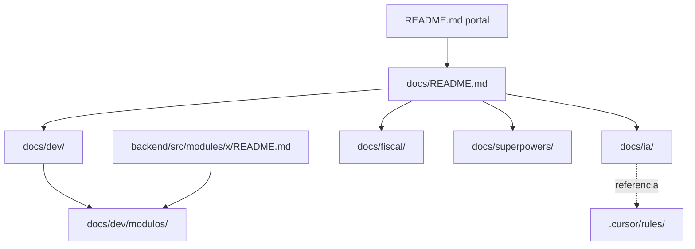

# Reestruturação da Documentação do Projeto

- **Data:** 2026-07-03
- **Status:** Aprovada (aguardando revisão do usuário)
- **Autor:** Sessão de brainstorming (Cursor)
- **Escopo:** Documentação do monorepo `msimulation-xml`

---

## 1. Contexto e problema

A documentação atual está **concentrada no `README.md` raiz** (~1.078 linhas) e **incompleta na estrutura modular** que o próprio projeto já prevê:

| O que existe hoje | Estado |
|---|---|
| `README.md` (raiz) | Monolítico (~1.078 linhas): faz onboarding, arquitetura, setup, fluxos, fiscal e validador MCP num só arquivo |
| `backend/README.md` | Sólido, mas a tabela de módulos aponta para ~9 `README.md` de módulos que **não existem** |
| `frontend/README.md` | Mínimo (~24 linhas) |
| `backend/docs/fiscal/` | `manual-nfe-moc.md`, `regras-fulfillment-cat31.md` (conhecimento fiscal acoplado ao backend) |
| `docs/fiscal/` | `mcp-nfe-validation-flow.md` (fiscal na raiz, separado do resto) |
| `docs/superpowers/` | Workflow de specs/plans/review para agentes (funciona bem) |
| READMEs por módulo | Regra `02-backend-documentation` exige; na prática só existe 1 (`fiscal-documents/infrastructure/observability/`) |

**Problemas:**
1. Não há navegação por audiência — dev humano, agente de IA e referência fiscal estão misturados.
2. O README raiz é grande demais para servir de porta de entrada.
3. A documentação por módulo prometida pela regra do Cursor não existe.
4. A referência fiscal está dividida entre `backend/docs/fiscal/` e `docs/fiscal/`.

## 2. Objetivo

Reestruturar toda a documentação de forma **equilibrada entre três audiências** — devs humanos, agentes de IA e referência fiscal de domínio — com o `README.md` raiz atuando como **portal enxuto** e o conteúdo detalhado organizado em `docs/` por audiência.

### 2.1 Decisões fechadas (brainstorming)

| Decisão | Escolha |
|---|---|
| Objetivo | Cobrir tudo de forma equilibrada (dev + IA + fiscal) |
| Estratégia de entrega | **Reestruturação completa** (README raiz enxuto + `docs/` por audiência) |
| Idioma | **Português** em toda a documentação |
| Camada de IA | `docs/ia/` para contexto estável + `.cursor/rules/` para regras executáveis; `docs/superpowers/` **permanece inalterado** |
| Docs por módulo | **Híbrido**: `README.md` mínimo no módulo (responsabilidade + link) + conteúdo completo em `docs/dev/modulos/` |
| Referência fiscal | **Tudo consolidado em `docs/fiscal/`** na raiz |
| Volume de entrega | **Tudo completo de uma vez**, incluindo os 12 READMEs de módulo detalhados |

### 2.2 Não-objetivos (YAGNI)

- Não reescrever nem reorganizar `docs/superpowers/` (specs/plans/review).
- Não alterar `.cursor/rules/*.mdc` (regras executáveis permanecem).
- Não traduzir documentação para inglês.
- Não documentar internamente cada arquivo `.ts` — a documentação de código (JSDoc) é responsabilidade contínua, fora deste escopo.
- Não alterar lógica de negócio, código de produção ou contratos de API.

## 3. Arquitetura da documentação

### 3.1 Estrutura de diretórios alvo

```
README.md                      ← PORTAL enxuto (o que é, quick start, mapa, links)
docs/
├── README.md                  ← índice do hub de documentação (navegação por audiência)
├── dev/                        ← devs humanos
│   ├── arquitetura.md          ← Clean Architecture + DDD, diagrama de camadas
│   ├── setup.md                ← rodar local, env vars, Docker, scripts
│   ├── fluxo-requisicao.md     ← ciclo HTTP: BFF → Fastify → módulo → Prisma
│   ├── testes-qualidade.md     ← testes, typecheck, pipeline de review
│   ├── onboarding.md           ← guia do estagiário (migrado do README raiz)
│   └── modulos/
│       ├── README.md           ← índice + diagrama de interação entre módulos
│       ├── auth.md
│       ├── catalog.md
│       ├── fiscal-documents.md
│       ├── fiscal-settings.md
│       ├── fiscal-validation.md
│       ├── health.md
│       ├── logistics.md
│       ├── lookup.md
│       ├── org.md
│       ├── remessas.md
│       ├── sales.md
│       └── tax.md
├── ia/                         ← contexto estável para agentes de IA
│   ├── README.md               ← como agentes devem usar este hub
│   ├── mapa-repositorio.md      ← onde vive cada coisa (arquivos-chave)
│   ├── convencoes.md           ← naming, camadas, padrões (resumo das rules)
│   └── glossario.md            ← termos fiscais + termos do domínio
├── fiscal/                     ← referência fiscal consolidada (raiz)
│   ├── README.md               ← índice fiscal
│   ├── manual-nfe-moc.md       ← movido de backend/docs/fiscal/
│   ├── regras-fulfillment-cat31.md ← movido de backend/docs/fiscal/
│   └── mcp-nfe-validation-flow.md  ← já está aqui
└── superpowers/                ← INALTERADO (specs/plans/review)
```

### 3.2 Componentes e responsabilidades

Cada unidade tem um propósito único e uma audiência clara:

- **`README.md` (raiz) — Portal.** Único ponto de entrada. Não contém detalhes profundos; delega via tabela de navegação.
- **`docs/README.md` — Hub.** Índice que roteia por audiência (dev / IA / fiscal / superpowers).
- **`docs/dev/` — Guias para humanos.** Setup, arquitetura, fluxo de requisição, testes, onboarding.
- **`docs/dev/modulos/` — Referência por bounded context.** Conteúdo completo dos 12 módulos.
- **`docs/ia/` — Contexto estável para agentes.** Mapa do repo, convenções e glossário que agentes leem para se orientar.
- **`docs/fiscal/` — Referência de domínio.** Regras fiscais e legislação num único lugar.
- **`backend/src/modules/<nome>/README.md` — Ponteiro.** Responsabilidade em 1-2 frases + link para o doc detalhado.

## 4. Detalhamento por componente

### 4.1 Portal — `README.md` raiz

Reduzido de ~1.078 para ~150-200 linhas. Mantém:
- O que é o projeto + aviso "simulador educacional" (sem validade jurídica).
- Quick start: pré-requisitos, `pnpm install`, `pnpm db:setup`, `pnpm dev`, tabela de URLs.
- Diagrama Mermaid do monorepo (reaproveita o atual).
- **Tabela de navegação** para `docs/dev/`, `docs/ia/`, `docs/fiscal/`, `docs/superpowers/`.

Migração de conteúdo (nada é perdido, apenas movido):

| Seção atual do README raiz | Destino |
|---|---|
| Conceitos básicos / termos | `docs/ia/glossario.md` |
| Visão geral do monorepo / stack | Portal (resumo) + `docs/dev/arquitetura.md` |
| Como rodar localmente / env vars | `docs/dev/setup.md` |
| Fluxos de negócio (diagramas) | `docs/dev/arquitetura.md` |
| Fluxo de uma requisição HTTP | `docs/dev/fluxo-requisicao.md` |
| Mapa de arquivos importantes | `docs/ia/mapa-repositorio.md` |
| Multi-tenant, auth e segurança | `docs/dev/arquitetura.md` (+ link `docs/dev/modulos/auth.md`) |
| Testes e qualidade | `docs/dev/testes-qualidade.md` |
| Guia do estagiário | `docs/dev/onboarding.md` |
| Scripts úteis | `docs/dev/setup.md` |
| Validador MCP Fiscal Brasil | `docs/fiscal/mcp-nfe-validation-flow.md` (+ link) |

### 4.2 `docs/dev/modulos/` — template padronizado

Todo arquivo de módulo segue o mesmo template (alinhado à regra `02-backend-documentation`):

```markdown
# Módulo: <nome>

## Visão geral
Qual a responsabilidade de negócio deste bounded context.

## Diagrama de fluxo (caso de uso principal)
```mermaid
sequenceDiagram
  ...Request → Controller → UseCase → Entity → Repository → Prisma
```

## Entidades principais
- <Entidade> — regra de negócio resumida.

## Casos de uso
- <NomeUseCase> — o que faz.

## Integração com outros módulos
- Depende de / é consumido por.
```

O conteúdo real de cada módulo é extraído lendo `application/use-cases/`, `domain/entities/`, `domain/ports/` e `presentation/controllers/` de cada `backend/src/modules/<nome>/`.

### 4.3 `docs/ia/` — contexto para agentes

- **`README.md`** — orienta o agente: leia `mapa-repositorio.md` para localizar código, `convencoes.md` para padrões e `glossario.md` para termos. Relação com `.cursor/rules/` (regras executáveis) e `docs/superpowers/` (workflow).
- **`mapa-repositorio.md`** — tabela "onde vive cada coisa" (migra o "Mapa de arquivos importantes" do README).
- **`convencoes.md`** — resumo navegável das regras: naming (kebab/camel/Pascal), camadas Clean Architecture, regra de dependências, padrão de XML por objetos.
- **`glossario.md`** — termos fiscais (NF-e, CT-e, DIFAL, CST, CFOP, FIFO) + termos do projeto (tenant, use case, BFF, remessa simbólica).

### 4.4 `docs/fiscal/` — consolidação

- Mover `backend/docs/fiscal/manual-nfe-moc.md` → `docs/fiscal/manual-nfe-moc.md`.
- Mover `backend/docs/fiscal/regras-fulfillment-cat31.md` → `docs/fiscal/regras-fulfillment-cat31.md`.
- `docs/fiscal/mcp-nfe-validation-flow.md` já está no lugar.
- Criar `docs/fiscal/README.md` como índice.
- Atualizar todas as referências a `backend/docs/fiscal/` no repositório (README raiz, `backend/README.md`, regra `especialista-fiscal.mdc` se apontar caminho, etc.).

### 4.5 READMEs mínimos por módulo (no código)

Criar `backend/src/modules/<nome>/README.md` para os 12 módulos:

```markdown
# <nome>

Responsabilidade em 1-2 frases.

📄 Documentação completa: [`docs/dev/modulos/<nome>.md`](../../../../docs/dev/modulos/<nome>.md)
```

Atualizar `backend/README.md` para que a tabela de módulos aponte para `docs/dev/modulos/`.

## 5. Fluxo de dados (navegação do leitor)



## 6. Tratamento de consistência e erros

- **Links quebrados:** toda referência a caminho antigo (`backend/docs/fiscal/`, seções do README raiz) deve ser reescrita. Verificação: `rg` por caminhos antigos ao final; nenhum resultado remanescente.
- **Mermaid válido:** validar sintaxe de cada diagrama; cores neutras/padrão.
- **Nada perdido:** cada bloco do README raiz atual tem destino explícito (tabela 4.1). Nenhuma informação descartada.
- **Idempotência do move:** usar `git mv` para preservar histórico dos arquivos fiscais.

## 7. Estratégia de verificação

- **Links:** varredura por links relativos quebrados após a reorganização.
- **Caminhos antigos:** `rg "backend/docs/fiscal"` retorna vazio (exceto histórico).
- **Cobertura de módulos:** existem 12 arquivos em `docs/dev/modulos/` + 12 `README.md` de módulo.
- **Portal:** README raiz ≤ ~200 linhas e todos os links do mapa de navegação resolvem.
- **Fidelidade fiscal:** conteúdo fiscal migrado sem alteração de regra (apenas move + índice).

## 8. Impacto e riscos

| Risco | Mitigação |
|---|---|
| Links quebrados após mover arquivos | Varredura final por caminhos antigos + revisão de todos os `docs/**/*.md` |
| Divergência entre README de módulo e código | Conteúdo extraído diretamente do código de cada módulo no momento da escrita |
| Regra `especialista-fiscal.mdc` aponta para `docs/fiscal/` | Verificar e ajustar caminho se necessário |
| Perda de histórico git dos arquivos fiscais | Usar `git mv` |

## 9. Entregáveis

1. `README.md` raiz reescrito como portal.
2. `docs/README.md` (hub).
3. 5 guias em `docs/dev/` + `docs/dev/modulos/README.md`.
4. 12 arquivos completos em `docs/dev/modulos/`.
5. 4 arquivos em `docs/ia/`.
6. `docs/fiscal/` consolidado (2 movidos + índice).
7. 12 `README.md` mínimos em `backend/src/modules/`.
8. `backend/README.md` atualizado (links de módulo).
9. Referências a caminhos antigos corrigidas em todo o repo.
