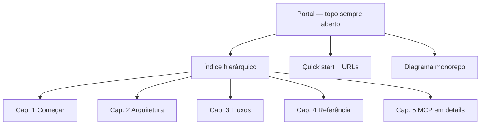

# Refatoração do README raiz — Portal no mesmo arquivo

- **Data:** 2026-07-14
- **Status:** Aprovada
- **Autor:** Sessão de brainstorming (Cursor)
- **Escopo:** Somente `README.md` na raiz do monorepo `msimulation-xml`
- **Relação com spec anterior:** Complementa, sem executar, a [reestruturação completa de documentação](./2026-07-03-reestruturacao-documentacao-design.md) (extração para `docs/dev|ia|fiscal`). Esta entrega prepara o README como portal; a migração para `docs/` fica para fase posterior.

---

## 1. Contexto e problema

O `README.md` raiz tem ~1.078 linhas e mistura onboarding, arquitetura, fluxos, referência e o bloco longo do validador MCP num único fluxo linear. O índice é plano (19 itens). Há sobreposição entre “como rodar”, tree do monorepo e avisos repetidos.

Não queremos, nesta fase, criar ou mover arquivos em `docs/`. O conteúdo detalhado permanece no mesmo arquivo, reorganizado.

## 2. Objetivo

Refatorar o `README.md` raiz para:

1. Ordem de leitura melhor (onboarding → setup → arquitetura → fluxos → referência → MCP).
2. Deduplicar texto repetido óbvio, sem perder conteúdo útil.
3. Índice e hierarquia claros (portal + capítulos).

### 2.1 Decisões fechadas

| Decisão | Escolha |
|---|---|
| Escopo | Apenas `README.md` raiz |
| Destino do conteúdo que “sai” do topo | Permanece no mesmo arquivo, em capítulos abaixo |
| Abordagem | Portal + capítulos no mesmo arquivo |
| Sucesso | Ordem + dedupe + hierarquia |
| `
` | Somente o capítulo do validador MCP, **fechado** por padrão |
| Idioma | Português |
| Commit do design | Não (pedido explícito do usuário nesta sessão) |

### 2.2 Não-objetivos (YAGNI)

- Não criar nem reorganizar `docs/dev/`, `docs/ia/` ou consolidar `docs/fiscal/`.
- Não alterar `backend/README.md`, `frontend/README.md` nem READMEs de módulo.
- Não alterar `.cursor/rules/`, código de produção ou contratos de API.
- Não comprimir o README até ~150–200 linhas (meta da spec 03/07 — exige extração).
- Não envolver todos os capítulos em `
` — só o MCP.

---

## 3. Arquitetura do documento

### 3.1 Duas faixas de leitura

**Faixa A — Portal (~80–120 linhas, sempre aberto)**

1. Título + tagline + aviso educacional (simulador, `tpAmb=2`, sem validade jurídica).
2. Índice hierárquico com âncoras para os cinco capítulos e `###` principais.
3. O que é o projeto (tabela das etapas operacionais).
4. Quick start: pré-requisitos, quatro passos (`install` → env → `db:setup` → `dev`), tabela de URLs.
5. Diagrama Mermaid do monorepo (o atual, uma única vez).

**Faixa B — Capítulos (resto do arquivo)**

| Capítulo `##` | Conteúdo (`###` / seções atuais) |
|---|---|
| **1. Começar** | Detalhe de env vars; scripts úteis; guia do estagiário; problemas comuns |
| **2. Arquitetura** | Para quem é; conceitos básicos; visão monorepo/stack; backend; frontend; packages; mapa de arquivos; multi-tenant, auth e segurança |
| **3. Fluxos** | Fluxos de negócio (diagramas); fluxo de uma requisição HTTP |
| **4. Referência** | Testes e qualidade; documentação complementar |
| **5. Operação — Validador MCP** | Seção atual completa do MCP, dentro de `
` fechado |

Heading sugerido do Cap. 5 (resumo do `
`): uma linha do tipo  
`Validador MCP — auditoria NF-e pós-geração, não bloqueante`.

### 3.2 Componentes e responsabilidades

| Unidade | Faz | Não faz |
|---|---|---|
| Portal | Orientar e desbloquear o primeiro `pnpm dev` | Detalhar env, módulos ou MCP |
| Cap. 1 | Operar o ambiente e onboarding humano | Explicar bounded contexts |
| Cap. 2 | Descrever estrutura e papéis dos pacotes | Passo a passo de install |
| Cap. 3 | Diagramas de negócio e ciclo HTTP | Setup |
| Cap. 4 | Qualidade e ponteiros de docs existentes | Reescrever docs externos |
| Cap. 5 | Referência completa do validador MCP | Bloquear a leitura do restante do README |

---

## 4. Mapeamento e dedupe

### 4.1 Destino de cada seção atual

| Seção atual (`##`) | Destino |
|---|---|
| O que é o projeto? | Portal |
| Para quem é este README? | Cap. 2 |
| Conceitos básicos | Cap. 2 |
| Visão geral do monorepo (tree + Mermaid) | Tree/Mermaid no Portal; Cap. 2 referencia o diagrama do topo sem repetir |
| Stack tecnológica | Cap. 2 |
| Como rodar localmente | Passo a passo + URLs no Portal; env vars e extras no Cap. 1 |
| Backend / Frontend / Packages | Cap. 2 |
| Fluxos de negócio / Fluxo HTTP | Cap. 3 |
| Mapa de arquivos importantes | Cap. 2 |
| Multi-tenant, auth e segurança | Cap. 2 |
| Testes e qualidade | Cap. 4 |
| Guia do estagiário | Cap. 1 |
| Scripts úteis | Cap. 1 |
| Validador MCP Fiscal Brasil | Cap. 5 (`
` fechado) |
| Documentação complementar | Cap. 4 |
| Problemas comuns | Cap. 1 |

### 4.2 Regras de dedupe (somente o listado)

1. Quick start no portal: só os quatro passos + tabela de URLs; tabela de variáveis de ambiente permanece **apenas** no Cap. 1.
2. Tree do monorepo e diagrama Mermaid: **uma vez** no portal; Cap. 2 não duplica.
3. Aviso “simulador educacional”: uma vez no portal + menção curta no guia do estagiário (já existe — manter, não expandir).
4. Um único índice hierárquico no topo; sem segundo sumário no meio do arquivo.

Qualquer outro corte de parágrafo exige justificativa no PR/implementação (ex.: frase idêntica repetida). Conteúdo útil não é descartado.

### 4.3 Uso de `
`

- Aplicar **somente** ao Cap. 5 (MCP).
- Atributo padrão: fechado (`
` sem `open`).
- Demais capítulos ficam abertos (sem `
`), para busca no editor e leitura por agentes.

---

## 5. Fluxo de leitura alvo

1. Dev chega no repositório → lê portal → sobe o projeto.
2. Precisa de scripts/env/onboarding → Cap. 1.
3. Precisa entender o monorepo → Cap. 2 (com link mental ao diagrama do portal).
4. Precisa do ciclo fiscal/HTTP → Cap. 3.
5. Precisa de testes ou docs satélites → Cap. 4.
6. Precisa do MCP → Cap. 5 (expande o `
` ou usa a âncora do índice).

---

## 6. Tratamento de consistência

- **Âncoras:** ao renomear headings, regenerar o índice no final. Todo `#slug` do índice deve resolver.
- **Links relativos:** manter válidos os caminhos já existentes (`backend/README.md`, `backend/docs/fiscal/...`, `.env.example`, etc.). Não inventar links para `docs/dev/` ou `docs/ia/` nesta fase.
- **Mermaid:** preservar diagramas válidos; não alterar regras de negócio descritas nos fluxos.
- **Fidelidade:** Cap. 5 e seções fiscais/descritivas migram de lugar; o texto substantivo permanece.

---

## 7. Estratégia de verificação

1. Checklist de âncoras: cada entrada do índice aponta para um heading real.
2. `rg` / revisão manual: links relativos do README continuam apontando para arquivos existentes.
3. Diff consciente: alterações além de reordenação/heading/dedupe listado devem ser intencionais e mínimas.
4. Render GitHub: portal legível no primeiro viewport; Cap. 5 colapsado.

Não há testes unitários; a verificação é documental.

---

## 8. Riscos

| Risco | Mitigação |
|---|---|
| Slugs de âncora quebram após renomear `##` | Regenerar índice após a última passada de headings |
| Agentes ignoram conteúdo em `
` | Cap. 5 permanece no índice com link; summary descritivo |
| Escopo crescer para extração em `docs/` | Não-objetivo explícito; apontar para a spec 03/07 |
| Dedupe agressivo demais | Lista fechada na §4.2; resto só com justificativa |

---

## 9. Entregáveis

1. `README.md` raiz reestruturado: portal + cinco capítulos, conforme este design.
2. Este arquivo de design em `docs/superpowers/specs/` (commit opcional — não exigido nesta sessão).

Fora desta entrega: implementação do plano da spec 03/07 (hub `docs/`, módulos, consolidação fiscal).
