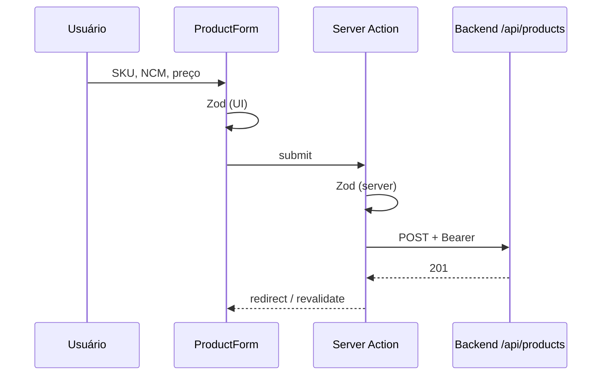

# Frontend — MSimulation XML

`@msimulation-xml/frontend` · **Next.js 16** (App Router) · React 19 · Tailwind v4 · shadcn/ui

Camada de apresentação (*thin client*) do simulador fiscal educacional. A UI **não** calcula impostos, **não** gera XML e **não** parseia planilhas fiscais — isso fica no [backend](../backend/README.md).

> **Contexto:** homologação (`tpAmb=2`), assinaturas fictícias, **sem validade** perante a SEFAZ.

Portal do monorepo: [`../README.md`](../README.md) · Contribuição: [`../CONTRIBUTING.md`](../CONTRIBUTING.md)

---

## Quick start

Na **raiz** do monorepo (API + DB precisam estar no ar):

```bash
pnpm install
cp ../.env.example ../.env                    # Docker Postgres
cp ../backend/.env.example ../backend/.env
cp .env.example .env.local                    # opcional — API_URL
pnpm db:setup                                 # na raiz
pnpm dev                                      # frontend :3000 + backend :3001
```

Só o frontend:

```bash
pnpm --filter @msimulation-xml/frontend dev
# ou, na raiz: pnpm dev:frontend
```

| Item | Valor |
| ---- | ----- |
| App | http://localhost:3000 |
| API esperada | `API_URL` → `http://127.0.0.1:3001` (ver [`.env.example`](./.env.example)) |

Scripts do package: `dev`, `build`, `start`, `lint` (ver `package.json`).

---

## O que o frontend faz (e o que não faz)

| Faz | Não faz |
| --- | ------- |
| Telas, formulários, navegação | Cálculo de ICMS/PIS/COFINS/IPI/DIFAL |
| Validação de formato (Zod) na UI | Gerar / assinar XML NF-e ou CT-e |
| Server Actions + BFF para a API | Parse fiscal de XLSX/CSV (`xlsx` no browser) |
| Exibir erros/`domain-errors` da API | Chamar ViaCEP / SEFAZ / ML direto do browser |

---

## Estrutura de rotas (`src/app/`)

```
src/app/
├── (auth)/login/              ← login, 2FA, reset, verificar e-mail
├── (onboarding)/onboarding/   ← cadastro inicial da empresa
├── (app)/                     ← área logada (AppShell)
│   ├── page.tsx               ← dashboard
│   ├── produtos/
│   ├── regras/
│   ├── operacoes/
│   ├── pedidos/
│   ├── nfe/ e cte/
│   ├── unidades-logisticas/
│   ├── empresas/
│   ├── usuarios/
│   ├── configuracoes-fiscais/
│   ├── auditoria/
│   └── ia/                    ← insights do validador (via API)
└── api/bff/[...path]/         ← proxy autenticado (downloads / XML)
```

---

## Padrões

| Padrão | Onde | Por quê |
| ------ | ---- | ------- |
| Server Components | `page.tsx` | Dados no servidor; token fora do browser |
| Server Actions | `actions.ts` ao lado da página | Mutações com Zod |
| React Hook Form + Zod | Formulários | Feedback rápido de UI |
| BFF proxy | `api/bff/[...path]/route.ts` | Download XML com sessão server-side |
| Erros amigáveis | `src/lib/user-facing-error.ts` | Traduz erros de domínio |

Cliente HTTP principal: `src/lib/fiscal-api.ts` (e subpastas). Sessão: `src/lib/auth/`.

### Fluxo típico (salvar produto)



---

## Marca na UI

- Logo: `src/components/brand-logo.tsx` (variantes `full`, `compact`, `mark`, `hero`)
- Tokens: `src/lib/brand.ts` e CSS em `src/app/globals.css`

---

## Problemas comuns (frontend)

| Sintoma | Solução |
| ------- | ------- |
| Frontend não alcança API | `frontend/.env.local` → `API_URL=http://127.0.0.1:3001` |
| CORS no browser | Backend: `CORS_ORIGINS=http://localhost:3000` |
| Sessão / 401 | Relogar; confira se a API está em `:3001` |

Mais troubleshooting de DB/MCP: [`../backend/README.md#problemas-comuns`](../backend/README.md#problemas-comuns).

---

## Qualidade

```bash
# Na raiz
pnpm lint
pnpm --filter @msimulation-xml/frontend build
```
